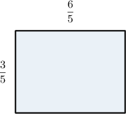
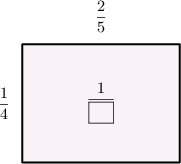
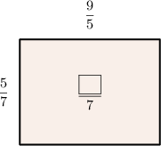
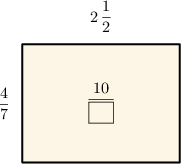
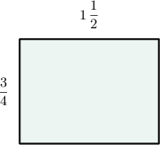

# Finding Areas Using Fraction Multiplication

Source: https://www.mathacademy.com/topics/572?courseId=30
Topic ID: 572

## Prerequisites

- [Connecting Fraction Multiplication and Area](./569-connecting-fraction-multiplication-and-area.md)
- [Multiplying Mixed Numbers](./2381-multiplying-mixed-numbers.md)

## Lesson

### Introduction

If the sides of a rectangle have fractional lengths, we find the rectangle's area by multiplying the fractions.

Look at the rectangle below. What is its area?

We find the area of the rectangle by multiplying the lengths of the sides:

$$

\dfrac{6}{5} \times \dfrac{3}{5} = \dfrac{6 \times 3}{5 \times 5} = \dfrac{18}{25}

$$

So, the area of the rectangle is $\dfrac{18}{25}$ square units.

### Example: Finding a Missing Number in an Area Model

#### Question

What number is missing from the area model below?

#### Explanation

The area of the rectangle can be found by multiplying the lengths of the sides:

$$

\dfrac{2}{5} \times \dfrac{1}{4}

$$

We can simplify this product by swapping the denominators:

$$

\begin{aligned}\frac{2}{5}×\frac{1}{4} & =\frac{2}{4}×\frac{1}{5} \\ & =\frac{1}{2}×\frac{1}{5} \\ & =\frac{1×1}{2×5} \\ & =\frac{1}{\color{blue}10}\end{aligned}

$$

So, the missing number is $10.$

### Example: Cases When Some Sides Are Improper Fractions

#### Question

What number is missing from the area model below?

#### Explanation

The area of the rectangle can be found by multiplying the lengths of the sides:

$$

\dfrac{5}{7} \times \dfrac{9}{5}

$$

We can simplify this product by swapping the denominators:

$$

\begin{aligned}\frac{5}{7}×\frac{9}{5} & =\frac{5}{5}×\frac{9}{7} \\ & =1×\frac{9}{7} \\ & =\frac{1×9}{7} \\ & =\frac{\color{blue}9}{7}\end{aligned}

$$

So, the missing number is $9.$

### Example: Cases When Some Sides Are Mixed Numbers

#### Question

What number is missing from the area model below?

#### Explanation

First, we write $2\,\dfrac{1}{2}$ as an improper fraction:

$$

2\,\dfrac{1}{2} = \dfrac{(2\times 2)+1}{2} = \dfrac{5}{2}

$$

The area of the rectangle can be found by multiplying the lengths of the sides:

$$

\dfrac{4}{7} \times \dfrac{5}{2}

$$

We can simplify this product by swapping the denominators:

$$

\begin{aligned}\frac{4}{7}×\frac{5}{2} & =\frac{4}{2}×\frac{5}{7} \\ & =2×\frac{5}{7} \\ & =\frac{2×5}{7} \\ & =\frac{10}{\color{blue}\,7\,}\end{aligned}

$$

So, the missing number is $7.$

### Example: Finding the Area of a Rectangle

#### Question

The width of a rectangular park is and its length is Using the model below, find the area of the park, expressed as an improper fraction.

#### Explanation

To find the area, we need to multiply the lengths of the sides.

First we write as an improper fraction:

Now, we find the area of the park by multiplying the lengths of its sides:

So, the area of the park is square kilometers.
