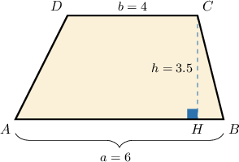
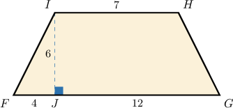
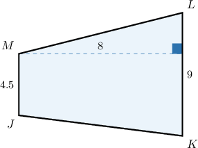
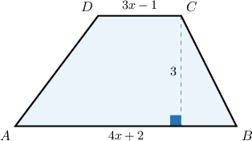
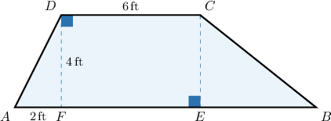
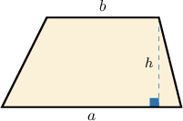
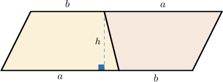

# Areas of Trapezoids

Source: https://www.mathacademy.com/topics/1353?courseId=113
Topic ID: 1353

## Prerequisites

- [Areas of Triangles](./1397-areas-of-triangles.md)
- [The Segment Addition Postulate](./2278-the-segment-addition-postulate.md)

## Lesson

### Introduction

The **area of a trapezoid** is given by the formula

$$

\mathcal{A} = \dfrac{(a+b)\cdot h}{2},

$$

where

- $a$ and $b$ are lengths of the **bases,** and

- $h$ is the **height** of the trapezoid (the length of a perpendicular segment drawn between the bases).

We'll derive this result at the end of the lesson.

To demonstrate how to apply this formula, let's use the above formula to compute the area of the trapezoid $ABCD$ shown below.

From the picture above, we have

$$

\begin{aligned}A & =\frac{(𝑎+𝑏)⋅ℎ}{2} \\ & =\frac{(𝐴𝐵+𝐶𝐷)⋅𝐶𝐻}{2} \\ & =\frac{(6+4)⋅3.5}{2} \\ & =\frac{10⋅3.5}{2} \\ & =\frac{35}{2} \\ & =17.5\,cm^{2}.\end{aligned}

$$

### Example: Calculating the Area of a Trapezoid

#### Question

Find the area of the trapezoid $FGHI.$

#### Explanation

The area of a trapezoid is given by

$$

\mathcal{A} = \dfrac{(a+b) \cdot h}{2},

$$

where $a,b$ are lengths of the bases and $h$ is the height of the trapezoid.

In our case, we have

$$

a = FJ+GJ = 16 , \qquad b = HI = 7 , \qquad h = IJ = 6.

$$

Therefore, the area of our trapezoid is

$$

\begin{aligned}A & =\frac{(16+7)⋅6}{2} \\ & =\frac{23⋅6}{2} \\ & =23⋅3 \\ & =69.\end{aligned}

$$

### Example: Calculating the Area of a Trapezoid With Vertical Bases

#### Question

What is the area of the trapezoid $JKLM?$

#### Explanation

The area of a trapezoid is given by

$$

\mathcal{A} = \dfrac{(a+b) \cdot h}{2},

$$

where $a,b$ are lengths of the bases and $h$ is the height of the trapezoid.

In our case, we have

$$

a = JM = 4.5, \qquad b = KL = 9, \qquad h = 8.

$$

Therefore, the area of our trapezoid is

$$

\begin{aligned}A & =\frac{(4.5+9)⋅8}{2} \\ & =13.5⋅4 \\ & =54.\end{aligned}

$$

### Example: Finding the Value of an Unknown Using the Area of a Trapezoid

#### Question

The area of the trapezoid $ABCD$ shown below is $12$ square units. Calculate $x.$

#### Explanation

The area of a trapezoid is given by

$$

\mathcal{A} = \dfrac{(a+b) \cdot h}{2},

$$

where $a,b$ are lengths of the bases and $h$ is the height of the trapezoid.

In our case, we have

$$

\begin{aligned}𝑎 & =𝐴𝐵=4𝑥+2 \\ 𝑏 & =𝐶𝐷=3𝑥−1 \\ ℎ & =3.\end{aligned}

$$

Substituting the above into the formula for the area of a trapezoid and solving for $x,$ we get

$$

\begin{aligned}\frac{(𝑎+𝑏)⋅ℎ}{2} & =A \\ \frac{((4𝑥+2)+(3𝑥−1))⋅3}{2} & =12 \\ (7𝑥+1)⋅3 & =24 \\ 7𝑥+1 & =8 \\ 7𝑥 & =7 \\ 𝑥 & =1.\end{aligned}

$$

### Example: Determining the Area of a Triangle by Finding the Area of a Trapezoid

#### Question

If the area of the trapezoid $ABCD$ is $38\,\text{ft}^2,$ what is the area of the triangle $\triangle BCE?$

#### Explanation

First, by considering the area of the trapezoid $ABCD,$ we have that

$$

\begin{aligned}A_{𝐴𝐵𝐶𝐷} & =\frac{(𝐴𝐵+𝐶𝐷)⋅𝐷𝐹}{2} \\ 38 & =\frac{(𝐴𝐵+6)⋅4}{2} \\ 38 & =(𝐴𝐵+6)⋅2 \\ 19 & =𝐴𝐵+6 \\ 𝐴𝐵 & =13\,ft.\end{aligned}

$$

Now, we use the fact that $EF=CD=6$ and $AF=2.$ This gives

$$

\begin{aligned}𝐵𝐸 & =𝐴𝐵−(𝐴𝐹+𝐸𝐹) \\ & =13−(2+6) \\ & =5\,ft.\end{aligned}

$$

Finally, the area of $\triangle BCE$ can be calculated as

$$

\begin{aligned}A_{△𝐵𝐶𝐸} & =\frac{𝐶𝐸⋅𝐵𝐸}{2} \\ & =\frac{𝐷𝐹⋅𝐵𝐸}{2} \\ & =\frac{4⋅5}{2} \\ & =10\,ft^{2}.\end{aligned}

$$

### Deriving the Formula

We'll now derive the formula for the area of a trapezoid. Consider a trapezoid with bases of length $a, b,$ and height $h,$ as shown above.

Let's now make another copy of the figure, rotate it $180^\circ,$ and place it next to the original.

We now have a parallelogram with a base of length $a+b$ and a height of $h.$ The area of this parallelogram is

$$

\text{Area of Parallelogram} = \text{base} \times \text{height} = (a+b) \times h.

$$

To find the area of the original trapezoid, we divide the above value in half:

$$

\text{Area of Trapezoid} = \dfrac{\text{Area of Parallelogram}}{2} = \dfrac{(a+b) \cdot h}{2}

$$
