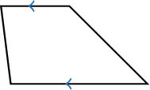
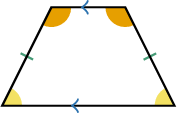
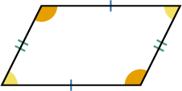
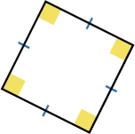
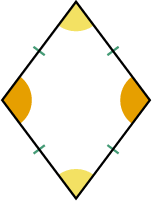
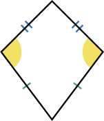
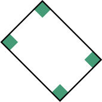
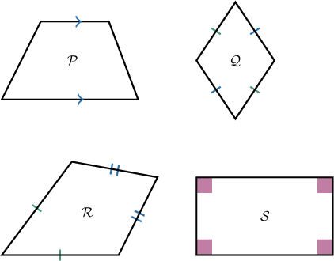
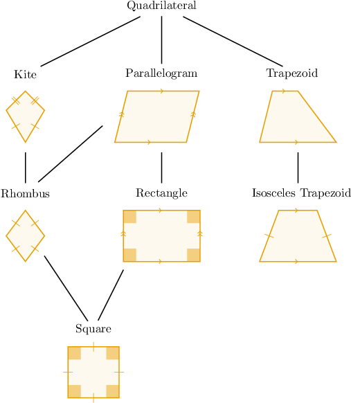

# Classifying Quadrilaterals

Source: https://www.mathacademy.com/topics/1459?courseId=113
Topic ID: 1459

## Prerequisites

- [Polygons](./1317-polygons.md)
- [Congruent Segments](./1462-congruent-segments.md)
- [Right, Straight, Full, and Null Angles](./1509-right-straight-full-and-null-angles.md)

## Lesson

### Introduction

There are lots of different types of quadrilaterals. Let's look at some examples.

- A **trapezoid** is a quadrilateral with exactly $1$ pair of opposite sides that are parallel to each other. The parallel sides are called the **bases**. The other two sides are called the **legs**.

- An **isosceles trapezoid** is a trapezoid with congruent legs.

- A **parallelogram** is a quadrilateral with $2$ pairs of parallel sides. Opposite sides and opposite angles of a parallelogram are always congruent. Moreover, if a quadrilateral has $2$ pairs of opposite congruent sides or $2$ pairs of opposite congruent angles, it is always a parallelogram.

- A **rectangle** is a parallelogram where all angles are right. A rectangle where all sides are congruent is a **square**.

- A **rhombus** is a parallelogram where all sides are congruent. The opposite angles of a rhombus are also congruent.

- A **kite** is a quadrilateral with two pairs of congruent sides that are adjacent to each other.

### Classifying Quadrilaterals

We can organize all mentioned types of quadrilaterals into the following hierarchy diagram:

Each shape below another is a specific type of the one above it. For example, every square is a rectangle, and every rectangle is a parallelogram. This means every square is also a parallelogram.

### Example: Describing a Quadrilateral

#### Question

Which of the following terms describe the shape below?

1. Parallelogram

2. Rectangle

3. Square

#### Explanation

First, recall the hierarchy diagram of quadrilaterals, where each shape below another is a specific type of the one above it.

Let's now look at the terms one by one.

- The given figure is a quadrilateral with two pairs of opposite congruent angles, so it is a parallelogram.

- Since all the angles in this parallelogram are right, it is a rectangle.

- Not all the sides of this rectangle are congruent, so it is not a square.

Consequently, the given shape is described by terms I (parallelogram) and II (rectangle).

### Example: Identifying a Quadrilateral

#### Question

Which of the following shapes is a trapezoid?

#### Explanation

First, recall the hierarchy diagram of quadrilaterals, where each shape below another is a specific type of the one above it.

Remember that a trapezoid is a quadrilateral with exactly one pair of opposite sides that are parallel to each other.

With that in mind, let's look at each shape in turn.

- The shape $\mathcal{P}$ is a trapezoid since it has one pair of opposite sides that are parallel.

- The shape $\mathcal{Q}$ is a rhombus. It has two pairs of opposite sides that are parallel to one another, not one pair. Therefore, it is not a trapezoid.

- The shape $\mathcal{R}$ is a kite. Its opposite sides are not parallel, therefore it is not a trapezoid.

- The shape $\mathcal{S}$ is a rectangle. It has two pairs of opposite sides that are parallel to one another, not one pair. Therefore, it is not a trapezoid.

Therefore, only shape $\mathcal{P}$ is a trapezoid.

### Example: Identifying True Statements About Quadrilaterals

#### Question

Which of the following statements are true?

1. A rhombus is always a kite.

2. A rhombus is always a parallelogram.

3. A kite is always a parallelogram.

#### Explanation

First, recall the hierarchy diagram of quadrilaterals, where each shape below another is a specific type of the one above it.

Let's now look at each statement in turn.

- Statement I is true. A kite has two pairs of congruent sides that are adjacent to each other. A rhombus fits this description, because all the sides in a rhombus are congruent.

- Statement II is true. In a parallelogram, opposite sides are parallel. The same is true for a rhombus. A rhombus is a specific type of parallelogram, where all the sides are congruent.

- Statement III is false. In a parallelogram, opposite sides are parallel. However, in a kite, it's only necessary that two pairs of congruent sides are adjacent to each other. Therefore, a kite is not always a parallelogram.

In conclusion, only statements I and II are true.
