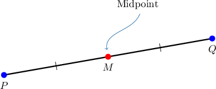
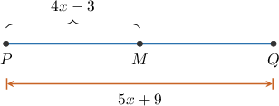
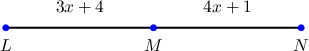
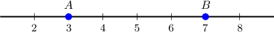
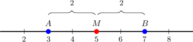
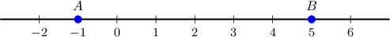
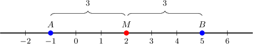
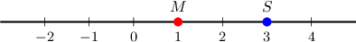
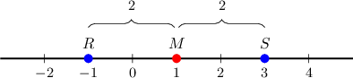

# Midpoints

Source: https://www.mathacademy.com/topics/1463?courseId=113
Topic ID: 1463

## Prerequisites

- [Solving Linear Equations by Clearing a Rational Expression](./651-solving-linear-equations-by-clearing-a-rational-expression.md)
- [Measures of Segments](./1379-measures-of-segments.md)

## Lesson

### Introduction

The **midpoint** of a line segment is the point that splits it into two segments of equal length. For example, $M$ is the midpoint of $\overline{PQ}$ shown below.

The midpoint splits the line segment into two congruent segments,

$$

\overline{PM}\cong \overline{QM}.

$$

In addition, the segment $\overline{PQ}$ is twice as long as the segments $\overline{PM}$ and $\overline{QM}$:

$$

PQ = 2PM, \qquad PQ = 2QM

$$

### Example: Using Properties of Midpoints to Calculate an Unknown Value From a Diagram

#### Question

Given that $M$ is the midpoint of $\overline{PQ}$, what is the value of $x?$

#### Explanation

Since $M$ is the midpoint of $\overline{PQ}$, the segment $\overline{PQ}$ is twice the length of the segment $\overline{PM}.$ So, we have:

$$

\begin{aligned}2𝑃𝑀 & =𝑃𝑄 \\ 2(4𝑥−3) & =5𝑥+9 \\ 8𝑥−6 & =5𝑥+9\end{aligned}

$$

Now, we subtract $5x$ from both sides of the equation:

$$

\begin{aligned}8𝑥−6−5𝑥 & =5𝑥+9−5𝑥 \\ 3𝑥−6 & =9\end{aligned}

$$

Next, we add $6$ to both sides:

$$

\begin{aligned}3𝑥−6+6 & =9+6 \\ 3𝑥 & =15\end{aligned}

$$

Finally, we divide both sides by $3{:}$

$$

\begin{aligned}\frac{3𝑥}{3} & =\frac{15}{3} \\ 𝑥 & =5\end{aligned}

$$

### Example: Using Properties of Midpoints to Calculate an Unknown Value From a Description

#### Question

The point $M$ is the midpoint of the line segment $\overline{LN}.$ What is the value of $x$ if $MN=4x+1$ centimeters and $LM=3x+4$ centimeters?

#### Explanation

We have the following diagram.

Since $M$ is the midpoint of $\overline{LN}$, the two segments $\overline{LM}$ and $\overline{MN}$ have the same length. So, we have:

$$

\begin{aligned}𝐿𝑀 & =𝑀𝑁 \\ 3𝑥+4 & =4𝑥+1 \\ 3𝑥+4−3𝑥 & =4𝑥+1−3𝑥 \\ 4 & =𝑥+1 \\ 4−1 & =𝑥+1−1 \\ 3 & =𝑥 \\ 𝑥 & =3\end{aligned}

$$

Therefore, $x = 3\,\textrm{cm}$.

### The Midpoint Formula

Let's find the midpoint $M$ of the line segment $\overline{AB}$ on a number line, if $A$ corresponds to $x_1= 3$ and $B$ corresponds to $x_2=7,$ as depicted below.

The midpoint of a line segment splits it into two segments of equal length. To find the number $x_m$ corresponding to $M,$ we use the following **midpoint formula**:

$$

\begin{aligned}𝑥_{𝑚} & =\frac{𝑥_{1}+𝑥_{2}}{2}\end{aligned}

$$

Substituting $x_1=3$ and $x_2=7$, we obtain

$$

\begin{aligned}𝑥_{𝑚} & =\frac{3+7}{2} \\ & =\frac{10}{2} \\ & =5.\end{aligned}

$$

Therefore, the midpoint $M$ corresponds to $x_m=5.$

### Example: Finding a Midpoint Using the Midpoint Formula

#### Question

Which number corresponds to the midpoint of the line segment $\overline{AB}$ shown below?

#### Explanation

The point $A$ corresponds to the number $x_1=-1$ while $B$ corresponds to $x_2=5.$

To find the number $x_m$ corresponding to the midpoint $M$, we use the midpoint formula:

$$

\begin{aligned}𝑥_{𝑚} & =\frac{𝑥_{1}+𝑥_{2}}{2} \\ & =\frac{−1+5}{2} \\ & =\frac{4}{2} \\ & =2\end{aligned}

$$

Therefore, the midpoint $M$ corresponds to $x_m=2.$

### Example: Using the Midpoint Formula to Calculate an Endpoint

#### Question

For the diagram depicted below, which number corresponds to the point $R$ if $M$ is the midpoint of the line segment $\overline{RS}?$

#### Explanation

From the picture, we can see that the point $S$ corresponds to the number $x_2=3$ while the midpoint $M$ corresponds to $x_m=1.$

To find the number $x_1$ corresponding to the point $R$, we first set up an equation using the midpoint formula:

$$

\begin{aligned}𝑥_{𝑚} & =\frac{𝑥_{1}+𝑥_{2}}{2} \\ 1 & =\frac{𝑥_{1}+3}{2}\end{aligned}

$$

Now, we solve for $x_1\mathbin{:}$

$$

\begin{aligned}1 & =\frac{𝑥_{1}+3}{2} \\ 2⋅1 & =𝑥_{1}+3 \\ 2 & =𝑥_{1}+3 \\ 2−3 & =𝑥_{1} \\ −1 & =𝑥_{1}\end{aligned}

$$

Therefore, the point $R$ corresponds to $x_1=-1.$

