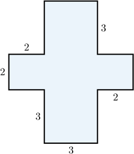
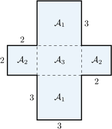
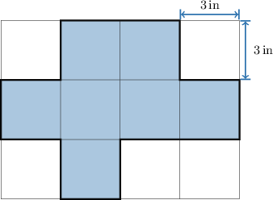
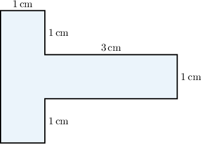
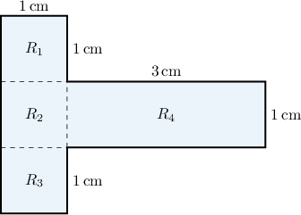
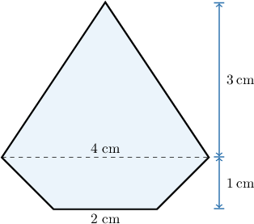
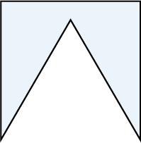
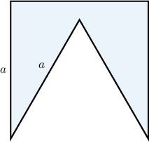

# Areas and Perimeters of Composite Shapes

Source: https://www.mathacademy.com/topics/1468?courseId=113
Topic ID: 1468

## Prerequisites

- [Areas of Trapezoids](./1353-areas-of-trapezoids.md)
- [Congruent Polygons](./1515-congruent-polygons.md)

## Lesson

### Introduction

A **composite polygon** is a polygon that is made up of other polygons, such as triangles, parallelograms, rectangles, squares, and others.

For example, the polygon below is composite. How can we find its area?

First, notice that the polygon consists of four squares and one rectangle in the middle.

To calculate the area of the composite polygon above, we add the areas of the four squares and the rectangle:

$$

\begin{aligned}A=2A_{1}+2A_{2}+A_{3}.\end{aligned}

$$

The areas of the squares and the rectangle are

$$

\begin{aligned}A_{1} & =3^{2}=9, \\ A_{2} & =2^{2}=4, \\ A_{3} & =3⋅2=6.\end{aligned}

$$

So, the area of the entire figure is

$$

\begin{aligned}A & =2⋅9+2⋅4+6 \\ & =18+8+6 \\ & =32.\end{aligned}

$$

### Example: Finding the Area of a Composite Shape Made Up of Rectangles

#### Question

Find the area of ​​the shaded region in the figure above.

#### Explanation

Note that the figure is formed by $7$ squares with the same dimensions. The area of ​​each square is

$$

\mathcal{A}_s= s^2 = 3^2 = 9 \textrm{ in}^2.

$$

Therefore, the area of ​​the shaded region is given by

$$

\begin{aligned}A & =7⋅A_{𝑠} \\ & =7⋅9 \\ & =63 in^{2}.\end{aligned}

$$

### Example: Finding the Perimeter of a Composite Shape Made Up of Rectangles

#### Question

Find the perimeter of ​​the figure above.

**

#### Explanation

The figure is composed of three squares, $R_1,$ $R_2,$ and $R_3$, and one rectangle, $R_4.$

The perimeter of the figure is determined by the sum of the lengths of

- $3$ sides of $R_1$ (each of length $1\,\textrm{cm}$),

- $1$ side of $R_2$ (of length $1\,\textrm{cm}$),

- $3$ sides of $R_3$ (of length $1\,\textrm{cm}$),

- $3$ sides of $R_4$ (two of length $3\,\textrm{cm}$ and one of length $1\,\textrm{cm}$).

Therefore, the perimeter is given by

$$

\begin{aligned}𝑝 & =3⋅1+1+3⋅1+(3+1+3) \\ & =3+1+3+7 \\ & =14 cm.\end{aligned}

$$

### Example: Finding the Area of a Composite Shape Made of Triangles and Trapezoids

#### Question

The figure above is composed of a trapezoid and an isosceles triangle. Find the area of ​​the figure.

**

#### Explanation

The area of ​​the trapezoid is

$$

\begin{aligned}A_{1} & =\frac{(2+4)⋅1}{2}=3 cm^{2}.\end{aligned}

$$

The area of ​​the isosceles triangle is

$$

\begin{aligned}A_{2} & =\frac{4⋅3}{2}=6 cm^{2}.\end{aligned}

$$

Therefore, the area of ​​the entire figure is

$$

\begin{aligned}A & =A_{1}+A_{2} \\ & =3+6 \\ & =9\,cm^{2}.\end{aligned}

$$

### Example: Finding the Perimeter of a Composite Shape Given Its Area

#### Question

The figure above is obtained by taking a square with an area of and cutting out an equilateral triangle. Find the perimeter of ​​the figure.

**

#### Explanation

Let be the length of the sides of the square. Then, the length of each side of the triangle is also since it is equilateral and the square and the triangle have a common side.

We're given that the area of a square is Therefore,

The perimeter of the figure is the sum of the lengths of

- sides of the square (each of length), and

- sides of the triangle (each of length).

So, we have

Finally, substituting into the above, we get that the perimeter of ​​the given shape is
