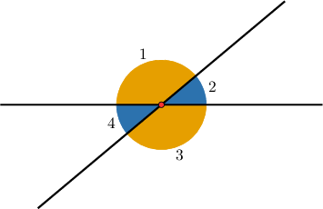
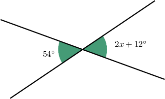
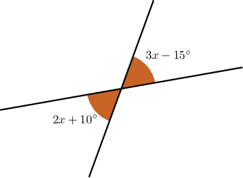
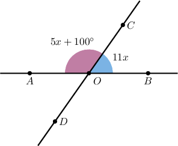
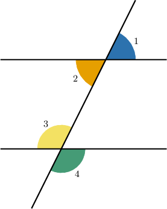

# Vertical Angles

Source: https://www.mathacademy.com/topics/1507?courseId=113
Topic ID: 1507

## Prerequisites

- [Right, Straight, Full, and Null Angles](./1509-right-straight-full-and-null-angles.md)
- [Congruent Angles](./3554-congruent-angles.md)

## Lesson

### Introduction

When two lines meet at a point, they create two pairs of opposite angles. The angles in each pair are called **vertical angles**.

Vertical angles are *always* congruent.

In the diagram above, $\angle 1$ and $\angle 3$ are vertical angles and are therefore congruent.

Likewise, $\angle 2$ and $\angle 4$ are vertical angles and are therefore congruent.

So, we have $\angle 1 \cong \angle 3$ and $\angle 2 \cong \angle 4.$

### Example: Calculating an Unknown Quantity Using Vertical Angles

#### Question

Given the figure below, find the value of $x.$

#### Explanation

The two angles marked in the diagram are vertical. Since vertical angles are congruent, we have:

$$

\begin{aligned}2𝑥+12^{∘} & =54^{∘} \\ 2𝑥 & =42^{∘} \\ 𝑥 & =21^{∘}\end{aligned}

$$

### Example: Calculating the Measure of Vertical Angles Given in Terms of a Variable

#### Question

Compute the measures of the shaded angles in the figure below.

#### Explanation

The two angles marked in the diagram are vertical. Since vertical angles are congruent, we have:

$$

\begin{aligned}3𝑥−15^{∘} & =2𝑥+10^{∘} \\ 𝑥−15^{∘} & =10^{∘} \\ 𝑥 & =25^{∘}\end{aligned}

$$

Now that we know $x=25^\circ,$ we can substitute into one of the expressions to calculate the measure of the angles. Let's substitute into the expression $2x + 10^\circ\mathbin{:}$

$$

2x + 10^\circ = 2 \cdot 25^\circ + 10^\circ = 60^\circ

$$

Therefore, both angles have a measure of $60^\circ.$

### Example: Finding an Unknown Angle by Combining Properties of Straight and Vertical Angles

#### Question

In the figure below, $\angle AOB$ is a straight angle. Determine $m \angle AOD.$

#### Explanation

Since $\angle AOB$ is straight, $m\angle AOB = 180^\circ.$ So by the angle addition postulate, we have

$$

m\angle AOC + m\angle BOC = 180^\circ.

$$

Substituting the given expressions into the above, we can solve for $x$ as follows:

$$

\begin{aligned}(5𝑥+100^{∘})+11𝑥 & =180^{∘} \\ 16𝑥+100^{∘} & =180^{∘} \\ 16𝑥 & =80^{∘} \\ 𝑥 & =5^{∘}\end{aligned}

$$

Now that we know $x=5^\circ,$ we can calculate $m \angle COB$ as follows:

$$

m \angle COB = 11(5^\circ) = 55^\circ

$$

Finally, since the angles $\angle AOD$ and $\angle COB$ are vertical angles, they have the same measure:

$$

m \angle AOD = m \angle COB = 55^\circ

$$

### Example: Using Vertical Angles in a Situation With Three Lines

#### Question

In the diagram shown below, it is known that $m \angle 1 = 60^\circ$ and $m \angle 3 = 120^\circ.$ Determine the value of $m \angle 2 + m \angle 4.$

#### Explanation

We have two pairs of vertical angles, and we know that vertical angles are congruent and therefore have the same measure. So, we have

$$

\begin{aligned}𝑚∠1=𝑚∠2, \\ 𝑚∠3=𝑚∠4.\end{aligned}

$$

We are told that $m \angle 1 = 60^\circ$ and $m \angle 3 = 120^\circ,$ so we have

$$

\begin{aligned}60^{∘}=𝑚∠2, \\ 120^{∘}=𝑚∠4.\end{aligned}

$$

Therefore, we obtain

$$

\begin{aligned}𝑚∠2+𝑚∠4 & =60^{∘}+120^{∘} \\ & =180^{∘}.\end{aligned}

$$
