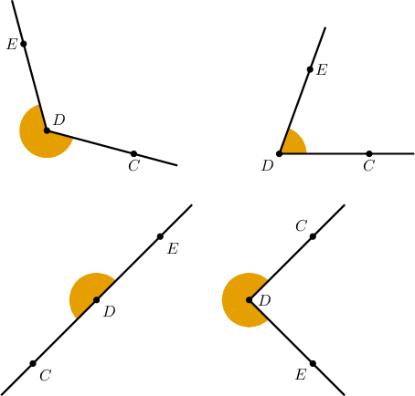
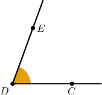
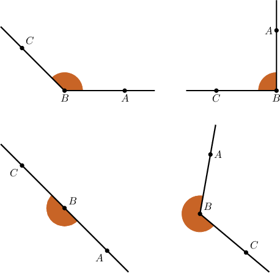
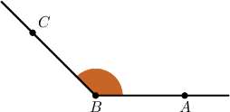
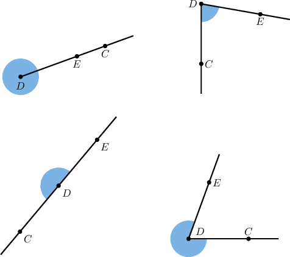
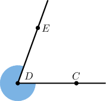

# Acute, Obtuse, and Reflex Angles

Source: https://www.mathacademy.com/topics/1510?courseId=113
Topic ID: 1510

## Prerequisites

- [Right, Straight, Full, and Null Angles](./1509-right-straight-full-and-null-angles.md)

## Lesson

### Introduction

We categorize angles that are not right, straight, or full into three groups.

- An **acute angle** has a measure between $0^\circ$ and $90^\circ\mathbin{:}$

- An **obtuse angle** has a measure between $90^\circ$ and $180^\circ\mathbin{:}$

- Angles whose measure is between $180^\circ$ and $360^\circ$ are called **reflex angles**.

### Example: Identifying Acute Angles

#### Question

Which of the following shows an acute angle $\angle CDE?$

#### Explanation

Remember that an acute angle has a measure between $0^\circ$ and $90^\circ.$ Therefore, the correct diagram is the following:

### Example: Identifying Obtuse Angles

#### Question

Which of the following shows an obtuse angle $\angle ABC?$

#### Explanation

Remember that an obtuse angle has a measure between $90^\circ$ and $180^\circ.$ Therefore, the correct diagram is the following:

### Example: Identifying Reflex Angles

#### Question

Which of the following shows a reflex angle $\angle CDE?$

#### Explanation

Remember that a reflex angle has a measure between $180^\circ$ and $360^\circ.$ Therefore, the correct diagram is the following:

