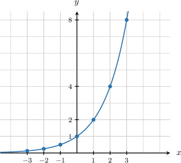
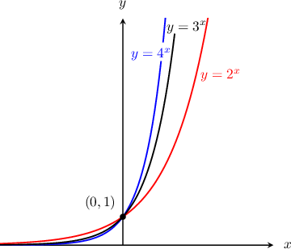
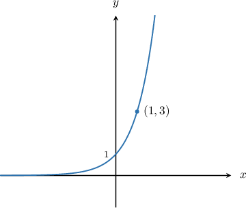
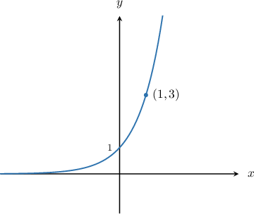
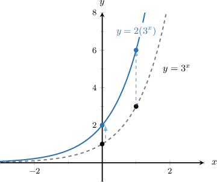
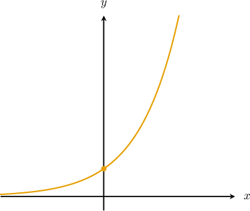
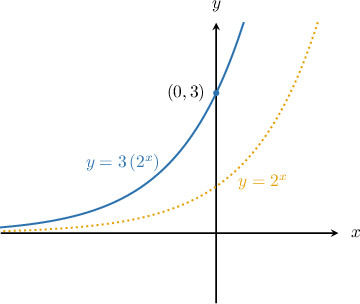
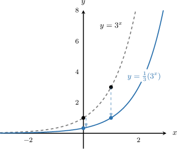
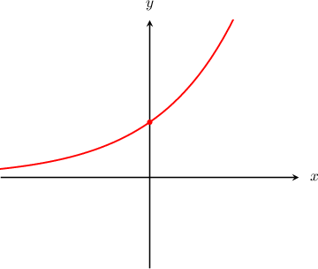
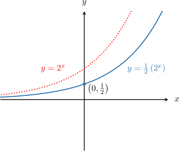

# Graphing Exponential Growth Functions

Source: https://www.mathacademy.com/topics/1530?courseId=113
Topic ID: 1530

## Prerequisites

- [Exponential Functions](./1153-exponential-functions.md)
- [Increasing and Decreasing Functions](./1628-increasing-and-decreasing-functions.md)
- [The Range of a Function: Advanced Cases](./3728-the-range-of-a-function-advanced-cases.md)

## Lesson

### Introduction

Suppose we wish to plot the graph of $y=2^x.$ First, we create a table of values:

Now, we can plot the graph:

Note the following key points:

1. The graph has a $y$-intercept at $(0,1).$

2. The graph is increasing.

3. For $x>0,$ the graph grows very rapidly as $x$ increases. Symbolically, we write $y\rightarrow \infty$ as $x\rightarrow \infty.$

4. For $x<0,$ the graph gets very close to zero as $x$ decreases. However, it never actually reaches zero, so the graph has the horizontal asymptote $y=0.$ Symbolically, we write $y\rightarrow 0$ as $x\rightarrow -\infty.$

5. The domain is $x\in (-\infty, \infty)$, and the range is $y>0.$

These key points apply to *any* exponential curve $y=a^x$ with $a>1.$ These graphs always have the same general shape:

### Example: Sketching the Graph of an Exponential Growth Function

#### Question

Sketch the graph of $f(x)=3^x.$

#### Explanation

The graph of $y=3^x$ has a $y$-intercept at $(0,1),$ grows rapidly for $x>0,$ and approaches the asymptote $y=0$ for $x<0.$

When $x=1,$ we have $y=3^1 = 3.$ Therefore, another point on the graph is $(1,3).$

We draw the graph through this point as follows:

### Example: Identifying True Statements about Exponential Growth Functions

#### Question

Which of the following statements are true in relation to the function $f(x) = 3^x?$

1. It passes through the point $(1,3).$

2. $f(x)\rightarrow -\infty$ as $x\rightarrow -\infty.$

3. The graph of $y=f(x)$ has a vertical asymptote $x=0.$

#### Explanation

Let's start by recalling the graph of $y=3^x\mathbin{:}$

Now, let's look at each statement:

- Statement I is true because $f(1) = 3^1 = 3.$

- Statement II is false, since $f(x)\rightarrow 0$ as $x\rightarrow -\infty.$

- Statement III is false. The graph has a ** asymptote $y=0.$

In conclusion, only statement I is true.

### Vertical Stretching

Multiplying an exponential growth function by a positive number **scales** the graph in the vertical direction.

For example, the curve represents a vertical scaling of by a factor of It takes all of the -coordinates on and multiplies them by This has the effect of **stretching** the curve upwards.

Notice that the horizontal asymptote at remained the same, and the -intercept moved from to

In general, for *any* vertically stretched exponential curve

- the horizontal asymptote at remains the same, and

- the -intercept moves from to

### Example: Plotting a Vertically Stretched Exponential Growth Function

#### Question

Plot the graph of

#### Explanation

First we plot the graph of:

Then, we scale this graph vertically by a factor of The -intercept becomes and the resulting graph is as follows:

### Vertical Compression

The curve represents a vertical scaling of by a factor of It takes all of the -coordinates on and multiplies them by This has the effect of squashing, or **compressing**, the curve downwards.

Notice that the horizontal asymptote at remained the same, and the -intercept moved from to

In general for *any* vertically stretched exponential curve

- the horizontal asymptote at remains the same, and

- the -intercept moves from to

### Example: Plotting a Vertically Compressed Exponential Growth Function

#### Question

Plot the graph of $y=\dfrac{1}{2}(2)^x.$

#### Explanation

First we plot the graph of $y=2^{x}$:

Then, we scale this graph vertically by a factor of $\dfrac12.$ The $y$-intercept becomes $\left(0,\dfrac{1}{2} \right),$ and the resulting graph is as follows:

