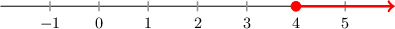
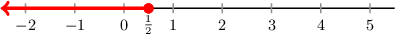
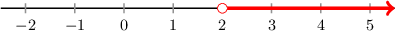
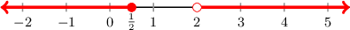
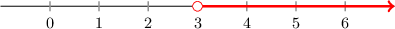
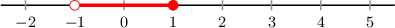
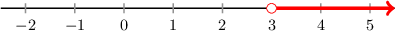
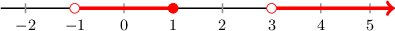

# Compound OR Inequalities

Source: https://www.mathacademy.com/topics/1576?courseId=113
Topic ID: 1576

## Prerequisites

- [Solving Compound Inequalities](./388-solving-compound-inequalities.md)
- [Unions of Intervals](./458-unions-of-intervals.md)

## Lesson

### Introduction

Suppose we want to find all of the values of $x$ that satisfy *either* $4x+2 < 6$ *or* $2x \geq 8.$

To do this, we solve each inequality individually and then compute the union of the two solutions.

We start by solving $4x+2 < 6\mathbin{:}$

$$

\begin{aligned}4𝑥+2 & <6 \\ 4𝑥 & <4 \\ 𝑥 & <1\end{aligned}

$$

Then, we solve $2x \geq 8\mathbin{:}$

$$

\begin{aligned}2𝑥 & ≥8 \\ 𝑥 & ≥4\end{aligned}

$$

To graph the values of $x$ that satisfy either inequality, we overlay the two graphs on the same number line:

Thus, the final solution is $x < 1$ or $x \geq 4.$ We can write this using interval notation as

$$

(-\infty, 1) \cup [4,\infty).

$$

### Example: Finding the Union of Two Linear Inequalities

#### Question

Find the set of values of $x$ that satisfy $6x-1 \leq 2$ or $5x-1 > 9.$ Express your answer in interval notation.

#### Explanation

We start by solving $6x-1 \leq 2\mathbin{:}$

$$

\begin{aligned}6𝑥−1 & ≤2 \\ 6𝑥 & ≤3 \\ 𝑥 & ≤\frac{3}{6} \\ 𝑥 & ≤\frac{1}{2}\end{aligned}

$$

Then, we solve $5x -1 > 9\mathbin{:}$

$$

\begin{aligned}5𝑥−1 & >9 \\ 5𝑥 & >10 \\ 𝑥 & >2\end{aligned}

$$

To graph the values of $x$ that satisfy either inequality, we overlay the two graphs on the same number line:

Therefore, the final solution is $x \leq \dfrac{1}{2}$ or $x >2.$ We can write this using interval notation as

$$

\begin{aligned}(−∞,\frac{1}{2}]∪(2,∞).\end{aligned}

$$

### Example: Solving For the Union of Two Opposite-Sided Linear Inequalities that Overlap

#### Question

Find all the values of $x$ that satisfy $12x+8 > 44$ or $5x+3 \leq 28.$

#### Explanation

We start by solving $12x+8 > 44\mathbin{:}$

$$

\begin{aligned}12𝑥+8 & >44 \\ 12𝑥 & >36 \\ 𝑥 & >3\end{aligned}

$$

Then, we solve $5x+3 \leq 28\mathbin{:}$

$$

\begin{aligned}5𝑥+3 & ≤28 \\ 5𝑥 & ≤25 \\ 𝑥 & ≤5\end{aligned}

$$

To graph the values of $x$ that satisfy either inequality, we overlay the two graphs on the same number line:

Therefore, the final solution is $-\infty < x < \infty.$ We can write this using interval notation as $(-\infty,\infty).$

### Example: Finding the Union of Two Linear Inequalities When One Inequality is Compound

#### Question

Find the set of values of $x$ that satisfy $1 < 5x+6 \leq 11$ or $5x-7 > 8.$

#### Explanation

We start by solving $1 < 5x+6 \leq 11\mathbin{:}$

$$

\begin{aligned}1 & <5𝑥+6≤11 \\ −5 & <5𝑥≤5 \\ −1 & <𝑥≤1\end{aligned}

$$

Then, we solve $5x-7 > 8\mathbin{:}$

$$

\begin{aligned}5𝑥−7 & >8 \\ 5𝑥 & >15 \\ 𝑥 & >3\end{aligned}

$$

To graph the values of $x$ that satisfy either inequality, we overlay the two graphs on the same number line:

Thus, the final solution is $-1 < x \leq 1$ or $x > 3.$ We can write this using interval notation as

$$

(-1,1] \cup (3,\infty).

$$
