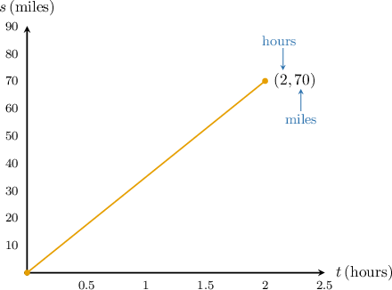
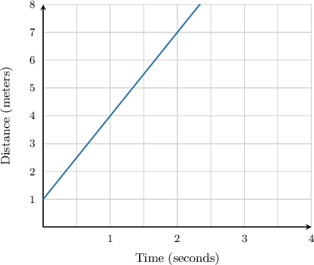
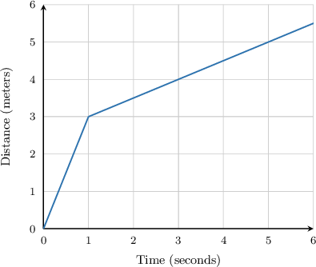
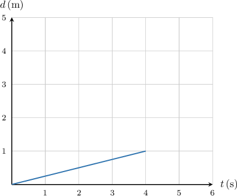
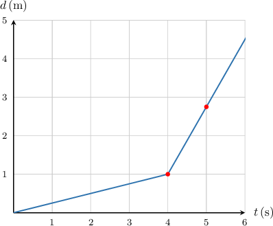

# Distance-Time Graphs

Source: https://www.mathacademy.com/topics/1589?courseId=113
Topic ID: 1589

## Prerequisites

- [Piecewise Functions](./165-piecewise-functions.md)
- [Analyzing and Interpreting Graphs of Linear Equations](./1588-analyzing-and-interpreting-graphs-of-linear-equations.md)
- [Speed as a Unit Rate](./3593-speed-as-a-unit-rate.md)

## Lesson

### Introduction

Suppose that Bobby and his dad took a -hour car trip from Boston to Rochester. The car was traveling at a constant speed, and they traveled miles.

We can represent this information visually using a **distance-time** graph, where distance is plotted as a function of time. To construct the distance-time graph, we use the given information to find two points on the graph.

- At time the distance they had traveled was miles. So, our graph will start at the point

- We also know that it took them hours to travel miles, so our graph will pass through the point

Now, we plot these two points and connect them to form a line.

This is our distance-time graph! Its slope represents the **speed** of the car:

The units of speed are units of distance (miles) divided by units of time (hours). Therefore, the speed of the car is

We can also use the slope to write the equation of the line. In slope-intercept form, the line can be written as

We know that the -intercept is and the slope is So, the equation of the line is or more simply,

### Example: Calculating the Speed of an Object

#### Question

The graph above shows the distance traveled by a cyclist on a road over a period of $4$ seconds. What was the speed of the cyclist?

#### Explanation

The slope of the distance-time graph gives the speed. So, to compute the speed of the cyclist, we need to find its slope.

This line begins at $(0,1)$ and also contains the point $(2,7).$ So, we can find the speed by computing the slope as follows:

$$

\begin{aligned}𝑚 & =\frac{𝑦_{2}−𝑦_{1}}{𝑥_{2}−𝑥_{1}} \\ & =\frac{7 meters−1 meter}{2 seconds−0 seconds} \\ & =3 meters/second\end{aligned}

$$

Therefore, the speed of the cyclist was $3\,\textrm{m/s}.$

### Example: Cases When the Speed Varies

#### Question

The graph above shows the displacement of an eagle over a period of time. What was the speed of the eagle at time $t=4?$

#### Explanation

The slope of the distance-time graph gives the speed. However, the distance-time graph is composed of two lines with different slopes. The speed of the eagle changed at $t=1$ seconds.

We are interested in the eagle's speed at $t=4$ seconds. This corresponds to the second line. This line begins at $(1,3)$ and also contains the point $(5,5).$ So, we can find the speed by computing the slope as follows:

$$

\begin{aligned}𝑚 & =\frac{𝑦_{2}−𝑦_{1}}{𝑥_{2}−𝑥_{1}} \\ & =\frac{5 meters−3 meters}{5 seconds−1 second} \\ & =\frac{2 meters}{4 seconds} \\ & =\frac{1}{2} meters/second\end{aligned}

$$

Therefore, at $t=4,$ the speed of the eagle was $\dfrac12\,\textrm{m/s}.$

### Example: Sketching a Distance-Time Graph

#### Question

A moving object travels at a speed of $0.25 \, \textrm{m/s}$ during the first four seconds and at $1.75 \, \textrm{m/s}$ after that. Draw the corresponding distance-time graph.

#### Explanation

We start the first line from the point $(0,0).$ Since the speed of the object during the first four seconds was $0.25 \, \textrm{m/s}$, the object covered a distance of $d=0.25\cdot 4 = 1 \, \textrm{m}.$ So, the first line goes from $(0,0)$ to $(4,1).$

We start the second line where the first line left off, at $(4,1).$ The speed of the object is now $1.75 \, \textrm{m/s},$ so if the object travels for one additional second, then it covers an additional distance of $1.75 \textrm{m}.$

The object has now traveled for a total time of $4\textrm{s}+1\textrm{s}=5\textrm{s}$ and covered a total distance of $1\textrm{m}+1.75\textrm{m}=2.75\textrm{m}.$ So, we have another point $(5,2.75).$

Finally, we draw the line from the point $(4,1)$ through the point $(5,2.75).$

