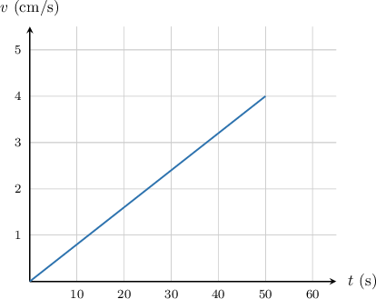
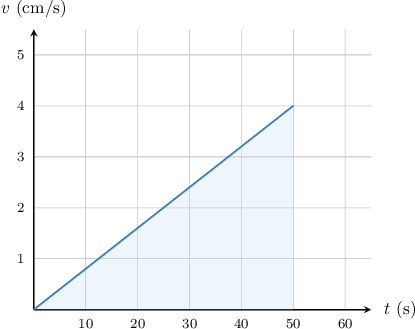
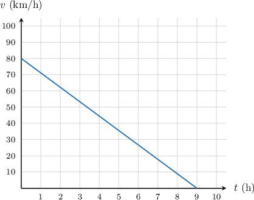
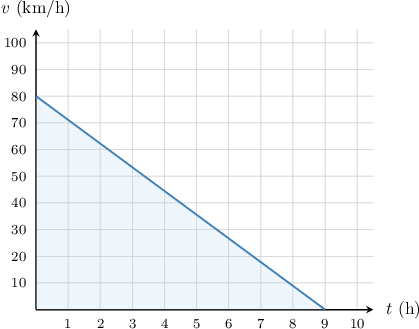
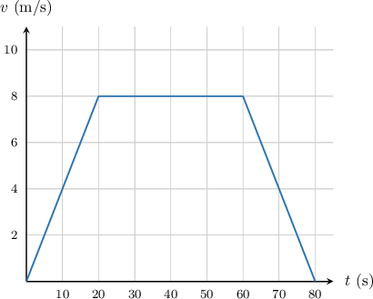
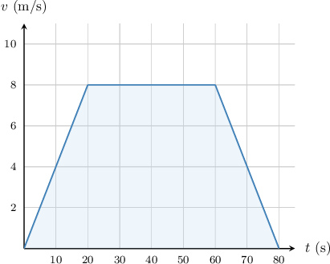
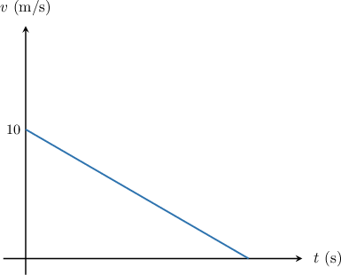
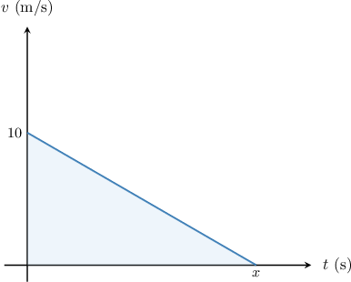
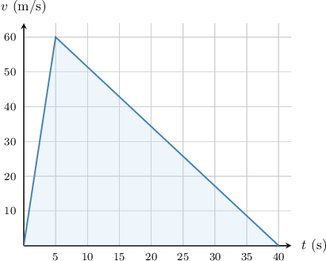

# Calculating Distance From a Speed-Time Graph

Source: https://www.mathacademy.com/topics/1590?courseId=113
Topic ID: 1590

## Prerequisites

- [Areas of Trapezoids](./1353-areas-of-trapezoids.md)
- [Speed-Time Graphs](./2327-speed-time-graphs.md)

## Lesson

### Introduction

The speed-time graph below represents the motion of a subatomic particle over a period of $50$ seconds. We will use this graph to find the total distance covered by the particle during this period.

In a speed-time graph, the distance covered by an object is equal to the area below the graph and above the $t$-axis. In this case, the required area is a triangle:

The area of a triangle with base $b$ and height $h$ is given by

$$

\mathcal{A} = \dfrac{b\cdot h}{2}.

$$

In our case, $b=50\,\textrm{s}$ and $h=4\,\textrm{cm/s}.$ Therefore, the area under the graph is

$$

\begin{aligned}A & =\frac{𝑏⋅ℎ}{2} \\ & =\frac{50⋅4}{2} \\ & =\frac{200}{2} \\ & =100.\end{aligned}

$$

This means the subatomic particle covered a total distance of $100 \,\textrm{cm}.$

To understand why the area represents the distance traveled, we can consider the units of each of the variables in the area equation:

- the base $(b)$ of the triangle has units of seconds, and

- the height $(h)$ of the triangle has units of centimeters per second.

If we include these units in our area calculation, they cancel out to give centimeters, which is a unit of distance.

$$

\begin{aligned}A & =\frac{𝑏⋅ℎ}{2} \\ & =\frac{1}{2}(50 s)(4 cm/s) \\ & =\frac{1}{2}⋅50⋅4⋅s⋅\frac{cm}{s} \\ & =25⋅4⋅s⋅\frac{cm}{s} \\ & =100\,cm\end{aligned}

$$

### Example: Calculating the Area Under a Triangular Speed-Time Graph

#### Question

The speed-time graph shows the motion of an object during the time interval from $t=0$ to $t=9$ hours. What is the total distance covered by the moving object?

#### Explanation

In a speed-time graph, the distance traveled is equal to the area under the graph.

In this case, the area that we need to calculate is the area of a right triangle.

The area of a triangle is given by the formula

$$

A = \dfrac{bh}{2},

$$

where $b$ is a base and $h$ is a corresponding height.

In this case, we have the following:

- The base of the triangle is $b=9.$

- The height of the triangle is $h=80.$

We substitute these values into the area formula and compute:

$$

\begin{aligned}𝐴 & =\frac{80⋅9}{2} \\ & =\frac{720}{2} \\ & =360\end{aligned}

$$

So, the distance covered by the object is $360\,\textrm{km}.$

### Example: Calculating the Area Under a Trapezoidal Speed-Time Graph

#### Question

The speed-time graph below represents the motion of an object during the time interval from $t=0$ to $t=80$ seconds. What is the total distance covered by the moving object?

#### Explanation

In a speed-time graph, the distance traveled is equal to the area under the graph.

In this case, the area that we need to calculate is the area of a trapezoid.

The area of a trapezoid is given by the formula

$$

A = \dfrac{(a+b)h}{2},

$$

where $a$ and $b$ are the bases, and $h$ is the height.

In this case, we have the following:

- The bottom base of the trapezoid is $a=80.$

- The top base of the trapezoid is $b=60-20=40.$

- The height of the trapezoid is $h=8.$

We substitute these values into the area formula and compute:

$$

\begin{aligned}𝐴 & =\frac{(80+40)⋅8}{2} \\ & =\frac{120⋅8}{2} \\ & =480\end{aligned}

$$

So, the distance covered by the object is $480$ meters.

### Example: Solving for Some Missing Information in a Speed-Time Graph

#### Question

A car starts to decelerate from an initial speed of $10\,\textrm{m/s}$ until it comes to rest. The speed-time graph illustrates the motion of the car. If the total distance covered by the car was $80$ meters, how long did it take for the car to stop?

#### Explanation

In a speed-time graph, the distance traveled is equal to the area under the graph.

The base of the triangle corresponds to the time it took for the car to stop. We do not know this quantity, so let's call it $x.$

The area of a triangle is given by the formula

$$

A = \dfrac{bh}{2},

$$

where $b$ is a base and $h$ is a corresponding height.

In this case, we have the following:

- The base of the triangle is $b=x.$

- The height of the triangle is $h=10.$

We substitute these values into the area formula and compute:

$$

\begin{aligned}𝐴 & =\frac{1}{2}𝑏ℎ \\ & =\frac{1}{2}⋅𝑥⋅10 \\ & =5𝑥\end{aligned}

$$

The distance traveled is $80$ meters and must be equal to the area of the shaded triangle. Therefore, we can solve for $x,$ as follows:

$$

\begin{aligned}80 & =5𝑥 \\ \frac{80}{5} & =𝑥 \\ 16 & =𝑥\end{aligned}

$$

Therefore, it took $16 \,\textrm{s}$ for the car to stop.

### Example: Constructing a Speed-Time Graph and Calculating the Distance Traveled

#### Question

An F1 racing car moves with constant acceleration during its first $5$ seconds of travel, changing its speed from $0\,\textrm{m/s}$ to $60\,\textrm{m/s}.$ Then, the car applies the brakes, decelerating at a constant rate before it comes to a stop $35$ seconds later. Calculate the total distance covered by the car.

#### Explanation

The distance covered by the car is the area below its speed-time graph. So, we first need to make a speed-time graph that illustrates the described situation.

- The graph starts at $(0,0),$ since the car starts at a speed of $0\,\textrm{m/s}.$

- After $5$ seconds, the speed of the car is $60 \textrm{m/s}.$ This corresponds to the point $(5,60).$

- After another $35$ seconds, the car stops. So, at $t=5+35=40$ seconds, the speed is $0 \textrm{m/s}.$ This corresponds to the point $(40,0).$

Connecting the points with line segments and shading the relevant area, we obtain the following graph:

In this case, the area that we need to calculate is the area of a triangle.

The area of a triangle is given by the formula

$$

A = \dfrac{bh}{2},

$$

where $b$ is a base and $h$ is a corresponding height.

In this case, we have the following:

- The base of the triangle is $b=40.$

- The height of the triangle is $h=60.$

We substitute these values into the area formula and compute:

$$

\begin{aligned}𝐴 & =\frac{𝑏ℎ}{2} \\ & =\frac{40⋅60}{2} \\ & =\frac{2\,400}{2} \\ & =1\,200\end{aligned}

$$

So, the distance covered by the car is $1\,200$ meters.
