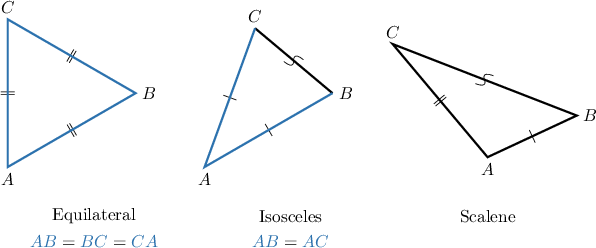
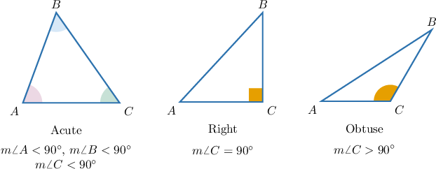
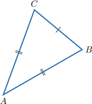
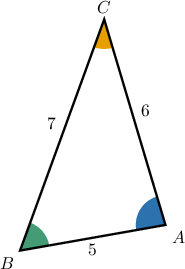
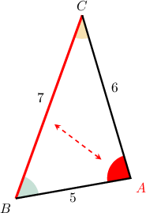
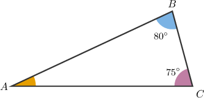
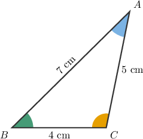

# Classifying Triangles

Source: https://www.mathacademy.com/topics/1601?courseId=113
Topic ID: 1601

## Prerequisites

- [Interior Angles of Triangles](./496-interior-angles-of-triangles.md)
- [Congruent Segments](./1462-congruent-segments.md)

## Lesson

### Introduction

Triangles can be classified by sides or by angles.

First, let's consider the classifications by sides. We have three groups of triangles:

- **Equilateral** triangles, where all sides have the same length.

- **Isosceles** triangles, where only two sides are congruent. The congruent sides are called the **legs** of the triangle, and the third side is called the **base**.

- **Scalene** triangles, where all sides have different measures.

### Classifying Triangles Based on Angles

Now, let's consider classifying triangles by angles. We have three groups of triangles.

- In an **acute** triangle, all three angles are acute.

- A triangle with a right angle is called a **right** triangle.

- A triangle with an obtuse angle is called an **obtuse** triangle.

### Example: Classifying a Triangle Based on Its Sides

#### Question

Classify the triangle shown below.

#### Explanation

In the triangle we see two congruent sides,

$$

\overline{AB} \cong \overline{AC},

$$

but the third side is not congruent:

$$

\overline{AB} \not\cong \overline{BC}.

$$

Therefore, since only two sides are congruent, $\triangle ABC$ is an isosceles triangle with base $\overline{BC}.$

### Example: Classifying a Triangle Based on Its Angles

#### Question

Given a triangle $\triangle ABC$, we know that $m\angle {B} = 20^{\circ}$ and $m\angle {C} = 3 m\angle {A}.$ Based on the angles, which type of triangle is $\triangle ABC?$

#### Explanation

Let $x$ be the measure of $\angle{A}.$ Then $m\angle {C}=3x.$

Since the sum of the interior angles is $180^{\circ}$, we have

$$

\begin{aligned}𝑚∠𝐴+𝑚∠𝐵+𝑚∠𝐶 & =180^{∘} \\ 𝑥+20^{∘}+3𝑥 & =180^{∘} \\ 4𝑥+20^{∘} & =180^{∘} \\ 4𝑥 & =160^{∘} \\ 𝑥 & =40^{∘}.\end{aligned}

$$

Therefore, $m\angle{A}=40^{\circ}$ and $m\angle {C}=3 \cdot 40^\circ = 120^{\circ}.$

So, $ABC$ is an obtuse triangle because it has an obtuse angle ($m\angle {C} > 90^{\circ}$).

### Relationships Between Sides and Interior Angles of a Triangle

Consider the following scalene triangle, where $AB=5$, $BC=7,$ and $AC=6$ units, respectively.

Looking at the angles, it's hard to tell which angle is the largest.

However, since we know the sides, there is a simple rule that we can use to determine the relative size of the angles:

Longer sides are opposite to larger angles and vice versa.

Applying this rule to $\triangle{ABC}$ depicted above, the longest side is $\overline{BC}.$ Therefore, the largest angle is the angle opposite to $\overline{BC},$ which is $\color{red}\angle{A}.$

Similarly,

- the mid-sized side ($\overline{AC}$) is opposite to the mid-sized angle ($\angle B$), and

- the shortest side ($\overline{AB}$) is opposite to the smallest angle ($\angle C$).

So, from least to greatest, the angles of the triangle are ordered as follows:

$$

m\angle{C} < m\angle{B} < m\angle{A}

$$

**Note:** This rule works in reverse too. If you know the biggest angle of a triangle, the longest side is always opposite to this angle.

### Example: Ordering the Sides of a Triangle by Size Given the Interior Angles

#### Question

Order the sides of the triangle $\triangle ABC$ above from the shortest to the longest.

#### Explanation

First, let's find the missing angle $\angle A.$ Since the interior angles of a triangle sum to $180^\circ,$ we have

$$

\begin{aligned}𝑚∠𝐴+80^{∘}+75^{∘} & =180^{∘} \\ 𝑚∠𝐴 & =180^{∘}−155^{∘} \\ 𝑚∠𝐴 & =25^{∘}.\end{aligned}

$$

So, we have $m\angle A < m\angle C < m\angle B.$

Since $\angle B$ is the largest angle, its opposite side $\overline{CA}$ must be the longest side of the triangle.

Since $\angle A$ is the smallest angle, its opposite side $\overline{BC}$ is the shortest side of the triangle.

So, we have

$$

BC < BA < CA

$$

and therefore the required order is

$$

\overline{BC}, \overline{BA}, \overline{CA}.

$$

### Example: Ordering the Angles of a Triangle by Size Given the Sides

#### Question

Order the angles of the triangle $\triangle ABC$ from smallest to largest.

#### Explanation

The shortest side is $\overline{BC},$ so the smallest interior angle is $\angle{A}.$

The longest side is $\overline{AB},$ which means that the opposite angle, $\angle C$, must be the largest one.

Therefore, the required order must be

$$

\angle A,\, \angle B,\, \angle C.

$$
