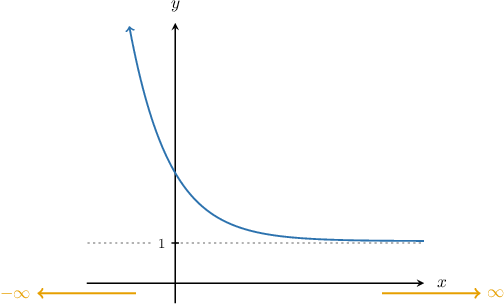
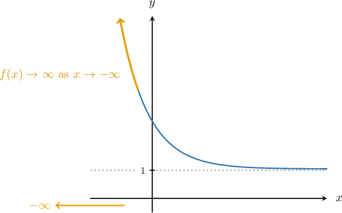
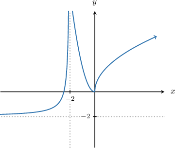
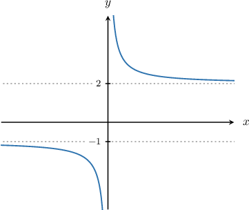

# End Behavior of Functions

Source: https://www.mathacademy.com/topics/2048?courseId=113
Topic ID: 2048

## Prerequisites

- [The Range of a Function](./754-the-range-of-a-function.md)

## Lesson

### Introduction

We are often interested in understanding how functions behave as their input becomes very large or very small. This is called the function's **end behavior.**

Consider the function $y=f(x)$ below.

The key to understanding the end behavior is to ask the following two questions:

1. What is the graph doing as $x$ becomes very large? ($x \to \infty$)

2. What is the graph doing as $x$ becomes very small? ($x \to -\infty$)

Let's now answer these questions.

- First, consider $x \to \infty.$ On the right of the graph, as $x$ gets larger and larger, the function value "levels off" to $1.$ In other words, as $x$ approaches "infinity," $f(x)$ approaches $1.$ We can express this using mathematical notation as follows:

- Now, consider $x \to -\infty.$ On the left of the graph, as $x$ gets more and more negative, the function does not "level off." Instead, the value of $f(x)$ grows larger and larger without bound. In other words, as $x$ approaches "negative infinity," $f(x)$ approaches "infinity." We can express this using mathematical notation as follows:

When determining a function's end behavior, we ignore anything happening in the middle of the graph, as this is irrelevant to a function's end behavior.

If the graph "levels off" in any of the two cases above, we've found a **horizontal asymptote**! In the example above, $y=1$ is a horizontal asymptote.

More formally, whenever $f(x)$ approaches some finite number $a$ as $x \rightarrow -\infty$ or $x \rightarrow \infty,$ we say that $y=a$ is a horizontal asymptote of the function $y=f(x).$

### Example: Determining Missing Values in End Behavior Statements

#### Question

The graph of the function $y = f(x)$ is given below. Find $a$ and $b$ such that $f(x) \rightarrow a$ as $x \rightarrow \infty$ and $f(x) \rightarrow b$ as $x \rightarrow -\infty.$

#### Explanation

- On the right of the graph, we see that as $x$ gets larger and larger, the function $f(x)$ grows larger and larger without bound (as indicated by the arrow). We can express this as follows: Therefore, $a = \infty.$

- On the left of the graph, we see that as $x$ gets more and more negative, the function $f(x)$ levels off to the value of $-2.$ We can express this as follows: Therefore, $b = -2.$

### Example: Determining Horizontal Asymptotes of Functions

#### Question

Which of the following statements are true for the graph shown below?

1. $y=2$ is a horizontal asymptote of $f(x)$

2. $f(x) \rightarrow -1$ as $x \rightarrow -\infty$

3. $y=0$ is a horizontal asymptote of $f(x)$

#### Explanation

Let's analyze each statement one-by-one.

- On the right side of the graph, we see that as $x$ gets larger and larger, the function $f(x)$ levels off to the value of $2.$ Symbolically, This means that $y=2$ is a horizontal asymptote of $f.$ Therefore, I is true.

- On the left side of the graph, we see that as $x$ gets more and more negative, the function $f(x)$ levels off to the value of $-1.$ Symbolically, Therefore, II is also true.

- The horizontal asymptotes of $f(x)$ are $y=2$ and $y=-1$. The line $y=0$ is not a horizontal asymptote because the function does not level off to $0$ on the right nor on the left. Therefore, III is false.

As a result, the correct answer is "I and II only".
