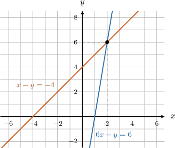
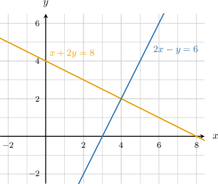
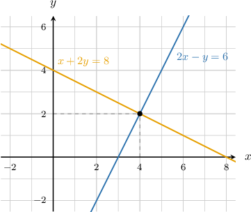
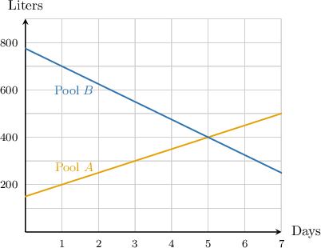
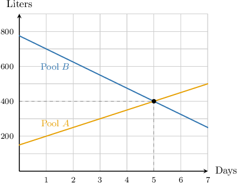

# Introduction to Systems of Linear Equations

Source: https://www.mathacademy.com/topics/2225?courseId=113
Topic ID: 2225

## Prerequisites

- [Graphing Linear Equations](./95-graphing-linear-equations.md)

## Lesson

### Introduction

Suppose that we want to know the values of $x$ and $y$ that satisfy *both* of the equations

$$

\begin{aligned}𝑥−𝑦=−4 \\ 6𝑥−𝑦=6.\end{aligned}

$$

We call this a **system of linear equations**. The equations of the system define two straight lines, so we can visualize the system by plotting both lines on the same graph.

The solution of the system corresponds to the point where the two lines intersect. In this case, it is the point $(2,6)$, as shown above. So $x=2$ and $y=6$ form the **solution** to the system. We can write the solution as the ordered pair $(2, 6).$

Whenever we find a solution to a system of equations, it is a good idea to double-check our result. To check that the solution $x=2,y=6$ is the correct solution, we substitute our solution into *both* of the equations.

Let's check the first equation.

$$

\begin{aligned}𝑥−𝑦 & \,=\,−4 \\ (2)−(6) & =−4 \\ −4 & =−4\,✓\end{aligned}

$$

Now we check the second equation:

$$

\begin{aligned}6𝑥−𝑦 & \,=\,6 \\ 6(2)−6 & =6 \\ 6 & =6\,✓\end{aligned}

$$

Since $x=2$ and $y=6$ satisfied *both* equations, it is indeed the solution to the system of equations.

### Example: Finding the Solution to a System From Its Graph

#### Question

Consider the following system of equations:

$$

\begin{aligned}𝑥+2𝑦=8 \\ 2𝑥−𝑦=6\end{aligned}

$$

Use the diagram below to determine this system's solution $(x,y)$.

#### Explanation

The solution of the system corresponds to the point of intersection of the lines.

In this case, we have the point $(4,2).$ Therefore, the solution to the given system is $(4,2).$

### Example: Word Problems

#### Question

The graph above shows the number of liters of water in pool $A$ and pool $B$ as a function of time, measured in days. How many days will it take for both pools to contain the same amount of water?

#### Explanation

The pools have the same amount of water when the two graphs intersect.

In this case, we have the point $(5,400).$ So, both pools have the same amount ($400\,\textrm{L}$) of water at $t=5$ days.
