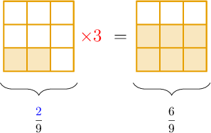

# Multiplying Fractions by Whole Numbers

Source: https://www.mathacademy.com/topics/2360?courseId=113
Topic ID: 2360

## Prerequisites

- [Converting Mixed Numbers to Improper Fractions](../../../elementary-school/lessons/grade-4/3901-converting-mixed-numbers-to-improper-fractions.md)
- [Multiplying Fractions by Whole Numbers Using Models](./3968-multiplying-fractions-by-whole-numbers-using-models.md)

## Lesson

### Introduction

We can use models to multiply fractions by whole numbers. But can we do this without using models?

As it turns out, models give us vital clues on how this should be done!

To demonstrate, let's take a look at the fraction model for $\dfrac 2 9 \times 3\mathbin{:}$

In the answer, we end up with ${\color{blue}{2}}\times {\color{red}{3}} = 6$ parts, and the denominator remains the same. This is always the case.

Therefore, to multiply a fraction by a whole number, we follow the following steps:

**Step 1**: We multiply the numerator by the whole number.

**Step 2**: We keep the denominator the same.

Using these steps, we can figure out the answer without using models:

$$

\dfrac{\color{blue}2}{9}{\color{red}\,\times 3\,} = \dfrac{{\color{blue}{2}}{\color{red}\,\times 3\,}}{9} = \dfrac{6}{9}

$$

### Example: Multiplying a Fraction by a Whole Number

#### Question

Find the value of $5\times \dfrac{1}{12}.$

#### Explanation

To multiply a fraction by a whole number, we multiply the fraction's numerator by the whole number and keep the denominator the same:

$$

5\times \dfrac{1}{12}= \dfrac{5\times 1}{12} = \dfrac{5}{12}

$$

### Example: Multiplying a Fraction by a Whole Number Resulting in a Whole Number

#### Question

Multiply $\dfrac{2}{3}\times 3.$

#### Explanation

To multiply a fraction by a whole number, we multiply the fraction's numerator by the whole number and keep the denominator the same:

$$

\dfrac{2\times 3}{3} = \dfrac{6}{3}

$$

Finally, we simplify this fraction by interpreting $\dfrac 6 3$ as a division:

$$

6\div 3 =2

$$

### Example: Multiplying a Fraction by a Whole Number With Simplification

#### Question

Multiply $\dfrac{1}{6}\times 4.$

#### Explanation

To multiply a fraction by a whole number, we multiply the fraction's numerator by the whole number and keep the denominator the same:

$$

\dfrac{1\times 4}{6} = \dfrac{4}{6}

$$

To simplify this fraction, we can divide the numerator and denominator by $2\mathbin{:}$

$$

\dfrac{4\div 2}{6\div 2} = \dfrac{2}{3}

$$

### Example: Multiplying a Fraction by a Whole Number Resulting in a Mixed Number

#### Question

Find the value $9\times\dfrac 3 {4}$ as a mixed number.

#### Explanation

To multiply a fraction by a whole number, we multiply the fraction's numerator by the whole number and keep the denominator the same:

$$

9\times \dfrac{3}{4} = \dfrac{9\times 3}{4} = \dfrac{27}{4}

$$

We now convert this to a mixed number:

$$

27\div 4 = 6\,\text{R} 3 = 6\,\dfrac{3}{4}

$$
