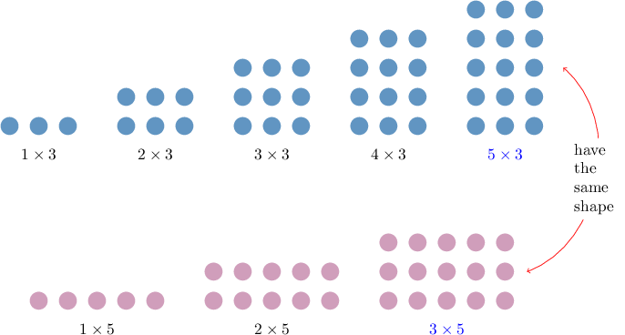

# Least Common Multiples

Source: https://www.mathacademy.com/topics/2440?courseId=113
Topic ID: 2440

## Prerequisites

- [The Multiples of a Number](../../../elementary-school/lessons/grade-4/2206-the-multiples-of-a-number.md)

## Lesson

### Introduction

The **least common multiple** of two numbers is the smallest value that is a multiple of both the numbers.

To illustrate, let's find the least common multiple of $3$ and $5.$

We start by listing the multiples of each number. Then we find the smallest number that appears in both lists.

- Multiples of $3\mathbin{:}$ $\quad 3, 6, 9, 12, {\color{blue}15}, \ldots$

- Multiples of $5\mathbin{:}$ $\quad 5, 10, {\color{blue}15}, 20, \ldots$

We conclude that the least common multiple of $3$ and $5$ is ${\color{blue}{15}}.$

We can visualize the least common multiple of $3$ and $5$ using a diagram like the one below.

### Example: Finding the Least Common Multiple of Two One-Digit Numbers

#### Question

Find the least common multiple of $3$ and $7.$

#### Explanation

First, we list the multiples of each number. Then, we find the smallest number that appears in both lists.

- Multiples of $3\mathbin{:}$ $\quad 3, 6, 9, 12, 15, 18, {\color{blue}21}, \ldots$

- Multiples of $7\mathbin{:}$ $\quad 7, 14, {\color{blue}21}, 28, \ldots$

We conclude that the least common multiple of $3$ and $7$ is ${\color{blue}{21}}.$

### Example: Finding the Least Common Multiple of a One-Digit and Two-Digit Number

#### Question

Determine the least common multiple of $6$ and $10.$

#### Explanation

First, we list the multiples of each number. Then, we find the smallest number that appears in both lists.

- Multiples of $6\mathbin{:}$ $\quad 6, 12, 18, 24, {\color{blue}30}, \ldots$

- Multiples of $10\mathbin{:}$ $\quad 10, 20, {\color{blue}30}, 40, \ldots$

We conclude that the least common multiple of $6$ and $10$ is ${\color{blue}{30}}.$

### Example: Finding the Least Common Multiple of Two Numbers: Word Problems

#### Question

Mathias and Bill both washed their cars today. Mathias washes his car every $8$ days, while Bill washes his car every $10$ days. How often do Mathias and Bill both wash their cars on the same day?

#### Explanation

We can solve this problem by finding the least common multiple of $8$ and $10.$

First, we list the multiples of $8$ and $10.$ Then, we find the smallest number that appears in both lists.

- Multiples of $8\mathbin{:}$ $\quad 8, 16, 24, 32, {\color{blue}40}, \ldots$

- Multiples of $10\mathbin{:}$ $\quad 10, 20, 30, {\color{blue}40}, \ldots$

The least common multiple of $8$ and $10$ is ${\color{blue}{40}}.$ Therefore, Mathias and Bill wash their cars on the same day every $40$ days.

### Example: Finding the Least Common Multiple of Three Numbers

#### Question

Determine the least common multiple of $3,$ $6,$ and $8.$

#### Explanation

First, we list the multiples of each number. Then, we find the smallest number that appears in all three lists.

- Multiples of $3\mathbin{:}$ $\quad 3, 6, 9, 12, 15, 18, 21, {\color{blue}24}, 27 \ldots$

- Multiples of $6\mathbin{:}$ $\quad 6, 12, 18, {\color{blue}24}, 30 \ldots$

- Multiples of $8\mathbin{:}$ $\quad 8, 16, {\color{blue}24}, 32 \ldots$

We conclude that the least common multiple of $3,$ $6,$ and $8$ is ${\color{blue}{24}}.$
