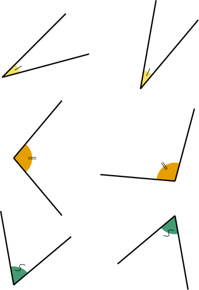
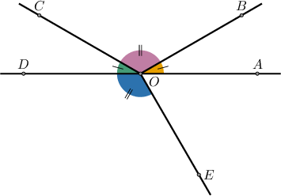
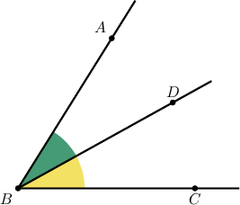

# Congruent Angles

Source: https://www.mathacademy.com/topics/3554?courseId=113
Topic ID: 3554

## Prerequisites

- [Solving Linear Equations With Variables on Both Sides](./343-solving-linear-equations-with-variables-on-both-sides.md)
- [Sums of Angles](./1505-sums-of-angles.md)
- [Measuring Angles Using a Protractor](./3980-measuring-angles-using-a-protractor.md)

## Lesson

### Introduction

Two angles are **congruent** if their measures are equal.

For example, if

$$

m\angle X =50^\circ \quad \text{and} \ \quad m\angle Y=50^\circ,

$$

then $\angle X$ and $\angle Y$ are congruent. We can express this as

$$

\angle X \cong \angle Y.

$$

However, if

$$

m\angle X =50^\circ \quad \text{and} \ \quad m\angle Z = 110^\circ,

$$

then $\angle X$ and $\angle Z$ are *not* congruent, and we write

$$

\angle X \ncong \angle Z.

$$

We represent congruent angles by marking the arcs with the same symbol. For example, three pairs of congruent angles are shown below:

### Example: Identifying Congruent Angles Given Measures of Angles

#### Question

From the information given below, find all of the angles that are congruent.

$$

\begin{aligned}𝑚∠𝐴 & =10^{∘}, \\ 𝑚∠𝐵 & =40^{∘}, \\ 𝑚∠𝐶 & =80^{∘}, \\ 𝑚∠𝐷 & =90^{∘}−𝑚∠𝐶, \\ 𝑚∠𝐸 & =𝑚∠𝐵.\end{aligned}

$$

#### Explanation

First, let's find the measures of $\angle D$ and $\angle E\mathbin{:}$

$$

\begin{aligned}𝑚∠𝐷 & =90^{∘}−𝑚∠𝐶 \\ & =90^{∘}−80^{∘} \\ & =10^{∘} \\ & \\ 𝑚∠𝐸 & =𝑚∠𝐵 \\ & =40^{∘}\end{aligned}

$$

So, we have:

$$

\begin{aligned}𝑚∠𝐴 & =10^{∘} \\ 𝑚∠𝐵 & =40^{∘} \\ 𝑚∠𝐶 & =80^{∘} \\ 𝑚∠𝐷 & =10^{∘} \\ 𝑚∠𝐸 & =40^{∘}\end{aligned}

$$

We have that $m \angle A = m \angle D$ and $m \angle B = m \angle E.$

Therefore, $\angle A \cong \angle D$ and $\angle B \cong \angle E.$

### Example: Using Markings to Denote Congruent Angles

#### Question

Which of the following statements are true regarding the angles shown below?

1. $\angle AOB \cong \angle COD$

2. $\angle COD \cong \angle BOC$

3. $m\angle BOC = m\angle DOE$

#### Explanation

From the diagram, we see that

- $\angle AOB$ and $\angle COD$ are each marked with a single hash mark "$|$," while

- $\angle BOC$ and $\angle DOE$ are each marked with a double hash mark "$||.$"

Therefore,

$$

\begin{aligned}∠𝐴𝑂𝐵 & ≅∠𝐶𝑂𝐷 \\ ∠𝐵𝑂𝐶 & ≅∠𝐷𝑂𝐸.\end{aligned}

$$

Consequently, we have

$$

\begin{aligned}𝑚∠𝐴𝑂𝐵 & =𝑚∠𝐶𝑂𝐷 \\ 𝑚∠𝐵𝑂𝐶 & =𝑚∠𝐷𝑂𝐸.\end{aligned}

$$

So statements I and III are true, while statement II is false.

### Example: Solving Problems Involving Congruent Angles

#### Question

In the figure above, $m \angle CBD = 5x - 5^\circ$ and $m \angle ABD =2x + 10^\circ.$ If $\angle CBD \cong \angle ABD$, find $m \angle ABC.$

#### Explanation

Since $\angle CBD \cong \angle ABD$, we have

$$

\begin{aligned}𝑚∠𝐶𝐵𝐷 & =𝑚∠𝐴𝐵𝐷 \\ 5𝑥−5^{∘} & =2𝑥+10^{∘} \\ 5𝑥 & =2𝑥+15^{∘} \\ 3𝑥 & =15^{∘} \\ 𝑥 & =5^{∘}.\end{aligned}

$$

Therefore, the measure of $\angle CBD$ is

$$

m \angle CBD = 5x - 5^\circ = 5 \cdot 5^\circ - 5^\circ = 20^\circ.

$$

So, by the angle addition postulate,

$$

\begin{aligned}𝑚∠𝐴𝐵𝐶 & =𝑚∠𝐶𝐵𝐷+𝑚∠𝐴𝐵𝐷 \\ & =𝑚∠𝐶𝐵𝐷+𝑚∠𝐶𝐵𝐷 \\ & =2⋅𝑚∠𝐶𝐵𝐷 \\ & =2⋅20^{∘} \\ & =40^{∘}.\end{aligned}

$$
