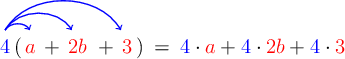
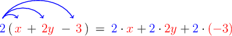

# The Distributive Law With Three Terms

Source: https://www.mathacademy.com/topics/3847?courseId=113
Topic ID: 3847

## Prerequisites

- [Applying the Distributive Law With Linear Expressions](./135-applying-the-distributive-law-with-linear-expressions.md)

## Lesson

### Introduction

The **distributive law** states that multiplying a group of terms by a number is the same as multiplying each term separately by that same number and adding the products.

The distributive law works no matter how many terms are inside the parentheses.

For example, let's take a look at the following expression:

$$

4(a+2b+3)

$$

We can expand this expression using the distributive law:

Therefore,

$$

\begin{aligned}4(𝑎+2𝑏+3) & = \\ 4⋅𝑎+4⋅2𝑏+4⋅3 & = \\ (4𝑎)+(8𝑏)+(12) & = \\ 4𝑎+8𝑏+12 & \end{aligned}

$$

The distributive law also applies when the multiplication occurs on the right of the parentheses. Let's see an example.

### Example: Distributing a Positive Number Over a Sum

#### Question

Expand $(3p + 4q + 2)\cdot 5$

#### Explanation

Using the distributive law, we multiply each term inside the parentheses by the number $5\mathbin{:}$

$$

\begin{aligned}(3𝑝+4𝑞+2)⋅5 & = \\ 3𝑝⋅5+4𝑞⋅5+2⋅5 & = \\ (15𝑝)+(20𝑞)+(10) & = \\ 15𝑝+20𝑞+10 & \end{aligned}

$$

### Dealing With Minus Signs Inside the Parentheses

The distributive law also works when there is subtraction inside the parentheses.

For example, we can expand the expression $2(x+2y-3)$ as follows:

Notice that we keep plus signs ($+$) between the three terms. This helps us to avoid mistakes when multiplying with negative numbers.

Now, evaluating our expression, we have

$$

\begin{aligned}2(𝑥+2𝑦−3) & = \\ 2⋅𝑥+2⋅2𝑦+2⋅(−3) & = \\ (2𝑥)+(4𝑦)+(−6) & = \\ 2𝑥+4𝑦−6 & \end{aligned}

$$

### Example: Distributing a Positive Number Over Sums and Differences

#### Question

Expand $4(5+4a-2b)$

#### Explanation

Using the distributive law, we multiply each term inside the parentheses by the number $4\mathbin{:}$

$$

\begin{aligned}4(5+4𝑎−2𝑏) & = \\ 4⋅5+4⋅(4𝑎)+4⋅(−2𝑏) & = \\ (20)+(16𝑎)+(−8𝑏) & = \\ 20+16𝑎−8𝑏 & = \\ 16𝑎−8𝑏+20 & \end{aligned}

$$

### Example: Distributing a Negative Number Over Sums and Differences

#### Question

Expand $(3x - 5y + 1) \cdot (-4).$

#### Explanation

Using the distributive law, we multiply each term inside the parentheses by the number $(-4)\mathbin{:}$

$$

\begin{aligned}(3𝑥−5𝑦+1)⋅(−4) & = \\ 3𝑥⋅(−4)+(−5𝑦)⋅(−4)+1⋅(−4) & = \\ (−12𝑥)+(20𝑦)+(−4) & = \\ −12𝑥+20𝑦−4 & \end{aligned}

$$
