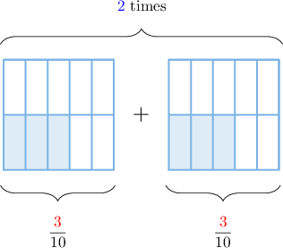
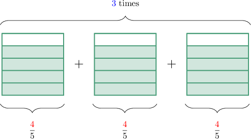
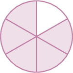
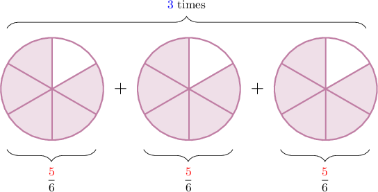
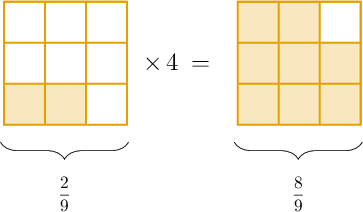
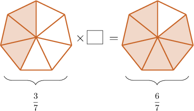

# Multiplying Fractions by Whole Numbers Using Models

Source: https://www.mathacademy.com/topics/3968?courseId=113
Topic ID: 3968

## Prerequisites

- [Multiplying Unit Fractions by Whole Numbers Using Models](./564-multiplying-unit-fractions-by-whole-numbers-using-models.md)

## Lesson

### Introduction

We can use our knowledge of fraction models to multiply fractions by whole numbers.

For example, let's consider the following product:

$$

\dfrac{3}{10} \times 2.

$$

We start by drawing a fraction model for $\dfrac{3}{10}{:}$

Multiplying $\dfrac{\color{red}3}{10}$ by $\color{blue}2$ means that we need to repeat the fraction $\color{blue}2$ times.

Now, we count the number of shaded pieces.

There are ${\color{red}3} \times {\color{blue}2} = 6$ shaded pieces in total. Therefore,

$$

\dfrac{3}{10} \times 2 = \dfrac{6}{10}.

$$

### Example: Representing a Product as a Repeated Addition

#### Question

Consider the diagram above. Write down this multiplication as a repeated addition of fraction models.

#### Explanation

In the model, we have $\dfrac{\color{red}4}{5}$ multiplied by ${\color{blue}3}.$ This means that we need to make $\color{blue}3$ copies of the given fraction model.

So, the missing picture is:

### Example: Multiplying a Fraction by a Whole Number Using Repeated Addition

#### Question

Use the model above to calculate $\dfrac{5}{6} \times 3.$

#### Explanation

Since we need to multiply $\dfrac{\color{red}5}{6}$ by $\color{blue}3$, we repeat the fraction model $\color{blue}3$ times, as shown below.

There are ${\color{red}5} \times {\color{blue}3} = 15$ shaded pieces in total. Therefore:

$$

\dfrac{5}{6} \times 3 = \dfrac{15}{6}

$$

### A Faster Method for Multiplying Fractions by Whole Numbers

There's another way we can use fraction models to multiply fractions by whole numbers.

To demonstrate, let's consider the following multiplication problem:

$$

\dfrac{2}{9} \times 4

$$

We start by drawing a fraction model to represent $\dfrac{2}{9}.$

Now, rather than repeating our model $4$ times (which would take a long time), we can instead multiply the number of shaded pieces by $4.$

Our model has $2$ shaded pieces. So, the resulting model must have $2 \times 4 = 8$ shaded pieces:

Therefore, we conclude that

$$

\dfrac{2}{9}\times 4 = \dfrac{8}{9}.

$$

### Example: Multiplying a Fraction by a Whole Number by Repeating the Shaded Parts

#### Question

What number is missing from the multiplication problem above?

#### Explanation

We have $\dfrac{3}{7}$ on the left and $\dfrac{6}{7}$ on the right.

The shape on the left has $3$ shaded pieces, and the shape on the right has $6$ shaded pieces. So the number of shaded pieces has increased by a factor of ${\color{blue}2}.$ (That is, the number of shaded pieces has been multiplied by ${\color{blue}2}.$)

Therefore, the multiplication problem shown is

$$

\dfrac{3}{7} \times {\color{blue}2} = \dfrac{6}{7}.

$$

So, the missing number is ${\color{blue}2}.$
