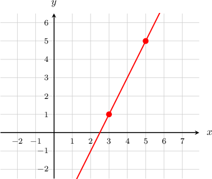

# Equations of Lines in Point-Slope Form

Source: https://www.mathacademy.com/topics/418?courseId=113
Topic ID: 418

## Prerequisites

- [Simplifying Linear Expressions Using the Distributive Law](./138-simplifying-linear-expressions-using-the-distributive-law.md)
- [Equations of Lines in Slope-Intercept Form](./1240-equations-of-lines-in-slope-intercept-form.md)

## Lesson

### Introduction

The **point-slope form** of a line that passes through any point $(x_1,y_1)$ with slope $m$ is given by

$$

y - y_1 = m(x-x_1).

$$

For example, consider the straight line graph which passes through the points $(3,1)$ and $(5,5)$, as shown below.

We know that the line passes through the point $(3,1),$ so we can use $(x_1,y_1) = (3,1)$ in our point-slope formula. All that remains is to compute $m,$ and we can do this using the given points.

First, calculate the slope $m$ using the given points:

$$

\begin{aligned}𝑚=\frac{𝑦_{2}−𝑦_{1}}{𝑥_{2}−𝑥_{1}}=\frac{5−1}{5−3}=\frac{4}{2}=2\end{aligned}

$$

Then, we substitute $m=2$ and the point $(x_1,y_1) = (3,1)$ into the point-slope formula:

$$

\begin{aligned}𝑦−𝑦_{1} & =𝑚(𝑥−𝑥_{1}) \\ 𝑦−1 & =2(𝑥−3)\end{aligned}

$$

**Note:** If we simplify this point-slope formula, we obtain the slope-intercept form of the line:

$$

\begin{aligned}𝑦−1 & =2(𝑥−3) \\ 𝑦−1 & =2𝑥−6 \\ 𝑦 & =2𝑥−5\end{aligned}

$$

**Watch out!** We could put $(x_1,y_1)=(5,5).$ In this case, the point-slope form will be different:

$$

y-5=2(x-5)

$$

But the resulting simplified slope-intercept form will be the same:

$$

y = 2x-5

$$

### Example: Finding a Point-Slope Equation Given a Slope and a Point

#### Question

Find, in point-slope form, the equation of the line that passes through the point $(6,2)$ and has a slope of $4.$

#### Explanation

Using $m=4$ and $(x_1,y_1) = (6,2)$, we substitute into the point-slope formula:

$$

\begin{aligned}𝑦−𝑦_{1} & =𝑚(𝑥−𝑥_{1}) \\ 𝑦−2 & =4(𝑥−6)\end{aligned}

$$

### Example: Finding a Point-Slope Equation Given Two Points

#### Question

Find, in point-slope form, the equation of the straight line that passes through the points $(5,7)$ and $(1,-1).$

#### Explanation

We know that the line passes through the point $(5,7),$ so we can use $(x_1,y_1) = (5,7)$ in our point-slope formula. All that remains is to compute $m,$ and we can do this using the given points:

$$

\begin{aligned}𝑚=\frac{𝑦_{2}−𝑦_{1}}{𝑥_{2}−𝑥_{1}}=\frac{−1−7}{1−5}=\frac{−8}{−4}=2\end{aligned}

$$

Then, we substitute $m=2$ and the point $(x_1,y_1) = (5,7)$ into the point-slope formula:

$$

\begin{aligned}𝑦−𝑦_{1} & =𝑚(𝑥−𝑥_{1}) \\ 𝑦−7 & =2(𝑥−5)\end{aligned}

$$

### Example: Finding a Slope-Intercept Form Using Point-Slope Form

#### Question

Calculate the equation of the straight line that passes through the points $(1,10)$ and $(3,-2),$ giving your final answer in slope-intercept form.

#### Explanation

First, we will construct the point-slope formula for the line. Then, we will simplify the point-slope formula into slope-intercept form.

We start by computing the slope $m$ using the given points:

$$

\begin{aligned}𝑚=\frac{𝑦_{2}−𝑦_{1}}{𝑥_{2}−𝑥_{1}}=\frac{−2−10}{3−1}=\frac{−12}{2}=−6\end{aligned}

$$

Then, we substitute $m=-6$ and the point $(x_1,y_1) = (1,10)$ into the point-slope formula:

$$

\begin{aligned}𝑦−𝑦_{1} & =𝑚(𝑥−𝑥_{1}) \\ 𝑦−10 & =−6(𝑥−1)\end{aligned}

$$

Finally, we simplify the equation into slope-intercept form:

$$

\begin{aligned}𝑦−10 & =−6(𝑥−1) \\ 𝑦−10 & =−6𝑥+6 \\ 𝑦 & =−6𝑥+16\end{aligned}

$$
