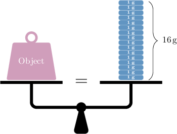

# Units of Mass

Source: https://www.mathacademy.com/topics/4196?courseId=113
Topic ID: 4196

## Prerequisites

- [Multiplying Fractions by Whole Numbers](./2360-multiplying-fractions-by-whole-numbers.md)

## Lesson

### Introduction

**Measuring** means finding a number that describes the size of something.

The **mass** of an object measures how much "stuff" (or **matter**) an object contains. The mass of an object is connected to its weight. We use **mass units** to specify an object's mass.

The most popular measurement system within the scientific community is the **metric system**. Within the metric system, the most common units of measurement are called **base units**.

The base unit of mass is the **gram,** which we denote using the symbol "$\text{g}$." The object below has a mass of exactly $1\,\textrm g.$

We can measure the mass of an object using **weighing scales.** To measure an object's mass, we first place it on one side of the weighing scales. Then, we put $1\,\textrm g$ masses on the other side until the scales balance perfectly.

In this example, we have an object on the left scale and sixteen $1\,\textrm g$ masses on the right scale. Since the scales are perfectly balanced, the object's mass is $16\,\textrm g.$

It's convenient to define new units of measurement from the base unit. The most common variations for mass units are shown below:

Let's give some examples of each unit, going from the largest (or "heaviest") unit $(\text{kg})$ to the smallest (or "lightest") unit $(\text{mg})$:

- A regular bag of sugar has a mass of around $1\,\text{kg}.$

- A single postage stamp has a mass of around $1\,\textrm g.$

- A single grain of sand has a mass of around $50\,\text{mg}.$

**Important**: Each metric symbol for mass ends in "$\text{g}$", the base unit.

### Example: Identifying Metric Units of Mass

#### Question

Suppose we want to measure the mass of an ant. Which of the following metric units could we use?

1. $\rm{m}$

2. $\rm{mg}$

3. $\rm{s}$

#### Explanation

A table showing the metric units of mass is given below.

Therefore, from the given options, the only unit of mass is $\text{mg}.$

### The Prefix System for Metric Units

Let's recall the table that relates metric units of mass.

**Important**: Symbols in the metric system follow a consistent set of **prefix rules**, which we explain below. If you find these difficult, *do not worry*! For now, you just need to remember the conversions shown in the table above.

The prefix rules are as follows:

- The prefix "$\textrm k$" stands for **kilo**, which means $1\,000$. Therefore, $1\,\text{kg} = 1\,000\,\text{g}.$

- The prefix "$\textrm m$" stands for **milli**, which means $\dfrac{1}{1,000}$. Therefore, $1\,\text{mg}=\dfrac{1}{1\,000}\,\text{g}.$ Notice that if we add $1\,\text{mg}$ to itself $1\,000$ times, we get exactly $1\,\text{g}{:}$ Therefore, $1\,000\,\text{mg}$ equals $1\,\text{g},$ as stated in the table.

### Example: Stating Mass Conversions in Metric Units

#### Question

A melon has a mass of $1\,\text{kg}.$ What is this mass in grams?

#### Explanation

A table showing the metric units of mass is given below.

So, $1\,\text{kg}$ is equivalent to $1\,000\,\text{g}.$

### Customary Units of Mass

Another way to measure mass is to use **customary units**. The most common customary units of mass are **ounce**, **pound**, and **ton**.

A table showing some of the most common customary mass units is shown below.

Let's give some examples of each unit, going from the largest unit $(\text{ton})$ to the smallest $(\text{oz})$:

- A small car could have a mass of around $1\,\text{ton}.$

- A small bag of rice has a mass of around $1\,\text{lb}.$

- A single slice of bread could have a mass of around $1\,\text{oz}.$

Customary units are not standard in the scientific community. However, they are commonly used in the United States and other countries.

### Example: Identifying Customary Units of Mass

#### Question

Suppose we want to measure the mass of a flat-screen TV. Which of the following customary units could we use?

1. $\text{yd}$

2. $\text{ft}$

3. $\text{lb}$

#### Explanation

A table showing the customary units of mass is given below.

Therefore, from the given options, the only unit of mass is $\text{lb}.$

### Example: Stating Mass Conversions in Customary Units

#### Question

An american bison has a mass of $1\,\text{ton}.$ What is this mass in pounds?

#### Explanation

A table showing the customary units of mass is given below.

So, $1\,\text{ton}$ is equivalent to $2,000\,\text{lb}.$
