# Corresponding Angles

Source: https://www.mathacademy.com/topics/421?courseId=113
Topic ID: 421

## Prerequisites

- [Solving Problems With Angles](./1437-solving-problems-with-angles.md)
- [Parallel and Perpendicular Lines](./3979-parallel-and-perpendicular-lines.md)

## Lesson

### Introduction

A line that crosses two parallel lines is called a **transversal**. For example, the line $\overset{\longleftrightarrow}{EF}$ in the diagram below is a transversal.

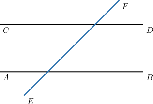

A pair of parallel lines with a transversal form a set of $8$ angles, shown below.

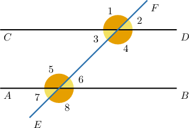

This set of eight angles can be grouped into two categories:

- We have four pairs of **vertical angles**:

- We also have four pairs of so-called **corresponding angles**: Corresponding pairs of angles are located in the same position as each other relative to the parallel lines and on the same side of the transversal. Pairs of corresponding angles are congruent.

### A Worked Example

Consider the following pair of parallel lines $\overset{\longleftrightarrow}{AB} \parallel \overset{\longleftrightarrow}{CD},$ and the transversal $\overset{\longleftrightarrow}{EF}.$

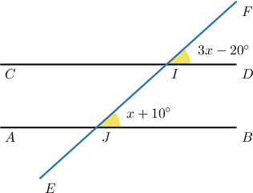

What is the value of $x?$

First, note that $\angle DIF$ and $\angle BJI$ are corresponding angles. Therefore, they are congruent and thus have the same measure. This means we can write down the following equation:

$$

\begin{aligned}𝑚∠𝐷𝐼𝐹 & =𝑚∠𝐵𝐽𝐼 \\ 3𝑥−20^{∘} & =𝑥+10^{∘}\end{aligned}

$$

To solve this equation, we first subtract $x$ from both sides:

$$

\begin{aligned}3𝑥−20^{∘} & =𝑥+10^{∘} \\ 3𝑥−20^{∘}−𝑥 & =𝑥+10^{∘}−𝑥 \\ 2𝑥−20^{∘} & =10^{∘}\end{aligned}

$$

Then, we add $20^\circ$ to both sides:

$$

\begin{aligned}2𝑥−20^{∘} & =10^{∘} \\ 2𝑥−20^{∘}+20^{∘} & =10^{∘}+20^{∘} \\ 2𝑥 & =30^{∘}\end{aligned}

$$

Finally, we divide both sides by $2{:}$

$$

\begin{aligned}2𝑥 & =30^{∘} \\ \frac{2𝑥}{2} & =\frac{30^{∘}}{2} \\ \frac{2𝑥}{2} & =15^{∘} \\ 𝑥 & =15^{∘}\end{aligned}

$$

Therefore, $x=15^\circ.$

### Example: Problems Involving an Unknown Corresponding Angle

#### Question

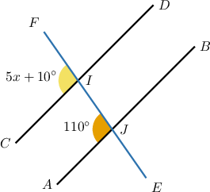

Solve for $x$ in the figure above given that $\overset{\longleftrightarrow}{AB} \parallel \overset{\longleftrightarrow}{CD}.$

#### Explanation

Since the angles $\angle{CIF}$ and $\angle{AJI}$ are corresponding angles, they are congruent and therefore have the same measure:

$$

\begin{aligned}𝑚∠𝐶𝐼𝐹 & =𝑚∠𝐴𝐽𝐼 \\ 5𝑥+10^{∘} & =110^{∘}\end{aligned}

$$

Now, we have an equation that we can solve for $x\mathbin{:}$

$$

\begin{aligned}5𝑥+10^{∘} & =110^{∘} \\ 5𝑥 & =100^{∘} \\ \frac{5𝑥}{5} & =\frac{100^{∘}}{5} \\ \frac{5𝑥}{5} & =20^{∘} \\ 𝑥 & =20^{∘}\end{aligned}

$$

### Example: Problems Involving Two Unknown Corresponding Angles

#### Question

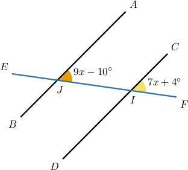

Solve for $x$ in the figure above given that $\overset{\longleftrightarrow}{AB} \parallel \overset{\longleftrightarrow}{CD}.$

#### Explanation

Since the angles $\angle{AJF}$ and $\angle{CIF}$ are corresponding angles, they are congruent and therefore have the same measure:

$$

\begin{aligned}𝑚∠𝐴𝐽𝐹 & =𝑚∠𝐶𝐼𝐹 \\ 9𝑥−10^{∘} & =7𝑥+4^{∘}\end{aligned}

$$

Now, we have an equation that we can solve for $x\mathbin{:}$

$$

\begin{aligned}9𝑥−10^{∘} & =7𝑥+4^{∘} \\ 9𝑥−7𝑥 & =4^{∘}+10^{∘} \\ 2𝑥 & =14^{∘} \\ \frac{2𝑥}{2} & =\frac{14^{∘}}{2} \\ \frac{2𝑥}{2} & =7^{∘} \\ 𝑥 & =7^{∘}\end{aligned}

$$

### Example: Solving Problems With Two Transversals

#### Question

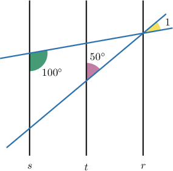

Given that $r$, $s$ and $t$ in the above diagram are parallel, find $m\angle{1}.$

#### Explanation

Consider $\angle 2$ and $\angle 3$ in the diagram below.

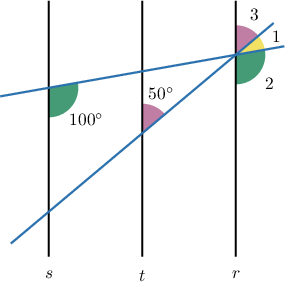

Note that $\angle 2$ and the angle whose measure is $100^\circ$ are corresponding angles formed by the same transversal. Therefore,

$$

m\angle 2 = 100^\circ.

$$

Similarly, note that $\angle 3$ and the angle whose measure is $50^\circ$ are corresponding angles formed by the same transversal. Therefore,

$$

m\angle 3 = 50^\circ.

$$

Let's add these measures to our diagram:

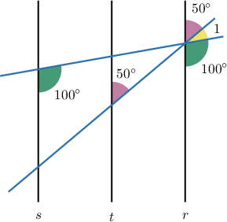

The angles $\angle 1$, $\angle 2,$ and $\angle 3$ combine to give a straight angle. So, we get

$$

\begin{aligned}𝑚∠1+𝑚∠2+𝑚∠3 & =180^{∘} \\ 𝑚∠1+100^{∘}+50^{∘} & =180^{∘} \\ 𝑚∠1+150^{∘} & =180^{∘} \\ 𝑚∠1 & =30^{∘}.\end{aligned}

$$

### Example: Solving Problems With Two Transversals That Require Solving an Equation

#### Question

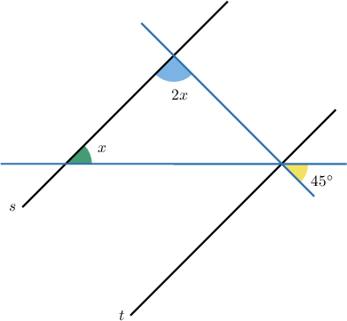

Solve for $x$ in the figure above given that $s \parallel t.$

#### Explanation

Consider $\angle 1$ and $\angle 2$ in the diagram below.

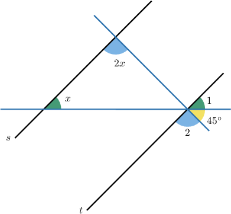

Note that $\angle 1$ and the angle whose measure is $x$ are corresponding angles formed by the same transversal. Therefore,

$$

m\angle 1 = x.

$$

Similarly, note that $\angle 2$ and the angle whose measure is $2x$ are corresponding angles formed by the same transversal. Therefore,

$$

m\angle 2 = 2x.

$$

Let's add these measures to our diagram.

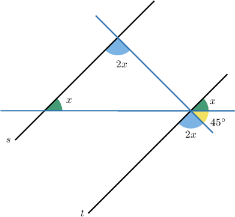

The angles $\angle 1$, $\angle 2,$ and the third angle whose measure is $45^\circ$, combine to give a straight angle. So, we get

$$

\begin{aligned}𝑚∠1+𝑚∠2+45^{∘} & =180^{∘} \\ 𝑥+2𝑥+45^{∘} & =180^{∘} \\ 3𝑥+45^{∘} & =180^{∘} \\ 3𝑥 & =135^{∘} \\ \frac{3𝑥}{3} & =\frac{135^{∘}}{3} \\ \frac{3𝑥}{3} & =45^{∘} \\ 𝑥 & =45^{∘}.\end{aligned}

$$
