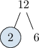
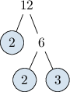
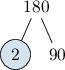
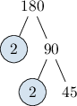
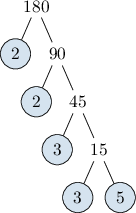

# The Fundamental Theorem of Arithmetic

Source: https://www.mathacademy.com/topics/4250?courseId=113
Topic ID: 4250

## Prerequisites

- [Prime Factors](./829-prime-factors.md)
- [Evaluating Exponents](./2321-evaluating-exponents.md)

## Lesson

### Introduction

Throughout this lesson, we will use a dot $(\cdot)$ instead of $\times$ to denote multiplication.

Recall that the first few prime numbers are the following:

$$

2,\quad 3, \quad 5, \quad 7, \quad 11, \quad 13, \quad 17, \quad 19, \quad 23, \quad 29

$$

The **fundamental theorem of arithmetic** states that *every* positive whole number larger than $1$ is either a prime number itself or can be written as a *product* of prime numbers.

For example, we can express the number $18$ as a product of prime numbers as follows:

$$

\begin{aligned}18=2⋅3⋅3\end{aligned}

$$

Now, since the factor $3$ appears twice, we can write $3\cdot 3$ as $3^2.$

$$

\begin{aligned}18 & =2⋅3^{2}\end{aligned}

$$

Writing an integer as a product of prime factors is called **prime factorization** or **prime decomposition**.

### Decomposing a Product Into Prime Factors

To find the prime factorization of a number, we can use a **factor tree**.

To demonstrate how this works, let's write $90$ as a product of prime factors:

- We start by placing $90$ at the top of our tree.

- We need to express $90$ as a product of its *smallest* prime factor and *another* factor. Note that the second factor is not always prime. The *smallest* prime factor of $90$ is $2,$ and $90 = 2 \cdot 45.$ We write these factors below $90$ on our tree with the smallest prime factor on the left-hand side. Because $2$ is prime, we draw a circle around it.

- Now, we repeat the process with the *other* factor, $45.$ The *smallest* prime factor of $45$ is $3,$ and $45 = 3 \cdot 15.$ We write these factors below $45$ on our tree with the smallest prime factor on the left-hand side. Because $3$ is prime, we draw a circle around it.

- Once again, we repeat the process with the *other* factor, $15.$ The *smallest* prime factor of $15$ is $3,$ and $15 = 3 \cdot 5.$ We write these factors below $15$ on our tree with the smallest prime factor on the left-hand side. Since $3$ and $5$ are *both* prime, we draw *two* circles.

All of the endpoints of our tree are now prime numbers, which means we're done!

Finally, to get our prime factorization, we multiply the circled numbers. This gives

$$

90 = 2\cdot 3 \cdot 3 \cdot 5.

$$

Finally, we can simplify our result using exponents. So, our final answer is

$$

90 = 2\cdot 3^2 \cdot 5.

$$

### Example: Finding the Prime Factorization of a Two-Digit Integer

#### Question

Express the number $12$ as a product of prime numbers.

#### Explanation

To find the prime factorization of a number, we can use a factor tree.

First, we need to express $12$ as the product of its ** prime factor and ** factor.

The ** prime factor of $12$ is $2,$ and $12 = 2 \cdot 6.$ We write these factors below $12$ on our tree with the smallest prime factor on the left-hand side.

Because $2$ is a prime number, we draw a circle around it.

Next, we need to express $6$ as the product of its ** prime factor and ** factor.

The ** prime factor of $6$ is $2,$ and $6 = 2 \cdot 3.$ We write these factors below $6$ on our tree with the smallest prime factor on the left-hand side.

Since $2$ and $3$ are ** prime, we draw ** circles.

All of the endpoints of our tree are now prime numbers, which means we're done!

To get our prime factorization, we multiply the circled numbers and simplify using exponents. This gives

$$

12 = 2\cdot 2\cdot 3 = 2^2\cdot 3.

$$

### Example: Finding the Prime Factorization of a Three-Digit Integer

#### Question

Find the prime decomposition of $180$.

#### Explanation

To find the prime factorization of a number, we can use a factor tree.

First, we need to express $180$ as the product of its ** prime factor and ** factor.

The ** prime factor of $180$ is $2,$ and $180 = 2 \cdot 90.$ We write these factors below $180$ on our tree with the smallest prime factor on the left-hand side.

We draw a circle around $2$ because it's prime.

Next, we need to express $90$ as the product of its ** prime factor and ** factor.

The ** prime factor of $90$ is $2,$ and $90 = 2 \cdot 45.$ We write these factors below $90$ on our tree with the smallest prime factor on the left-hand side.

We carry on like this, stopping only when all of the endpoints are prime. By doing this, we get the following:

So finally, our prime factorization is

$$

180 = 2\cdot 2 \cdot 3 \cdot 3 \cdot 5 = 2^2\cdot 3^2\cdot 5.

$$
