# Unions of Intervals

Source: https://www.mathacademy.com/topics/458?courseId=113
Topic ID: 458

## Prerequisites

- [Unbounded Intervals](./4028-unbounded-intervals.md)

## Lesson

### Introduction

Suppose we want to represent the following number line graph using interval notation:

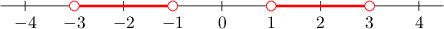

This number line consists of the interval $(-3, -1)$ as well as the interval $(1, 3).$

To express the combination of these two intervals, we create a **union of intervals** using the **union sign** $\cup$ as follows:

$$

(-3, -1) \cup (1, 3)

$$

### Example: Expressing an Inequality as a Union of Intervals

#### Question

Express the compound inequality $x < 4$ or $x \ge 10$ using interval notation.

#### Explanation

We can represent the compound inequality on a number line, as follows:

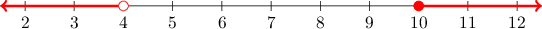

This number line consists of the interval $(-\infty, 4)$ as well as the interval $[10, \infty).$

So, we can express the compound inequality as the union of these two intervals:

$$

(-\infty, 4) \:{\cup}\: [10, \infty)

$$

### Example: Expressing a Union of Non-Overlapping Intervals as an Inequality

#### Question

Express $\left(-\infty, -1 \right) \cup [2, \infty)$ as an inequality.

#### Explanation

First, we graph the two intervals on a number line:

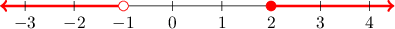

The interval $\left(-\infty, -1 \right)$ can be expressed as the inequality $x < -1.$

Likewise, the interval $[2, \infty)$ can be expressed as the inequality $x \geq 2.$

So, the union of these intervals represents the compound inequality

$$

x < -1 \text{ or } x \geq 2.

$$

### The Union of Overlapping Intervals

Sometimes, the union of two intervals can simplify into a single interval. For example, consider the union

$$

(-3,2) \cup (0,4).

$$

If we plot these two intervals on number lines, we get the following:

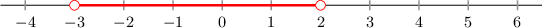

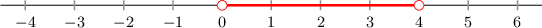

The union of the two intervals consists of all the points which are contained within at least one of the intervals. So, to graph the union of the two intervals, we take the graphs of the individual intervals and lay them on top of each other.

The resulting graph is as follows:

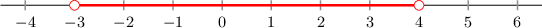

This graph represents the interval $(-3,4).$ So, the union $(-3,2) \cup (0,4)$ simplifies to the interval $(-3,4).$

### Example: Expressing a Union of Overlapping Intervals Given Graphically

#### Question

What is the union of the intervals shown on the number lines below?

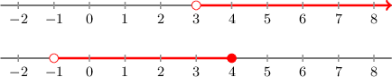

#### Explanation

We have the following number lines:

The union of the two intervals consists of all the points which are contained within at least one of the intervals. So, to graph the union of the two intervals, we take the graphs of the individual intervals and lay them on top of each other.

The resulting graph is as follows:

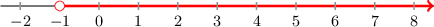

The graph represents the interval $(-1,\infty).$

### Example: Expressing a Union of Overlapping Intervals

#### Question

Simplify the union of intervals $(-\infty,2) \cup [-1,3].$

#### Explanation

If we plot these two intervals on number lines, we get the following:

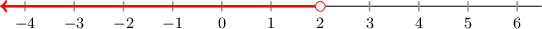

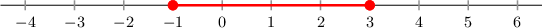

The union of the two intervals consists of all the points which are contained within at least one of the intervals. So, to graph the union of the two intervals, we take the graphs of the individual intervals and lay them on top of each other.

The resulting graph is as follows:

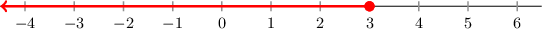

This graph represents the interval $(-\infty,3].$ So, the union $(-\infty,2) \cup [-1,3]$ simplifies to the interval $(-\infty,3].$
