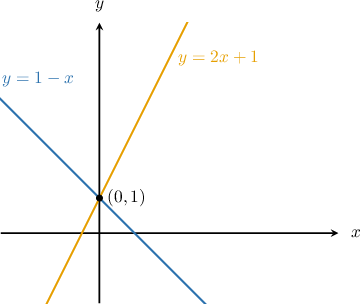
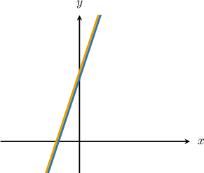
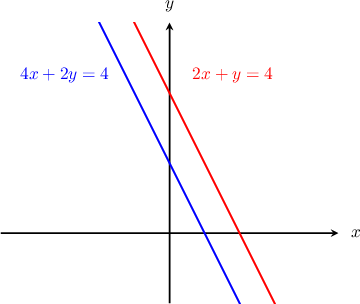
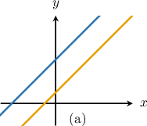
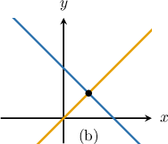
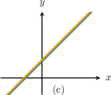

# Systems of Equations With No Solutions and Infinitely Many Solutions

Source: https://www.mathacademy.com/topics/493?courseId=113
Topic ID: 493

## Prerequisites

- [Calculating the Intersection of Two Lines](./408-calculating-the-intersection-of-two-lines.md)
- [Parallel Lines in the Coordinate Plane](./837-parallel-lines-in-the-coordinate-plane.md)
- [Linear Equations With Infinitely Many Solutions](./1414-linear-equations-with-infinitely-many-solutions.md)
- [Linear Equations With No Solutions](./5572-linear-equations-with-no-solutions.md)

## Lesson

### Introduction

The systems of equations we've encountered up to now have all had *exactly one solution*.

For example, consider the following system:

Using either substitution or elimination, we can show that the solution to this system is This is the *only* solution, and it tells us the point of intersection between the two corresponding lines.

In general, systems of equations can have

- *exactly one* solution (like the example above)

- *infinitely many* solutions

- *no solutions*

To determine the number of solutions to a system of equations, we solve it using either substitution or elimination and interpret the result.

Let's look at a system of equations with infinitely many solutions.

### A System With Infinitely Many Solutions

Consider the following system of equations:

To show that this system has infinitely many solutions, we solve the system using elimination.

Notice that if we multiply the first equation by then we get a term that can cancel with the term in the second equation:

When we add the two equations, we obtain:

The statement is *always* true. This implies that this system of equations has *infinitely many solutions*.

Geometrically, this means that the equations and both represent the *same straight line*. In other words, the two lines **coincide**.

These two lines intersect at an infinite number of points. The system has infinitely many solutions because there are infinitely many intersection points.

Another way to see that this system has infinitely many solutions is to notice that the lines are nonzero multiples of each other.

For example, if we multiply the equation of the first line by we get the second line!

Let's now look at an example of a system with *no solutions*.

### Example: Finding the Number of Solutions to a System

#### Question

Show that the following system of equations has no solution.

$$

\begin{aligned}4𝑥+2𝑦=4 \\ 2𝑥+𝑦=4\end{aligned}

$$

#### Explanation

Let's start by solving the system using elimination.

Notice that if we multiply the second equation by $-2,$ then we will get a $-4x$ term that can cancel with the $4x$ term in the first equation:

$$

\begin{aligned}4𝑥+2𝑦=4 & \\ 2𝑥+𝑦=4 & \,×(−2)\end{aligned}

$$

When we add the two equations, it turns out that both variables cancel, and we obtain a false statement:

$$

\begin{aligned}4𝑥+2𝑦 & =4 \\ −4𝑥−2𝑦 & =−8 \\ 0 & =(4−8) \\ 0 & =−4\end{aligned}

$$

The statement $0=-4$ is **. Therefore, we conclude that the system has **.

Geometrically, this means that the corresponding lines **. In other words, they are **

### The Intersection of Two Lines

As we've seen, the solutions of a linear system

correspond to the points of intersection of the two lines. There are three possibilities:

- Case shows two parallel lines. Because there are no points of intersection, the system has *no solutions*. This happens whenever the lines have the *same* slope but *different* -intercepts.

- Case shows two lines intersecting at a single point. Because there is a single point of intersection, the system has *one solution*.

- Case shows two lines that coincide. Because there are infinitely many points of intersection, the system has *infinitely many* solutions. This happens whenever the lines have the *same* slope and *same* -intercept. In such cases, the two lines are nonzero multiples of each other.

### Example: Finding the Number of Intersection Points of Two Lines

#### Question

At how many points do the lines $x - 2y = 2$ and $10y - 5x = -10$ intersect?

#### Explanation

The number of points of intersection between the two lines is equal to the number of solutions of the corresponding system:

$$

\begin{aligned}𝑥−2𝑦=2 \\ 10𝑦−5𝑥=−10\end{aligned}

$$

We will solve the system using substitution. First, we solve for $x$ in the first equation:

$$

\begin{aligned}𝑥−2𝑦 & =2 \\ 𝑥 & =2𝑦+2\end{aligned}

$$

Then, we substitute $x=2y+2$ into the second equation and solve for $y\mathbin{:}$

$$

\begin{aligned}10𝑦−5𝑥 & =−10 \\ 10𝑦−5(2𝑦+2) & =−10 \\ 10𝑦−10𝑦−10 & =−10 \\ −10 & =−10\end{aligned}

$$

The result is a statement that's always true. Therefore, we conclude that the system has infinitely many solutions.

Consequently, the lines intersect at infinitely many points (i.e., they coincide).

### Describing General Solutions of Systems With Infinitely Many Solutions

When a system of equations has one solution, we can describe the solution as a single point $(x,y).$ This represents the point where the two lines intersect.

Now, suppose a system of equations has *infinitely many* solutions. Can we describe the solutions to the system in a similar way?

Indeed, we can. To demonstrate, consider the following system:

$$

\begin{aligned}3𝑥−𝑦=−2 \\ 6𝑥−2𝑦=−4\end{aligned}

$$

Earlier, we showed that this system has infinitely many solutions. Therefore, the corresponding lines coincide.

Our goal is to express *all* the solutions of this system in the form $({\color{blue}{x}},{\color{red}{y}}).$ To do this, we find the corresponding $y$-coordinate for each $x$-coordinate by solving one of the equations for $y.$ It doesn't matter which, so let's pick the first equation.

$$

\begin{aligned}3𝑥−𝑦=−2\,⇒\,𝑦=3𝑥+2\end{aligned}

$$

Therefore, for any given $x$-value, the corresponding $y$-value is $y = 3x+2.$

Finally, we can express the intersection points as

$$

({\color{blue}{x}},{\color{red}{y}}) = \left({\color{blue}{x}},{\color{red}{3x+2}}\right),

$$

where $\color{blue}x$ is *any* number.

### Understanding the Result

Let's go back to our system of equations:

$$

\begin{aligned}3𝑥−𝑦=−2 \\ 6𝑥−2𝑦=−4\end{aligned}

$$

We showed that the set of intersection points $(x,y)$ is given by

$$

(x,y) = \left(x,3x + 2\right)

$$

where $x$ is any number.

This formula allows us to generate as many intersection points as we want! To do this, we select *any* $x$-value and substitute it into the formula above.

For example:

- If we set $x=0,$ we get the point This point is indeed a solution to the system: Both equations are satisfied. Therefore, $(0,2)$ is a solution.

- If $x= 1,$ we get the point This point is another solution to the system: Both equations are satisfied. Therefore, $(1,5)$ is a solution.

By selecting any $x$-value and finding the corresponding $y$-value, $(x,y)$ gives a solution to the system and, consequently, a point of intersection between the two lines.

### Example: Finding the General Solution to a System With Infinitely Many Intersection Points

#### Question

Find all points of intersection of the lines $3x+2y=2$ and $6x+4y=4.$

#### Explanation

The points of intersection of the lines correspond to the solutions of the following system:

$$

\begin{aligned}3𝑥+2𝑦=2 \\ 6𝑥+4𝑦=4\end{aligned}

$$

We will solve the system using elimination. Notice that if we multiply the first equation by $-2,$ then we will get a $-6x$ term that can cancel with the $6x$ term in the second equation:

$$

\begin{aligned}3𝑥+2𝑦=2 & \,×(−2) \\ 6𝑥+4𝑦=4 & \end{aligned}

$$

When we add the two equations, it turns out that both variables cancel, and we obtain a true statement:

$$

\begin{aligned}−6𝑥−4𝑦 & =−4 \\ 6𝑥+4𝑦 & =4 \\ 0 & =(−4+4) \\ 0 & =0\end{aligned}

$$

Because we obtained a true statement, we conclude that there are infinitely many solutions to the system. Therefore, the lines have infinitely many intersection points.

We want to find an expression that represents every solution to the system. Any value of $x$ is a solution, and we can find the corresponding $y$-coordinate for each $x$-coordinate by solving one of the lines for $y,$ as follows:

$$

\begin{aligned}3𝑥+2𝑦 & =2 \\ 2𝑦 & =2−3𝑥 \\ 𝑦 & =\frac{2−3𝑥}{2} \\ 𝑦 & =1−\frac{3}{2}𝑥\end{aligned}

$$

Therefore, the points of intersection are $\left(x,1-\dfrac{3}{2}x \right),$ where $x$ is any number.
