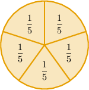
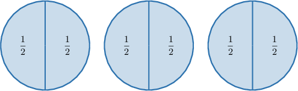
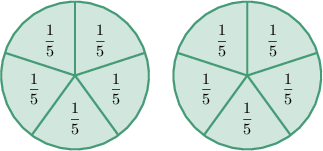
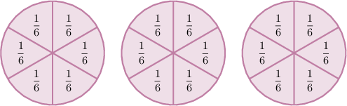
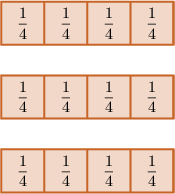
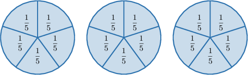

# Dividing Whole Numbers by Unit Fractions Using Models

Source: https://www.mathacademy.com/topics/529?courseId=113
Topic ID: 529

## Prerequisites

- [Modeling Fractions Using Number Lines](../../../elementary-school/lessons/grade-4/7003-modeling-fractions-using-number-lines.md)

## Lesson

### Introduction

Remember that a **unit fraction** is a fraction containing $1$ in the numerator.

For example, the following fractions are unit fractions since they each contain ${\color{blue}{1}}$ in the numerator:

$$

\dfrac{\color{blue}{1}}{2}, \qquad \dfrac{\color{blue}{1}}{5}, \qquad \dfrac{\color{blue}{1}}{8}

$$

However, the following fractions are *not* unit fractions since they do *not* contain ${\color{blue}{1}}$ in the numerator:

$$

\dfrac{\color{red}{2}}{3}, \qquad \dfrac{\color{red}{5}}{8}, \qquad \dfrac{\color{red}{7}}{12}

$$

In this lesson, we will use models to divide whole numbers by unit fractions.

Let's start with an example. Suppose we divide the pizza below into fifths. How many fifths will there be in total?

Since each part is $\dfrac{1}{\color{blue}5}$ of a whole, we need to split $\color{red}1$ pizza (whole) into $\color{blue}5$ equal parts, as shown below.

So, we get ${\color{red}1} \times {\color{blue}5} = 5$ parts in total.

### Example: Determining How Many Parts Fit Into a Whole

#### Question

The $3$ circles above are divided into halves. How many halves are there in total?

#### Explanation

Since each part is $\dfrac{1}{\color{blue}2}$ of a whole, we need to split each of the $\color{red}3$ circles (wholes) into $\color{blue}2$ equal parts, as shown below.

So, we get ${\color{red}3} \times {\color{blue}2} = 6$ parts in total.

### Dividing Whole Numbers by Unit Fractions

The model below represents $2$ wholes. Let's use it to calculate the value of $2 \div \dfrac{1}{5}.$

To calculate ${\color{red}2} \div \dfrac{1}{\color{blue}5}$, we need to divide each of $\color{red}2$ wholes into $\color{blue}5$ equal parts, as shown below.

We get ${\color{red}2} \times {\color{blue}5} = 10$ pieces in total.

Therefore,

$$

2 \div \dfrac{1}{5} = 10\,.

$$

### Example: Identifying a Model Representing a Division Problem

#### Question

What model could represent the division problem below?

$$

3 \div \dfrac{1}{6} = 18

$$

#### Explanation

Consider the following $\color{red}3$ wholes:

To calculate ${\color{red}3} \div \dfrac{1}{\color{blue}6}$, we need to divide each of $\color{red}3$ wholes into $\color{blue}6$ equal parts, as shown below. This gives us the corresponding model for the given division problem.

We get ${\color{red}3} \times {\color{blue}6}= 18$ pieces in total.

### Example: Identifying the Division Problem Represented by a Model

#### Question

Each of the three shapes in the model below represents one whole.

From left to right, what numbers are missing from the division problem below?

$$

\,0\,

$$

#### Explanation

In the model, there are $\color{red}3$ shapes. Each shape consists of $4$ pieces that each represent $\dfrac{1}{4}$ of a whole. There are $\color{blue}12$ pieces in total.

The model tells us that when we divide $\color{red}3$ wholes into quarters, we will be left with $\color{blue}12$ pieces.

Therefore, the division problem is:

$$

\,3\,

$$

So, the missing numbers are $\color{red}3$ and $\color{blue}12.$

### Example: Dividing Whole Numbers by Unit Fractions

#### Question

The model above represents $3$ wholes. Use this model to calculate the value of $3 \div \dfrac{1}{5}.$

#### Explanation

To calculate ${\color{red}3} \div \dfrac{1}{\color{blue}5}$, we need to divide each of $\color{red}3$ wholes into $\color{blue}5$ equal parts, as shown below.

We get ${\color{red}3} \times {\color{blue}5} = 15$ pieces in total.

Therefore:

$$

3 \div \dfrac{1}{5} = 15

$$
