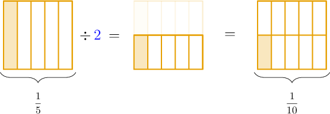

# Dividing Unit Fractions by Whole Numbers

Source: https://www.mathacademy.com/topics/530?courseId=113
Topic ID: 530

## Prerequisites

- [Dividing Unit Fractions by Whole Numbers Using Models](./528-dividing-unit-fractions-by-whole-numbers-using-models.md)
- [Two-Digit by One-Digit Multiplication](../../../elementary-school/lessons/grade-5/2392-two-digit-by-one-digit-multiplication.md)

## Lesson

### Introduction

To divide a unit fraction by a whole number, we multiply the fraction's denominator by the whole number.

For example, to calculate $\dfrac{1}{5} \div {\color{blue}2},$ we multiply the fraction's denominator by ${\color{blue}2}\!:$

$$

\dfrac{1}{5} \div {\color{blue}2} = \dfrac{1}{5 \times {\color{blue}2}} = \dfrac{1}{10}

$$

Notice that we get the same answer using a fraction model, and the process is similar.

### Example: Dividing a Unit Fraction

#### Question

What is the value of $\dfrac{1}{4} \div 3?$

#### Explanation

To divide a unit fraction by a whole number, we multiply the fraction's denominator by that whole number:

$$

\dfrac{1}{4} \div 3 = \dfrac{1}{4 \times 3} = \dfrac{1}{12}

$$

### Example: Dividing a Unit Fraction With a Two-Digit Denominator

#### Question

What is the value of $\dfrac{1}{16} \div 5?$

#### Explanation

To divide a unit fraction by a whole number, we multiply the fraction's denominator by that whole number:

$$

\dfrac{1}{16} \div 5 = \dfrac{1}{16 \times 5} = \dfrac{1}{80}

$$

### Example: Word Problems

#### Question

Joshua uses $\dfrac{1}{2} \, \text{kg}$ of ham to make $4$ pizzas. If the ham is distributed equally among the $4$ pizzas, how much ham does he put on each pizza?

#### Explanation

To determine the amount of ham on each pizza, we must divide the amount of ham by the number of pizzas:

$$

\dfrac{1}{2} \div 4

$$

To divide a unit fraction by a whole number, we multiply the fraction's denominator by that whole number:

$$

\dfrac{1}{2} \div 4 = \dfrac{1}{2 \times 4} = \dfrac{1}{8}

$$

Therefore, Joshua puts $\dfrac{1}{8} \, \text{kg}$ of ham on each pizza.
