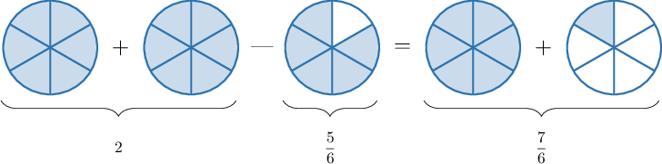

# Subtracting Fractions and Whole Numbers

Source: https://www.mathacademy.com/topics/545?courseId=113
Topic ID: 545

## Prerequisites

- [Adding Fractions and Whole Numbers](./539-adding-fractions-and-whole-numbers.md)
- [Subtracting Fractions and Whole Numbers Using Models](./544-subtracting-fractions-and-whole-numbers-using-models.md)

## Lesson

### Introduction

The method of subtracting fractions and whole numbers is very similar to the one we use for addition.

For example, suppose that we want to find the value of $2-\dfrac{5}{\color{blue}6}.$ We first write $2$ as an improper fraction:

$$

\dfrac{2}{1}

$$

Then, we put this fraction over a denominator of $\color{blue}6$ by multiplying the numerator and denominator by ${\color{blue}{6}}$:

$$

\dfrac{2 \times {\color{blue}{6}}}{1\times{\color{blue}{6}}} = \dfrac{12}{6}

$$

So now, we have to find:

$$

\underbrace{\dfrac{12}{6}}_{2} - \dfrac{5}{6}

$$

To subtract two fractions with like denominators, we subtract the numerators and keep the denominators the same.

$$

\begin{aligned}\frac{12}{6}−\frac{5}{6}=\frac{7}{6}\end{aligned}

$$

So our final answer is $\dfrac 7 {6}.$

We can always check our answer using a fraction model:

### Example: Subtracting Fractions and Whole Numbers

#### Question

What is $3 - \dfrac{1}{7}$ expressed as an improper fraction?

#### Explanation

To subtract $\dfrac{1}{\color{blue}{7}}$ from $3$, we need to express the whole number $3$ as an equivalent fraction with a denominator of ${\color{blue}{7}}.$

First, we write $3$ as an improper fraction:

$$

\dfrac{3}{1}

$$

Then, we put this fraction over a denominator of $\color{blue}7$ by multiplying the numerator and denominator by ${\color{blue}{7}}$:

$$

\dfrac{3 \times {\color{blue}{7}}}{1\times{\color{blue}{7}}} = \dfrac{21}{7}

$$

So now, we have to find:

$$

\dfrac{21}{7} - \dfrac{1}{7}

$$

To subtract two fractions with like denominators, we subtract the numerators and keep the denominators the same:

$$

\begin{aligned}\frac{21}{7}−\frac{1}{7}=\frac{20}{7}\end{aligned}

$$

### Example: Subtracting Fractions and Whole Numbers: Converting the Final Answer to a Mixed Number

#### Question

What is $\dfrac{31}{9} - 2$ expressed as a mixed number?

#### Explanation

To subtract $2$ from $\dfrac{31}{\color{blue}{9}}$, we need to express the whole number $2$ as an equivalent fraction with a denominator of ${\color{blue}{9}}.$

First, we write $2$ as an improper fraction:

$$

\dfrac{2}{1}

$$

Then, we put this fraction over a denominator of $\color{blue}9$ by multiplying the numerator and denominator by ${\color{blue}{9}}$:

$$

\dfrac{2 \times {\color{blue}{9}}}{1\times{\color{blue}{9}}} = \dfrac{18}{9}

$$

So now, we have to find:

$$

\dfrac{31}{9} - \dfrac{18}{9}

$$

To subtract two fractions with like denominators, we subtract the numerators and keep the denominators the same:

$$

\begin{aligned}\frac{31}{9}−\frac{18}{9}=\frac{31−18}{9}=\frac{13}{9}\end{aligned}

$$

Finally, we convert to a mixed number:

$$

13 \div 9 = 1 \, \text{R} \, 4

$$

So our final answer is $1 \, \dfrac{4}{9}.$

### Example: Converting the Final Answer to a Mixed Number: Word Problems

#### Question

Julia had $4$ liters of orange juice, but she accidentally spilled $\dfrac{15}{8}$ liters of juice. Expressed as a mixed number, how much juice is left?

#### Explanation

To find out how much juice is left, we have to calculate the difference $4 - \dfrac{15}{8}.$

To subtract $\dfrac{15}{\color{blue}{8}}$ from $4$, we need to express the whole number $4$ as an equivalent fraction with a denominator of ${\color{blue}{8}}.$

First, we write $4$ as an improper fraction:

$$

\dfrac{4}{1}

$$

Then, we put this fraction over a denominator of $\color{blue}8$ by multiplying the numerator and denominator by ${\color{blue}{8}}$:

$$

\dfrac{4 \times {\color{blue}{8}}}{1\times{\color{blue}{8}}} = \dfrac{32}{8}

$$

So now, we have to find:

$$

\dfrac{32}{8} - \dfrac{15}{8}

$$

To subtract two fractions with like denominators, we subtract the numerators and keep the denominators the same:

$$

\begin{aligned}\frac{32}{8}−\frac{15}{8}=\frac{32−15}{8}=\frac{17}{8}\end{aligned}

$$

Finally, we convert to a mixed number:

$$

17 \div 8 = 2 \, \text{R} \, 1

$$

Therefore, $2 \, \dfrac{1}{8}$ liters of juice is left.
