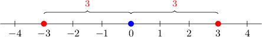

# Rules of Absolute Value

Source: https://www.mathacademy.com/topics/75?courseId=113
Topic ID: 75

## Prerequisites

- [Absolute Value Expressions](./96-absolute-value-expressions.md)

## Lesson

### Introduction

Recall that the absolute value of a number represents the distance of that number from the origin.

Let's take a look at the number line below.

Since $-3$ and $3$ are at the same distance from the origin, we have

$$

|-3| = |3| = 3.

$$

In general, for any real number $a,$

$$

|-a| = |a|.

$$

We can use this fact to simplify expressions containing absolute value. Let's see an example.

### Example: Simplifying the Absolute Value of a Negative Term

#### Question

Simplify the expression $|-2x|.$

#### Explanation

Since $|-a| = |a|,$ we can rewrite our expression as follows:

$$

\begin{aligned}|−2𝑥| & =|2𝑥|\end{aligned}

$$

### The Distributive Properties

The absolute value operation is **distributive with respect to multiplication.** This means that the absolute value of a product equals the product of the absolute values.

To demonstrate, consider the following expression:

$$

|(-6) \cdot 2|

$$

We can evaluate this expression in two separate ways:

- The first is to find the absolute value of the product. In doing this, we get

$$

\begin{aligned}|(−6)⋅2| & =|−12| \\ & =12.\end{aligned}

$$

- The second is to find the product of the absolute values. In doing this, we get

$$

\begin{aligned}|(−6)⋅2| & =|−6|⋅|2| \\ & =6⋅2 \\ & =12.\end{aligned}

$$

In general

$$

|a \cdot b| = |a|\cdot |b|.

$$

The absolute value operation is also distributive with respect to division. In general,

$$

\left|\dfrac{a}{b}\right| = \dfrac{|a|}{|b|}.

$$

### Example: Distributing the Absolute Value Over Multiplication

#### Question

Simplify the expression $|-18a|.$

#### Explanation

Firstly, since $|-a| = |a|,$ we can write our expression as

$$

|18a|

$$

Then, we distribute the absolute value over the multiplication, and simplify:

$$

\begin{aligned}|18𝑎| & = \\ |18⋅𝑎| & = \\ |18|⋅|𝑎| & = \\ 18⋅|𝑎| & = \\ 18|𝑎| & \end{aligned}

$$

### Example: Distributing the Absolute Value Over Division

#### Question

Simplify the expression $\left|-\dfrac{9}{5c}\right|.$

#### Explanation

Firstly, since $|-a| = |a|,$ we can write our expression as

$$

\left|\dfrac{9}{5c}\right|.

$$

Then, we distribute the absolute value over the division, and simplify:

$$

\begin{aligned}\frac{9}{5𝑐} & = \\ \frac{|9|}{|5𝑐|} & = \\ \frac{9}{|5𝑐|} & = \\ \frac{9}{|5|⋅|𝑐|} & = \\ \frac{9}{5|𝑐|} & \end{aligned}

$$
