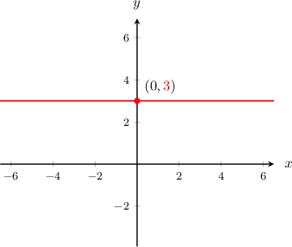
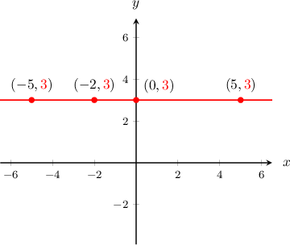
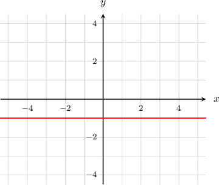
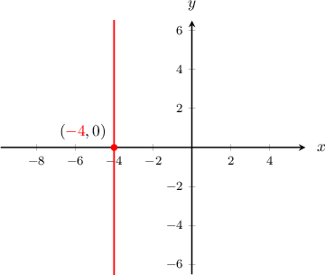
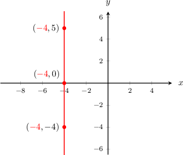
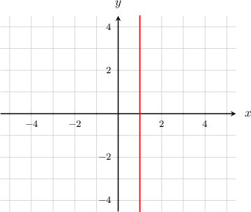
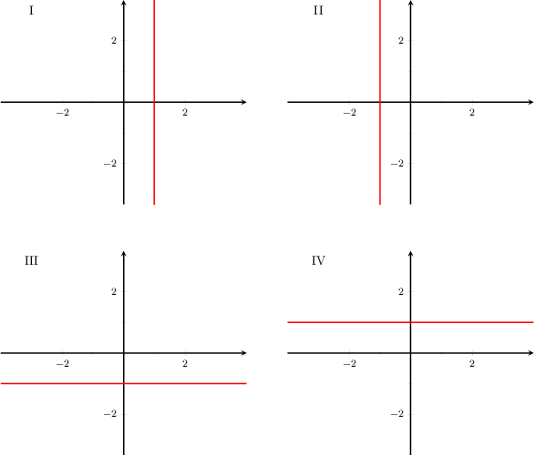
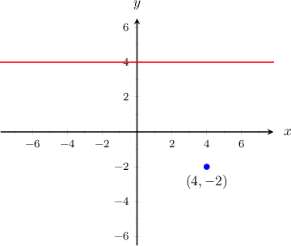

# Horizontal and Vertical Lines

Source: https://www.mathacademy.com/topics/97?courseId=113
Topic ID: 97

## Prerequisites

- [Graphing Linear Equations](./95-graphing-linear-equations.md)

## Lesson

### Introduction

Suppose that we wish to find the equation of the **horizontal line** that passes through the point $(0,3)$, as shown below:

Notice that for *any* $x$-value on the line, the $y$-value is always $\color{red}3.$

Therefore, the equation of the line is $y=3.$

**Note**: When writing the equation of a horizontal line, we always put the variable $y$ on the left side and the constant on the right side.

### Example: Finding the Equation of a Horizontal Line

#### Question

Identify the equation that corresponds to the graph below.

#### Explanation

The graph is a horizontal line where the $y$-value of every point is $-1.$ Consequently, its equation is $y = -1.$

### Vertical Lines

Suppose that we want to find the equation of the **vertical line** that passes through the point $(-4,0)$, as shown below:

Notice that for *any* $y$-value on the line, the $x$-value is always $\color{red}-4.$

Therefore, the equation of this vertical line is $x=-4.$

**Note**: When writing the equation of a vertical line, we always put the variable $x$ on the left side and the constant on the right side.

### Example: Finding the Equation of a Vertical Line

#### Question

Identify the equation in **** that corresponds to the graph below.

#### Explanation

The graph is a vertical line where the $x$-value of every point is $1.$ Consequently, its equation is $x=1.$

### Example: Identifying a Horizontal or Vertical Line

#### Question

Which of the plots above shows the following lines?

- $x=-1$

- $y=-1$

#### Explanation

- On the line $x=-1,$ every point has an $x$-coordinate of $-1.$ Therefore, graph II represents this equation.

- On the line $y=-1,$ every point has an $y$-coordinate of $-1.$ Therefore, graph III represents this equation.

### Example: Points Associated With Horizontal and Vertical Lines

#### Question

A horizontal line in the $xy$-plane passes through the point $(- 2,4).$ What is the equation of the line? Does the point $(4,-2)$ lie on that line?

#### Explanation

Since the horizontal line passes through $(-2,4)$, every point on the line has a $y$-coordinate of $4.$ So, the equation of that line is $y=4.$

The $y$-coordinate of the point $(4,-2)$ is $-2,$ but all points on the line $y=4$ have a $y$-coordinate of $4.$ So, the point $(4,-2)$ is not on the line.

