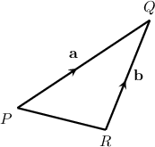
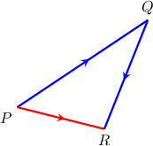
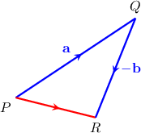
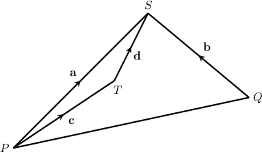
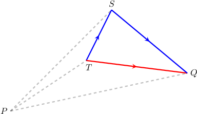
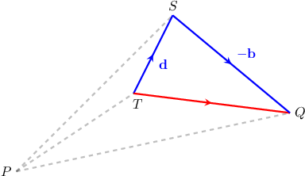
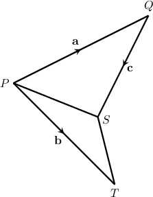
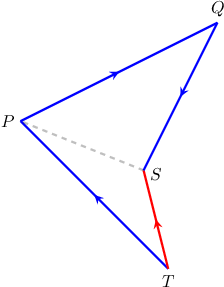
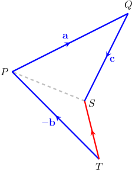
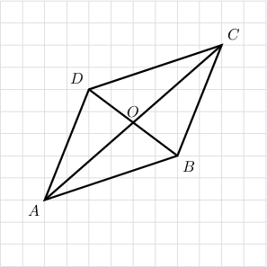

# Problem Solving Using Vector Diagrams

Source: https://www.mathacademy.com/topics/1102?courseId=111
Topic ID: 1102

## Prerequisites

- [The Triangle Law for the Addition of Two Vectors](./1100-the-triangle-law-for-the-addition-of-two-vectors.md)

## Lesson

### Introduction

It's often helpful to express a given vector in terms of sums and scalar multiples of a handful of known vectors.

As an example, let's consider the following diagram:

How can we express the vector $\overrightarrow{PR}$ in terms of the vectors $\textbf{a}$ and $\textbf{b}$ only?

According to the triangle law of addition,

$$

\begin{aligned}\overset{𝑃𝑅}{} & =\overset{𝑃𝑄}{}+\overset{𝑄𝑅}{}\end{aligned}

$$

as shown below.

From the original diagram, we have that

$$

{\color{blue}{\overrightarrow{PQ}}} = \mathbf{a} \qquad\text{and}\qquad {\color{blue}{\overrightarrow{QR}}} = -\mathbf{b}.

$$

Therefore, by substituting these values into our equation for ${\color{red}\overrightarrow{PR}},$ we obtain

$$

\begin{aligned}\overset{𝑃𝑅}{} & =\overset{𝑃𝑄}{}+\overset{𝑄𝑅}{} \\ & =𝐚+(−𝐛) \\ & =𝐚−𝐛.\end{aligned}

$$

Let's see another example.

### Example: Expressing a Vector as a Sum or Difference of Two Known Vectors

#### Question

Consider the diagram above, where $\overrightarrow{PS}=\mathbf{a},$ $\overrightarrow{QS}=\mathbf{b},$ $\overrightarrow{PT}=\mathbf{c},$ and $\overrightarrow{TS}=\mathbf{d}.$ Find $\overrightarrow{TQ}$ in terms of $\mathbf{a},\mathbf{b}, \mathbf{c},$ and $\mathbf{d}.$

#### Explanation

We want to find a "path" from $T$ to $Q$ consisting only of the vectors $\mathbf a, \mathbf b, \mathbf c,$ and $\mathbf d.$

According to the triangle law of addition,

$$

{\color{red}{\overrightarrow{TQ}}} = {\color{blue}{\overrightarrow{TS}}} + {\color{blue}{\overrightarrow{SQ}}},

$$

as shown below.

Now, from the original diagram, we have that

$$

{\color{blue}\overrightarrow{TS}} = \mathbf{d}, \qquad {\color{blue}{\overrightarrow{SQ}}} = -\mathbf{b}.

$$

Let's add these to our diagram.

Therefore, we obtain

$$

\begin{aligned}\overset{𝑇𝑄}{} & =\overset{𝑇𝑆}{}+\overset{𝑆𝑄}{} \\ & =𝐝+(−𝐛) \\ & =𝐝−𝐛.\end{aligned}

$$

### Example: Expressing a Vector as a Sum or Difference of More Than Two Known Vectors

#### Question

Consider the diagram shown below, where $\overrightarrow{PQ}=\mathbf{a},$ $\overrightarrow{PT}=\mathbf{b},$ and $\overrightarrow{QS}=\mathbf{c}.$ Find $\overrightarrow{TS}$ in terms of $\mathbf{a},\mathbf{b},$ and $\mathbf{c}.$

#### Explanation

We want to find a "path" from $T$ to $S$ consisting only of the vectors $\mathbf a, \mathbf b,$ or $\mathbf c.$

According to the triangle law of addition,

$$

{\color{red}{\overrightarrow{TS}}} = {\color{blue}{\overrightarrow{TP}}} + {\color{blue}{\overrightarrow{PQ}}} + {\color{blue}{\overrightarrow{QS}}}

$$

as shown below.

Now, from the original diagram, we have that

$$

{\color{blue}\overrightarrow{TP}} = -\mathbf{b}, \qquad {\color{blue}\overrightarrow{PQ}} = \mathbf{a}, \qquad {\color{blue}\overrightarrow{QS}} = \mathbf{c}.

$$

Let's add these to our diagram.

Therefore, we obtain

$$

\begin{aligned}\overset{𝑇𝑆}{} & =\overset{𝑇𝑃}{}+\overset{𝑃𝑄}{}+\overset{𝑄𝑆}{} \\ & =−𝐛+𝐚+𝐜 \\ & =𝐚−𝐛+𝐜.\end{aligned}

$$

### Example: Identifying Vector Equalities

#### Question

In parallelogram $ABCD$ shown above, which of the following equalities are true?

1. $\overrightarrow{CB}+\overrightarrow{BA}=\overrightarrow{CA}$

2. $\overrightarrow{CB}-\overrightarrow{AB}=\overrightarrow{AC}$

3. $\overrightarrow{DC}=\overrightarrow{BA}$

#### Explanation

- Equality I is true. Indeed, $\overrightarrow{CB}+\overrightarrow{BA}=\overrightarrow{CA}.$

- Equality II is false. Indeed, since $\overrightarrow{CA}$ and $\overrightarrow{AC}$ have opposite directions.

- Equality III is false. Indeed, $\overrightarrow{DC}\neq\overrightarrow{BA}$ since they have opposite directions.

Therefore, the correct answer is "I only."
