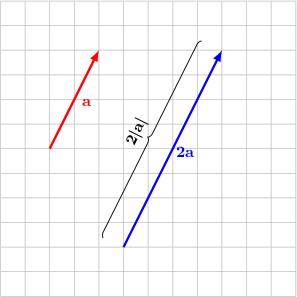
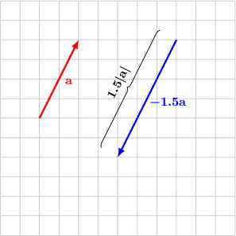
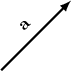
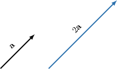
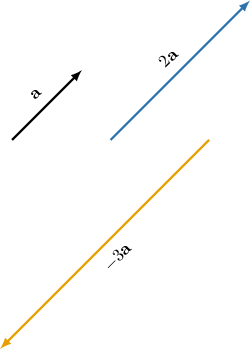
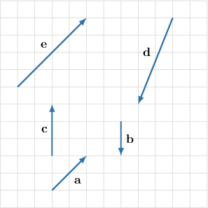

# Parallel Vectors

Source: https://www.mathacademy.com/topics/1103?courseId=111
Topic ID: 1103

## Prerequisites

- [The Magnitude of a Vector](./1101-the-magnitude-of-a-vector.md)

## Lesson

### Introduction

Consider the vector $\mathbf{a}$ shown in the picture below. The vector $2\mathbf{a}$ is the vector that has the same direction as $\mathbf{a}$ and a length (magnitude) that is twice the length of $\mathbf{a}\mathbin{:}$

$$

|2\mathbf{a}|=2 \cdot |\mathbf{a}|

$$

On the other hand, $-1.5\mathbf{a}$ is the vector that has the opposite direction to $\mathbf{a}$ and its magnitude is $1.5$ times the magnitude of $\mathbf{a}$:

$$

|-1.5\mathbf{a}|=1.5 \cdot |\mathbf{a}|

$$

Notice that $2\mathbf{a}$ and $-1.5\mathbf{a}$ are both parallel to $\mathbf a,$ and are parallel to each other.

### Example: Creating Parallel Vectors

#### Question

The vector $\mathbf a$ is shown in the diagram below. Draw the vectors $2\mathbf a$ and $-3\mathbf a.$

#### Explanation

First, notice that both $2\mathbf{a}$ and $-3\mathbf{a}$ must be parallel to $\mathbf{a}.$

Now, for the vector $2\mathbf{a}$ we have the following:

- The magnitude of $2\mathbf{a}$ is $2$ times the magnitude of $\mathbf{a}.$

- Vectors $\mathbf{a}$ and $2\mathbf{a}$ have the same direction since the factor $2$ is positive.

Next, for the vector $-3\mathbf{a}$ we have the following:

- The magnitude of $3\mathbf{a}$ is $3$ times the magnitude of $\mathbf{a}.$

- Vectors $\mathbf{a}$ and $-3\mathbf{a}$ have opposite directions since the factor $-3$ is negative.

### Determining Whether Two Vectors Are Parallel

In general, two vectors $\mathbf{a}$ and $\mathbf{b}$ are called **parallel** (or **collinear**) if there exists a number $\lambda$ such that

$$

\mathbf{a} = \lambda \mathbf{b}.

$$

Sometimes, we'll use a special notation

$$

\mathbf{a} \parallel \mathbf{b}

$$

to denote that $\mathbf{a}$ is parallel to $\mathbf{b}$.

### Example: Determining Whether Two Vectors are Parallel

#### Question

Suppose, $\mathbf{a} \neq \mathbf{0}$ and $\mathbf{b} \neq \mathbf{0}$. Given that $7\mathbf{a}+14\mathbf{b}$ and $\lambda \left(3\mathbf{a}+6\mathbf{b} \right)$ are equal vectors, find the scalar factor $\lambda.$

#### Explanation

Notice that

$$

7\mathbf{a}+14\mathbf{b}= \dfrac{7}{3} (3\mathbf{a}+6\mathbf{b}),

$$

Therefore, $\lambda=\dfrac{7}{3}.$

### Example: Identifying Parallel Vectors From a Diagram

#### Question

Consider the diagram that is shown below. Which of the following statements are true?

1. $\mathbf{b}=-\mathbf{c}$

2. $\mathbf{e}=2\mathbf{a}$

3. $\mathbf{a}=2\mathbf{e}$

#### Explanation

- Statement I is false. The vectors $\mathbf{b}$ and $\mathbf{c}$ have different magnitudes. So, $\mathbf{b} \neq -\mathbf{c}.$

- Statement II is true. Indeed, vectors $\mathbf{a}$ and $\mathbf{e}$ are parallel and have the same direction. Also, the magnitude of $\mathbf{e}$ is $2$ times the magnitude of $\mathbf{a}$. So, $\mathbf{e}=2\mathbf{a}.$

- Statement III is false. The magnitude of $\mathbf{e}$ is greater than the magnitude of $\mathbf{a}$. So, $\mathbf{a} \neq 2\mathbf{e}.$

Therefore, only statement II is true.

### The Zero Vector is Parallel to Any Vector

For any vector $\mathbf{a}$ the vector $0 \cdot \mathbf{a}$ is equal to the zero vector:

$$

0\cdot\mathbf{a}=\mathbf{0}.

$$

This means that the zero vector $\mathbf{0}$ is parallel to *any* vector.
