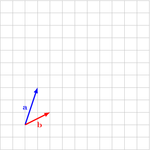
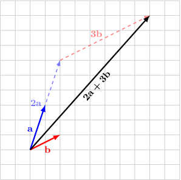
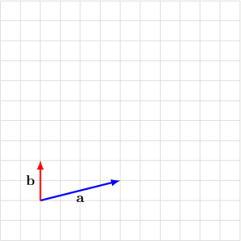
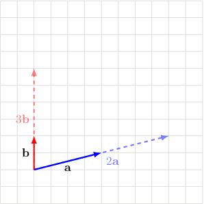
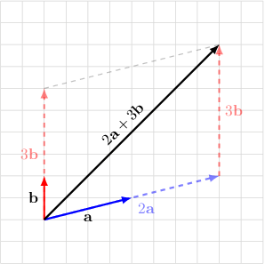

# Linear Combinations of Vectors and Their Properties

Source: https://www.mathacademy.com/topics/1105?courseId=111
Topic ID: 1105

## Prerequisites

- [Solving Systems of Equations by Substitution](../../../middle-school/lessons/grade-7/487-solving-systems-of-equations-by-substitution.md)
- [Parallel Vectors](./1103-parallel-vectors.md)

## Lesson

### Introduction

A **linear combination** of two vectors $\mathbf{a}$ and $\mathbf{b}$ is a sum of multiples of the two vectors.

For example, let's consider the vectors $\mathbf a$ and $\mathbf b,$ shown below:

One particular linear combination of these vectors is

$$

2 \mathbf{a} + 3 \mathbf{b} = 2 \cdot \mathbf{a} + 3 \cdot \mathbf{b}.

$$

If we draw this linear combination in the coordinate plane, we get the following:

### Example: Finding a Linear Combination of Two Vectors

#### Question

Given the vectors $\mathbf{a}$ and $\mathbf{b}$ shown below, draw the linear combination $2\mathbf{a}+3\mathbf{b}.$

#### Explanation

- The vector $2\mathbf{a}$ has the same direction as $\mathbf{a}$ but twice the magnitude.

- Likewise, the vector $3\mathbf{b}$ has the same direction as $\mathbf{b}$ but three times the magnitude.

Now, we can draw $3\mathbf{b}$ starting from the head of $2\mathbf{a}.$ The resultant

$$

2\mathbf{a}+3\mathbf{b}

$$

goes from the tail of $2\mathbf{a}$ to the head of $3\mathbf{b}.$

### An Important Property of Linear Combinations

If two vectors are not parallel, then each linear combination can only be written in one way.

For example, if we have two vectors $\mathbf{a},\mathbf{b}$ with $\mathbf{a} \nparallel \mathbf{b},$ and two real numbers $\alpha,\beta,$ then the equality

$$

2 \mathbf{a} + 3 \mathbf{b} = \alpha \mathbf{a} + \beta \mathbf{b}

$$

holds if and only if $\alpha=2$ and $\beta=3$.

In other words, the pair of numbers $\alpha,\beta$ defines a unique vector $\alpha \mathbf{a} + \beta \mathbf{b}.$ That is to say, if

$$

\alpha_1 \mathbf{a} + \beta_1 \mathbf{b} = \alpha_2 \mathbf{a} + \beta_2 \mathbf{b},

$$

then $\alpha_1 = \alpha_2$ and $\beta_1 = \beta_2.$

**Watch out!** This property holds only if two vectors *are not parallel*.

### Example: Solving a Statement With Linear Combinations Whose Coefficients Are Linear Functions

#### Question

Suppose we are given two vectors $\mathbf{a}$ and $\mathbf{b}$ where $\mathbf{a} \nparallel \mathbf{b}.$ Find $\alpha$ and $\beta,$ if

$$

\mathbf{a}+7\mathbf{b}=(2\alpha+\beta)\mathbf{a}-\beta\mathbf{b}.

$$

#### Explanation

Since $\mathbf{a} \nparallel \mathbf{b},$ the linear combination can only be written in one way. So, the coefficients of $\mathbf{a}$ must be equal, and the coefficients of $\mathbf{b}$ must be equal.

Equating the coefficients, we get:

$$

\begin{aligned}1=2𝛼+𝛽 \\ 7=−𝛽\end{aligned}

$$

From the second equation, we obtain

$$

\begin{aligned}𝛽 & =−7.\end{aligned}

$$

Substituting back into the first equation, we get:

$$

\begin{aligned}1 & =2𝛼+𝛽 \\ 1 & =2𝛼+(−7) \\ 8 & =2𝛼 \\ 𝛼 & =4\end{aligned}

$$

So, we conclude that $\alpha = 4$ and $\beta = -7.$
