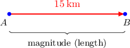
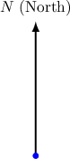
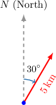
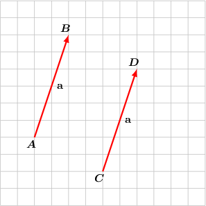
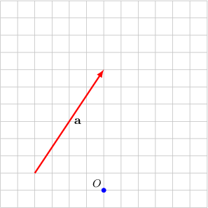
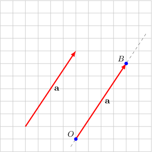
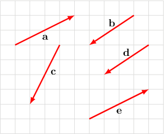
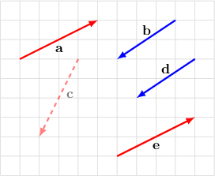

# Introduction to Vectors

Source: https://www.mathacademy.com/topics/1107?courseId=111
Topic ID: 1107

## Prerequisites

- [Measures of Segments](../../../middle-school/lessons/grade-7/1379-measures-of-segments.md)
- [Congruent Angles](../../../middle-school/lessons/grade-7/3554-congruent-angles.md)

## Lesson

### Introduction

A **vector** is a mathematical object that is used to represent quantities that have both **direction** and **magnitude.** We can think of a vector as a "directed line segment".

For example, consider a ship that travels $15\:\text{km}$ due east. In the diagram below, the ship starts at the point $A$ and ends at the point $B.$ This information can be represented as a **vector**, a directed line segment that starts at $A$ and points to $B,$ as follows:

The vector itself represents the **displacement** of the ship. The magnitude (length) of the vector represents the total distance traveled, and the direction of the vector gives the direction of travel.

The **tail** of the vector is at the point $A.$ The **head** of the vector is at the point $B.$

The vector can be written using its endpoints as $\overrightarrow{AB}.$ We can also represent vectors using lowercase letters written in bold, such as $\mathbf{a},$ $\mathbf{b},$ $\mathbf{c}.$

### Example: Drawing Vectors Representing Displacements

#### Question

Show on a picture the displacement vector of a ship that travels $5\:\text{km}$ on a bearing of ${30}^{\circ}$.

#### Explanation

We choose an arbitrary point on the plane as the starting point (tail) of the vector. The vertical line shows the north direction.

We go $30^\circ$ clockwise from the north.

The length of the line segment represents the distance traveled by the ship (which is $5\:\text{km}$).

### Equal Vectors

Two vectors are **equal** if they have both the same magnitude and the same direction. For example, the two vectors shown in the picture below are equal.

As we can see from the picture above, we have

$$

\overrightarrow{AB} = \overrightarrow{CD} = \textbf{a}.

$$

### Example: Drawing Equal Vectors

#### Question

Consider a vector $\textbf{a}$ and a point $O$ (shown below). Draw a vector that is equal to the vector $\textbf{a}$ and has its tail at $O.$

#### Explanation

First, we sketch the line that is passing through $O$ and parallel to $\textbf{a}.$

Now, we choose a point $B$ on the line, in the direction of $\textbf{a},$ such that $OB$ equals the length of $\textbf{a}.$

So, the vector $\overrightarrow{OB}$ is equal to the vector $\textbf{a}$ and has its tail at $O.$

### Example: Identifying Equal Vectors

#### Question

Find the pairs of equal vectors in the diagram shown below.

#### Explanation

Two vectors are equal if and only if they lie on parallel lines and have both the same magnitude and the same direction.

The vectors $\mathbf{a}$ and $\mathbf{e}$ are parallel and have the same direction and magnitude, hence $\mathbf{a} = \mathbf{e}.$ Similarly, $\mathbf{b}$ and $\mathbf{d}$ are parallel and have the same direction and magnitude, hence $\mathbf{b} = \mathbf{d}.$

On the other hand, $\mathbf{a} \neq \mathbf{b}$, $\mathbf{a} \neq \mathbf{c}$ and $\mathbf{b} \neq \mathbf{c}$ because they are not parallel.

Therefore, we get $\mathbf{a}=\mathbf{e}$ and $\mathbf{b}=\mathbf{d}$ only.

