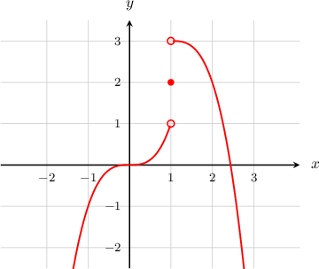
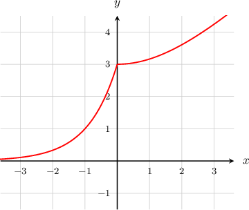

# Limits of Piecewise Functions

Source: https://www.mathacademy.com/topics/1262?courseId=111
Topic ID: 1262

## Prerequisites

- [Limits of Logarithmic Functions](./1377-limits-of-logarithmic-functions.md)
- [Limits of Exponential Functions](./1717-limits-of-exponential-functions.md)
- [Limits of Reciprocal Functions](./1905-limits-of-reciprocal-functions.md)
- [Limits of Reciprocal Trigonometric Functions](./1958-limits-of-reciprocal-trigonometric-functions.md)
- [Limits of Radical Functions](./1986-limits-of-radical-functions.md)

## Lesson

### Introduction

Suppose we want to compute $\lim\limits_{x \to \, 1} f(x)$ for the piecewise function $f(x)$ given below.

$$

\begin{aligned}𝑥^{3}\, & for \,𝑥<1 \\ 2\, & for \,𝑥=1 \\ −(𝑥−1)^{3}+3\, & for \,𝑥>1\end{aligned}

$$

We begin by sketching a graph of the function:

To compute $\lim\limits_{x \to \, 1} f(x),$ we must compute the left and right-sided limits separately.

- Approaching from the left, we have $x<1,$ so we use the expression $f(x) = x^3.$ We get

- Approaching from the right, we have $x>1,$ so we use the expression $f(x)=-(x-1)^3+3.$ We get

Because the left and right-sided limits are not equal, the overall limit does not exist:

$$

\lim\limits_{x \to \, 1} f(x) = \text{DNE}.

$$

### Example: Computing the One-Sided Limits of a Piecewise Function when the Limits Coincide

#### Question

Find the left- and right-sided limits at $x=1$ of the piecewise function $f(x)$ defined by

$$

\begin{aligned}6𝑒^{𝑥−1}\, & for \,𝑥<1 \\ 𝑥^{2}+2𝑥+3\, & for \,𝑥>1.\end{aligned}

$$

#### Explanation

Approaching from the left, we have $x<1,$ so we use the expression $f(x) = 6e^{x-1}.$ We get

$$

\begin{aligned}\underset{𝑥→\,1^{−}}{lim}𝑓(𝑥) & =\underset{𝑥→\,1^{−}}{lim}6𝑒^{𝑥−1} \\ & =6𝑒^{1−1} \\ & =6𝑒^{0} \\ & =6.\end{aligned}

$$

Approaching from the right, we have $x>1,$ so we use the expression $f(x) = x^2+2x+3.$ We get

$$

\begin{aligned}\underset{𝑥→\,1^{+}}{lim}𝑓(𝑥) & =\underset{𝑥→\,1^{+}}{lim}𝑥^{2}+2𝑥+3 \\ & =1^{2}+2(1)+3 \\ & =6.\end{aligned}

$$

### Example: Computing the One-Sided Limits of a Piecewise Function when the Limits Do Not Coincide

#### Question

Find the left-sided and right-sided limits at $x=0$ for the function

$$

\begin{aligned}𝑓(𝑥)=\begin{aligned}−𝑥^{2}+3\, & for \,𝑥<0 \\ \sqrt{√𝑥}\, & for \,𝑥≥0.\end{aligned}\end{aligned}

$$

#### Explanation

Approaching from the left, we have $x < 0,$ so we use the expression $f(x)=-x^2+3.$ We get

$$

\begin{aligned}\underset{𝑥→0^{−}}{lim}𝑓(𝑥) & =\underset{𝑥→0^{−}}{lim}(−𝑥^{2}+3) \\ & =−(0)^{2}+3 \\ & =3.\end{aligned}

$$

Approaching from the right, we have $x>0,$ so we use the expression $f(x)=\sqrt{x}.$ We get

$$

\begin{aligned}\underset{𝑥→0^{+}}{lim}𝑓(𝑥) & =\underset{𝑥→0^{+}}{lim}\sqrt{√𝑥} \\ & =\sqrt{√0} \\ & =0.\end{aligned}

$$

### Limits of Piecewise Functions

Suppose we want to find $\lim_\limits{x\rightarrow 0}f(x)$ for the piecewise function given by

$$

\begin{aligned}𝑓(𝑥)=\begin{aligned}3^{𝑥+1}\, & for \,𝑥<0 \\ \sqrt{√𝑥^{2}+9}\, & for \,𝑥≥0.\end{aligned}\end{aligned}

$$

To get an idea of the behavior of the function around $x=0,$ we can plot the function.

To compute $\lim\limits_{x \to \, 0} f(x),$ we must compute the left and right-sided limits separately.

- Approaching from the left, we have $x < 0,$ so we use the expression $f(x)=3^{x+1}.$ We get

- Approaching from the right, we have $x>0,$ so we use the expression $f(x)=\sqrt {x^2+9}.$ We get

The left and right-sided limits both exist and are equal. So, the overall limit is

$$

\lim\limits_{x \to \, 0} f(x) =3.

$$

### Example: Computing Limits of Piecewise Functions with a Gap in the Domain

#### Question

Find $\lim_\limits{x\rightarrow 1}g(x)$ for the function given by

$$

\begin{aligned}\frac{\sqrt{√4𝑥^{2}+5}}{3𝑥−7}\, & for \,𝑥≤1 \\ (𝑥−2)^{2}−1\, & for \,𝑥≥2.\end{aligned}

$$

#### Explanation

To compute $\lim\limits_{x \to \, 1} g(x),$ we must compute the left and right-sided limits separately.

However, the right-sided limit $\lim_\limits{x\rightarrow 1^+}g(x)$ does not exist since $g(x)$ is not defined in the interval $x\in(1,2).$

Consequently, the overall limit does not exist either:

$$

\lim_\limits{x\rightarrow 1}g(x) = \text{DNE}.

$$

### Example: Solving for a Constant Such that the Limit of a Piecewise Function Exists

#### Question

For the piecewise function

$$

\begin{aligned}𝑓(𝑥)=\begin{aligned}4𝑥^{3}−2\, & for \,𝑥<1 \\ 3𝑥+𝑏\, & for \,𝑥>1\end{aligned},\,\end{aligned}

$$

it is known that $\lim_\limits{x\rightarrow 1}f(x)$ exists. What is the value of the constant $b?$

#### Explanation

In order for $\lim_\limits{x\rightarrow 1}f(x)$ to exist, the left and right-sided limits must both exist and be equal.

- Approaching from the left, we have $x < 1,$ so we use the expression $f(x)=4x^3-2.$ We get

- Approaching from the right, we have $x>1,$ so we use the expression $f(x)= 3x+b.$ We get

Finally, since the left and right-sided limits must be equal, we have

$$

\begin{aligned}\underset{𝑥→1^{−}}{lim}𝑓(𝑥) & =\underset{𝑥→1^{+}}{lim}𝑓(𝑥) \\ 2 & =3+𝑏 \\ 𝑏 & =−1.\end{aligned}

$$
