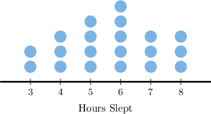
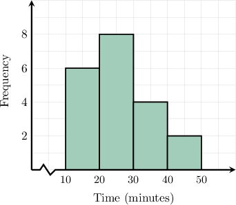

# Experimental Probability

Source: https://www.mathacademy.com/topics/130?courseId=111
Topic ID: 130

## Prerequisites

- [Converting Between Percentages and Fractions](../../../middle-school/lessons/grade-6/2451-converting-between-percentages-and-fractions.md)
- [Converting Between Percentages and Decimals](../../../middle-school/lessons/grade-6/2452-converting-between-percentages-and-decimals.md)
- [Dot Plots](../../../middle-school/lessons/grade-6/2499-dot-plots.md)
- [Histograms](../../../middle-school/lessons/grade-6/2510-histograms.md)

## Lesson

### Introduction

The **experimental probability** of an event is the quotient of the number of times an event occurred in an experiment by the total number of trials.

For example, suppose we conduct an experiment in which we toss a coin $100$ times, and we find that the coin lands heads up $44$ times.

To compute the experimental probability, we divide the number of times the coin landed heads up by the number of times we flipped the coin:

$$

P(\text{head}) = \dfrac{44}{100} = 0.44.

$$

So, the experimental probability of getting heads is $0.44.$

Each repetition of the process (here, a single coin toss) is called a **trial**, while the outcome that we are looking to obtain (here, a head) is an **event**.

In general, the formula for the experimental probability is

$$

P(\text{Event}) = \dfrac{\text{number of event occurrences}}{\text{total number of trials}}.

$$

### Example: Calculating an Experimental Probability From Experimental Data

#### Question

A jar contains colored marbles. A marble is selected at random $40$ times with replacement, and a green marble is chosen $18$ times. Based on this data, what is the experimental probability of selecting a green marble?

#### Explanation

The experimental probability of an event is the fraction of the time the event occurred in an experiment:

$$

P(\text{Event}) = \dfrac{\text{number of event occurrences}}{\text{total number of trials}}

$$

To compute the experimental probability in this case, we divide the number of times a green marble is chosen $(18)$ by the number of times a marble is selected $(40){:}$

$$

P(\text{green}) = \dfrac{18}{40}

$$

Converting to a percentage, we get

$$

P(\text{green}) = \dfrac{18}{40} = \dfrac{45}{100} = 45\%.

$$

Therefore, the experimental probability of selecting a green marble is $45\%.$

### Experimental Probabilities From Data Representations

Experimental probability can be calculated from different types of data representations, such as tables, dot plots, and histograms. In each case, the process is the same: count how many times the event occurred and divide by the total number of trials:

$$

P(\text{event}) = \dfrac{\text{number of event occurrences}}{\text{total number of trials}}

$$

When working with different representations:

- In a table, the frequencies are listed directly, so we read the counts from the table.

- In a dot plot, each dot represents one trial, so we count the dots that match the event.

- In a histogram, each bar shows the number of trials in an interval, so we use the height of the relevant bar(s).

The key idea is to correctly identify:

- how many times the event occurred, and

- how many total trials were recorded.

For example, suppose a librarian records the number of books students check out in one week. The table below shows the results.

Suppose we want to find the experimental probability that a randomly selected student checked out $2$ books.

From the table, we note the following:

- The number of students who checked out $2$ books is $8.$

- The total number of students surveyed is

Using the formula, we compute

$$

2

$$

Therefore, the experimental probability that a student checked out $2$ books is $\dfrac{4}{15}.$

### Example: Calculating an Experimental Probability From a Table

#### Question

A science teacher records how many minutes students spend exercising after school. The table below shows the results of her survey.

Based on this information, what is the experimental probability that a student spends between $20$ and $40$ minutes exercising after school?

#### Explanation

The experimental probability of an event is the fraction of the time the event occurred in an experiment:

$$

P(\text{Event}) = \dfrac{\text{number of event occurrences}}{\text{total number of trials}}

$$

To compute the experimental probability in this case, we divide the number of students who spend between $20$ and $40$ minutes exercising after school by the total number of students surveyed. From the table, we note the following:

- The number of students who spend between $20$ and $40$ minutes exercising after school is $6+5=11.$ Time (minutes) Frequency $<10$ $4$ $10-20$ $9$ $20-30$ $6$ $30-40$ $5$ $>40$ $1$

- The total number of students surveyed is

Therefore, the experimental probability that a student spends between $20$ and $40$ minutes exercising after school is

$$

20

$$

### Example: Calculating an Experimental Probability From a Dot Plot

#### Question

A teacher records how many hours her students sleep each night. Each dot in the plot above represents one student. Based on this data, what is the experimental probability that a randomly selected student sleeps at least $6$ hours per night?

#### Explanation

The experimental probability of an event is the fraction of the time the event occurred in an experiment:

$$

P(\text{Event}) = \dfrac{\text{number of event occurrences}}{\text{total number of trials}}

$$

To compute the experimental probability in this case, we divide the number of students who sleep at least $6$ hours per night by the total number of students. From the plot, we note the following:

- The number of students who sleep at least $6$ hours per night is $5+3+3=11.$

- The total number of students surveyed is

Therefore, the experimental probability that a randomly selected student sleeps at least $6$ hours per night is

$$

6

$$

### Example: Calculating an Experimental Probability From a Histogram

#### Question

The histogram above shows the distribution of the number of minutes students spend practicing piano each day. Based on this data, what is the experimental probability that a student practices between $20$ and $30$ minutes?

#### Explanation

The experimental probability of an event is the fraction of the time the event occurred in an experiment:

$$

P(\text{Event}) = \dfrac{\text{number of event occurrences}}{\text{total number of trials}}

$$

To compute the experimental probability in this case, we divide the number of students who practice between $20$ and $30$ minutes by the total number of students surveyed. From the plot, we note the following:

- The number of students who practice between $20$ and $30$ minutes is $8.$

- The total number of students surveyed is

Therefore, the experimental probability that a student practices between $20$ and $30$ minutes is

$$

20

$$
