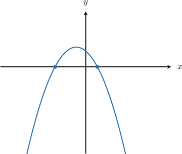
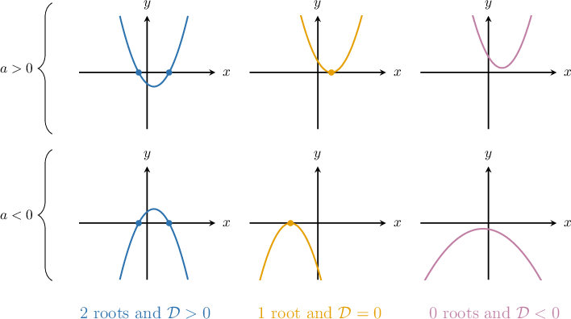
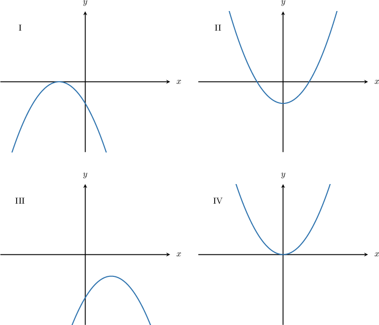
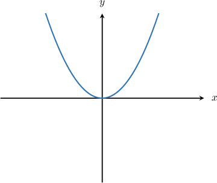
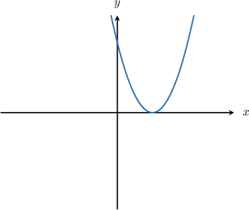
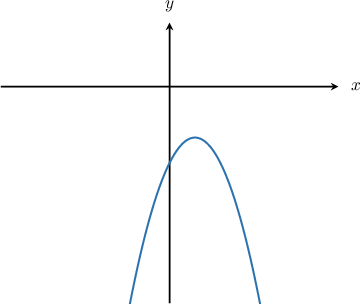
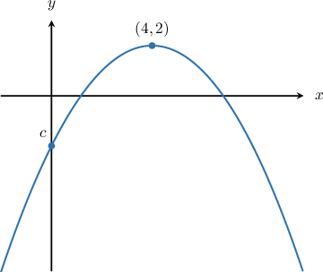

# The Discriminant of a Quadratic Function

Source: https://www.mathacademy.com/topics/1429?courseId=111
Topic ID: 1429

## Prerequisites

- [The Discriminant of a Quadratic Equation](./425-the-discriminant-of-a-quadratic-equation.md)
- [Roots of Quadratic Functions](./661-roots-of-quadratic-functions.md)

## Lesson

### Introduction

Remember that for a quadratic equation $ax^2+bx+c=0,$ the discriminant $\mathcal{D} = b^2 - 4ac$ tells us a lot about the number of solutions:

- if $\mathcal{D}>0,$ then we get $2$ distinct real solutions,

- if $\mathcal{D}=0,$ then we get $1$ distinct real solution, and

- if $\mathcal{D}<0,$ then we get no real solutions.

In the same way, the number of roots of a quadratic function $y=ax^2+bx+c$ tells us a lot about the discriminant:

- if the graph has $2$ roots, then $\mathcal{D}>0,$

- if the graph has $1$ root, then $\mathcal{D}=0,$ and

- if the graph has no roots, then $\mathcal{D}<0.$

To illustrate, consider the graph of the quadratic function $y=-x^2-x+1$ as shown below.

In the graph, the parabola intersects the $x$-axis twice, so it has $2$ roots. Therefore, we must have $\mathcal{D}>0.$ Indeed, if we calculate $\mathcal D$ explicitly, we get a positive result:

$$

\begin{aligned}D & =𝑏^{2}−4𝑎𝑐 \\ & =(−1)^{2}−4⋅(−1)⋅1 \\ & =1−(−4) \\ & =5\end{aligned}

$$

The general relation between the discriminant $\mathcal{D}$ of a quadratic function $y= ax^2+bx+c$ and the function's graph is sketched below. Remember that the leading coefficient $a$ determines which way the parabola opens: upward if $a>0,$ and downward if $a<0.$

### Example: Identifying Sketches Satisfying Discriminant and Leading Coefficient Conditions

#### Question

The graph of the parabola $y = ax^2 + bx + c$ with $a \gt 0$ has discriminant $\mathcal{D} = 0.$ Which of the following could be the graph of this function?

#### Explanation

To find the possible graph of the parabola, we need to determine two things:

- The direction in which the parabola opens.

- The number of distinct real roots of the quadratic function.

Since $a \gt 0,$ the parabola opens upward. Moreover, since the discriminant $\mathcal{D} = 0,$ the quadratic function has one distinct real root. So, it should intersect the $x$-axis once.

Therefore, of the given options, the only graph that satisfies both these conditions is diagram IV.

### Example: Identifying True Statements Regarding Discriminants

#### Question

The graph of the parabola $y=ax^2+bx+c$ (shown below) has discriminant $\mathcal D.$ Which of the following statements are true?

1. $a > 0$

2. $\mathcal D = 0$

3. $\mathcal D < 0$

#### Explanation

Given the graph of a quadratic function:

- if the graph has $2$ roots, then $\mathcal{D} > 0,$

- if the graph has $1$ root, then $\mathcal{D} = 0,$ and

- if the graph has no roots, then $\mathcal{D} < 0.$

For the given graph of the parabola $y=ax^2+bx+c{:}$

- Notice that $a$ is the leading coefficient. Since the parabola opens upward, we have that $a > 0.$ Therefore, statement I is true.

- Also, notice that the parabola intersects the $x$-axis once, so it has $1$ root. Therefore, we must have $\mathcal{D} = 0.$ Hence, statement II is true, while statement III is false.

In conclusion, only statements I and II are true.

### Example: Further Identifying True Statements Regarding Discriminants

#### Question

The graph of the parabola $y=ax^2+bx+c$ (shown below) has discriminant $\mathcal D.$ Which of the following statements are true?

1. $\mathcal D < 0$

2. $a > 0$

3. $c < 0$

#### Explanation

For the given graph of the parabola $y=ax^2+bx+c{:}$

- Notice that the parabola does not intersect the $x$-axis, so it has no roots. Therefore, we have $\mathcal{D} \lt 0,$ and hence, statement I is true.

- The value $a$ is the leading coefficient. Since the parabola opens downward, we have that $a \lt 0.$ Therefore, statement II is false.

- The value $c$ represents the $y$-intercept of the parabola. The $y$-intercept is below the $x$-axis, so it must be negative. Therefore, we must have $c < 0,$ and hence, statement III is true.

In conclusion, only statements I and III are true.

### Example: Deducing Discriminant Information Given the Vertex of a Quadratic Function

#### Question

The vertex of the parabola $y=ax^2+bx+c$ is at the point $(4,2).$ Given that $\mathcal{D}$ is the parabola's discriminant and $c \lt 0,$ which of the following statements are true?

1. $\mathcal{D} > 0$

2. $\mathcal{D} = 0$

3. $\mathcal{D} < 0$

#### Explanation

We know the location of the vertex and that the $y$-intercept lies below the $x$-axis. So, let's sketch our parabola based on this information.

Since the vertex $(4,2)$ is above the $x$-axis and not lying on the $x$-axis, the curve has either no roots or two distinct roots. Therefore, we must have $\mathcal{D} \neq 0.$

On the other hand, since $c< 0,$ the $y$-intercept is below the $x$-axis. So, the curve must intersect the $x$-axis in at least one place as it traverses from the $y$-intercept below the $x$-axis to the vertex above the $x$-axis. Hence, $\mathcal{D} \nless 0.$

Therefore, $\mathcal{D} \gt 0$ and only statement I is true.
