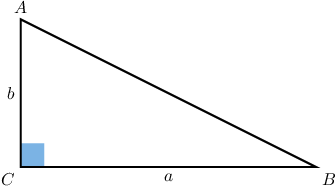
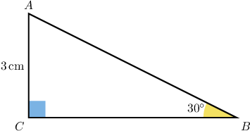
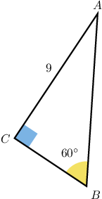
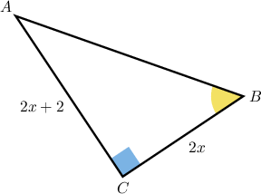
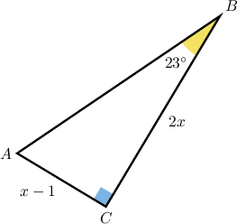

# Calculating Areas of Right Triangles Using Trigonometry

Source: https://www.mathacademy.com/topics/1608?courseId=111
Topic ID: 1608

## Prerequisites

- [Calculating Side Lengths of Right Triangles Using Trigonometry](./629-calculating-side-lengths-of-right-triangles-using-trigonometry.md)
- [Special Trigonometric Ratios](./765-special-trigonometric-ratios.md)
- [Areas of Triangles](../../../middle-school/lessons/grade-7/1397-areas-of-triangles.md)

## Lesson

### Introduction

Consider the right triangle $\triangle ABC$ shown below.

The area of this right triangle is

$$

\mathcal A = \dfrac 1 2 ab.

$$

But how can we calculate the area if we only know one side and one angle, as in the triangle below?

We can follow the two steps below.

**Step 1**: Calculate the missing side using the trigonometric ratios.

Here, we need the adjacent side, and we know the opposite side. So, we should use tangent:

$$

\begin{aligned}tan⁡(𝐵) & =\frac{𝐴𝐶}{𝐵𝐶} \\ tan⁡30^{∘} & =\frac{3}{𝐵𝐶} \\ \frac{\sqrt{3}}{3} & =\frac{3}{𝐵𝐶} \\ 𝐵𝐶\sqrt{3} & =9 \\ 𝐵𝐶 & =\frac{9}{\sqrt{3}} \\ 𝐵𝐶 & =3\sqrt{3}\,cm.\end{aligned}

$$

**Step 2**: Use the formula to calculate the area.

Now that we know both sides of the triangle, we can just apply the formula as usual and get

$$

\begin{aligned}A & =\frac{1}{2}𝐴𝐶⋅𝐵𝐶 \\ & =\frac{1}{2}⋅3⋅3\sqrt{3} \\ & =\frac{9\sqrt{3}}{2}\,cm^{2}.\end{aligned}

$$

### Example: Determining the Area of a Triangle Given an Angle and the Length of a Leg

#### Question

In square units, what is the area of $\triangle ABC$ shown below?

#### Explanation

In this case, the area of the right triangle is

$$

\mathcal A = \dfrac 1 2 AC \cdot BC.

$$

Notice that relative to the given angle $\angle B,$ we have the length of the opposite side $\overline{AC}$ and need to determine the length of the adjacent side $\overline{BC}.$ Hence, we can use the tangent ratio to solve for $BC{:}$

$$

\begin{aligned}tan⁡(𝑚∠𝐵) & =\frac{𝐴𝐶}{𝐵𝐶} \\ tan⁡(60^{∘}) & =\frac{9}{𝐵𝐶} \\ \sqrt{3} & =\frac{9}{𝐵𝐶} \\ \sqrt{3}𝐵𝐶 & =9 \\ 𝐵𝐶 & =\frac{9}{\sqrt{3}} \\ & =\frac{9\sqrt{3}}{3} \\ & =3\sqrt{3}\end{aligned}

$$

Therefore, the area of $\triangle{ABC}$ is

$$

\begin{aligned}A & =\frac{1}{2}⋅9⋅(3\sqrt{3}) \\ & =\frac{27\sqrt{3}}{2}.\end{aligned}

$$

### Example: Finding the Area of a Triangle by Solving for a Variable Given a Trigonometric Ratio of One Angle

#### Question

Given that $\tan(m\angle{B}) =\dfrac{4}{3},$ calculate the area (in square units) of $\triangle ABC$ shown below.

#### Explanation

In this case, the area of the right triangle is

$$

\mathcal{A} = \dfrac12 BC \cdot AC.

$$

We are given that $\tan(m\angle{B}) = \dfrac{4}{3}.$ Notice that relative to $\angle{B},$ we have expressions for the lengths of the opposite side $\overline{AC}$ and adjacent side $\overline{BC}.$ Hence, we can use the tangent ratio to solve for $x{:}$

$$

\begin{aligned}tan⁡(𝑚∠𝐵) & =\frac{𝐴𝐶}{𝐵𝐶} \\ \frac{4}{3} & =\frac{2𝑥+2}{2𝑥} \\ 4⋅2𝑥 & =3⋅(2𝑥+2) \\ 8𝑥 & =6𝑥+6 \\ 2𝑥 & =6 \\ 𝑥 & =3\end{aligned}

$$

So, the side lengths are

$$

\begin{aligned}𝐴𝐶 & =2𝑥+2=2(3)+2=8, \\ 𝐵𝐶 & =2𝑥=2(3)=6.\end{aligned}

$$

Therefore, the area of $\triangle{ABC}$ is

$$

\begin{aligned}A & =\frac{1}{2}𝐵𝐶⋅𝐴𝐶 \\ & =\frac{1}{2}⋅6⋅8 \\ & =24.\end{aligned}

$$

### Example: Determining the Area of a Triangle Given a Trigonometric Ratio of an Angle and the Length of a Leg

#### Question

Given that $\sin \theta = \dfrac 13,$ calculate the area (in square units) of $\triangle ABC$ shown below.

#### Explanation

In this case, the area of the right triangle is

$$

\mathcal{A} = \dfrac12 AC \cdot BC.

$$

We are given that $\sin \theta = \dfrac13,$ where $\theta = m\angle{A}.$ Notice we're also given the length of the side $\overline{BC}$ opposite to $\angle{A}.$ Hence, we can use the sine ratio to find the length of the hypotenuse $\overline{AB}{:}$

$$

\begin{aligned}sin⁡𝜃 & =\frac{𝐵𝐶}{𝐴𝐵} \\ \frac{1}{3} & =\frac{5}{𝐴𝐵} \\ 𝐴𝐵 & =5(3) \\ 𝐴𝐵 & =15\end{aligned}

$$

Now, we can use the Pythagorean theorem to find the missing side $AC\mathbin{:}$

$$

\begin{aligned}𝐴𝐶 & =\sqrt{𝐴𝐵^{2}−𝐵𝐶^{2}} \\ & =\sqrt{15^{2}−5^{2}} \\ & =\sqrt{225−25} \\ & =\sqrt{200} \\ & =10\sqrt{2}\end{aligned}

$$

Therefore, the area of $\triangle{ABC}$ is

$$

\begin{aligned}A & =\frac{1}{2}𝐴𝐶⋅𝐵𝐶 \\ & =\frac{1}{2}⋅10\sqrt{2}⋅5 \\ & =25\sqrt{2}.\end{aligned}

$$

### Example: Finding the Area of a Triangle by Solving for a Variable Given an Angle

#### Question

In square units rounded to one decimal place, find the area of $\triangle ABC$ shown below.

#### Explanation

In this case, the area of the right triangle is

$$

\mathcal{A} = \dfrac12 AC \cdot BC.

$$

We are given that $m\angle{B} = 23^\circ.$ Notice that relative to $\angle{B},$ we have expressions for the lengths of the opposite side $\overline{AC}$ and adjacent side $\overline{BC}.$ Hence, we can use the tangent ratio to solve for $x{:}$

$$

\begin{aligned}tan⁡(𝑚∠𝐵) & =\frac{𝐴𝐶}{𝐵𝐶} \\ tan⁡(23^{∘}) & =\frac{𝑥−1}{2𝑥} \\ 2𝑥⋅tan⁡(23^{∘}) & =𝑥−1 \\ 1 & =𝑥−2𝑥⋅tan⁡(23^{∘}) \\ 1 & =𝑥(1−2⋅tan⁡(23^{∘})) \\ 𝑥 & =\frac{1}{1−2⋅tan⁡(23^{∘})} \\ 𝑥 & =6.620\,3…\end{aligned}

$$

So, the side lengths are

$$

\begin{aligned}𝐵𝐶 & =2𝑥=2(6.620\,3…)=13.240\,6…, \\ 𝐴𝐶 & =𝑥−1=(6.620\,3…)−1=5.620\,3….\end{aligned}

$$

Therefore, the area of $\triangle{ABC}$ is

$$

\begin{aligned}A & =\frac{1}{2}(5.620\,3…)(13.240\,6…) \\ & =37.208\,0… \\ & ≈37.2,\end{aligned}

$$

rounded to the one decimal place.
