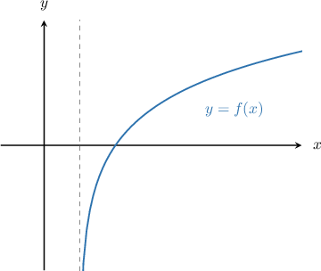
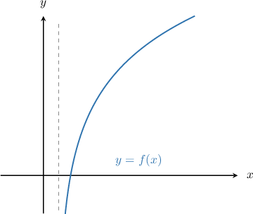

# Properties of Transformed Logarithmic Functions

Source: https://www.mathacademy.com/topics/1610?courseId=111
Topic ID: 1610

## Prerequisites

- [Solving Logarithmic Equations Containing the Natural Logarithm](./1551-solving-logarithmic-equations-containing-the-natural-logarithm.md)
- [Combining Graph Transformations of Logarithmic Functions](./1707-combining-graph-transformations-of-logarithmic-functions.md)
- [Further Solving Linear Inequalities](../../../middle-school/lessons/grade-7/4034-further-solving-linear-inequalities.md)

## Lesson

### Introduction

When we transform a logarithmic function $y = \log_a (x),$ its domain might be modified as well.

For example, the diagram below shows the graph of the transformed logarithmic function $f(x) = \log_2(x-1).$ What is the domain of $f(x)?$

First, recall that the domain of $y=\log_a (x)$ is

$$

x > 0.

$$

To find the domain of $f(x),$ we take the above inequality and replace $x$ with the argument (or input) of the logarithm function contained in $f(x).$ In this case, the argument is $x-1,$ so we get

$$

x-1 > 0.

$$

Solving this inequality, we obtain

$$

\begin{aligned}𝑥−1 & >0 \\ 𝑥 & >1.\end{aligned}

$$

Therefore, the domain of $y=f(x)$ is $x\in(1, \infty).$

### Example: The Domain of a Transformed Logarithmic Function

#### Question

What is the domain of $f(x)=\ln (2x+4)-2?$

#### Explanation

The domain of $y = \ln x$ is

$$

x \gt 0.

$$

To find the domain of $f(x),$ we replace $x$ with $2x+4$ in the above inequality. This gives

$$

2x+4 > 0.

$$

Solving this inequality, we obtain

$$

\begin{aligned}2𝑥+4 & >0 \\ 2𝑥 & >−4 \\ 𝑥 & >−2.\end{aligned}

$$

Therefore, the domain of $y = f(x)$ is $x\in\left(-2, \infty \right).$

### Example: The Vertical Asymptote of a Transformed Logarithmic Function

#### Question

Find the equation of the vertical asymptote of the function $f(x) = -\ln(4x).$

#### Explanation

The equation of the vertical asymptote of the function $y = \ln{x}$ is $x=0.$

To find the equation of the vertical asymptote of $f(x),$ we set the argument of the logarithmic term equal to zero, and solve for $x.$ This gives

$$

\begin{aligned}4𝑥 & =0 \\ 𝑥 & =0.\end{aligned}

$$

Therefore, the equation of the vertical asymptote is $x = 0.$

### Example: The Root of a Transformed Logarithmic Function

#### Question

Find the root of $f(x) = \log(2x) - 2.$

#### Explanation

To find the root of $f(x),$ we must solve $f(x)=0\mathbin{:}$

$$

\log(2x) - 2 = 0

$$

We solve this equation by making $x$ the subject, as follows:

$$

\begin{aligned}log⁡(2𝑥)−2 & =0 \\ log⁡(2𝑥) & =2 \\ 10^{log⁡(2𝑥)} & =10^{2} \\ 2𝑥 & =100 \\ 𝑥 & =50\end{aligned}

$$

Therefore, the root of $f(x)$ is $x=50.$

### The Range of a Transformed Logarithmic Function

When we transform a logarithmic function $y = \log_a (x),$ its range is not affected.

For example, the diagram below shows the graph of the transformed logarithmic function $f(x) = 3\log_2(x-1)+1.$

The range of $\log_2 x$ is

$$

\log_2 x \in (-\infty,\infty).

$$

Because the range of the logarithm function is the interval containing all real numbers, horizontal and vertical shifts and stretches do not affect its range. Therefore, the range of $f(x)$ is

$$

f(x) \in (-\infty,\infty).

$$

### Example: The Range of a Transformed Logarithmic Function

#### Question

What is the range of $f(x) = 5\log_6(x-1)-4?$

#### Explanation

The range of the function $y = \log_{6}(x)$ is $y \in (-\infty,\infty).$

For a logarithmic function, horizontal and vertical shifts and stretches do not affect the range.

Therefore, the range of the given function is $f(x) \in (-\infty,\infty).$
