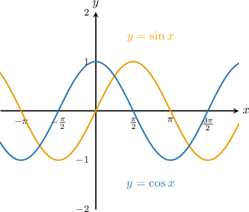
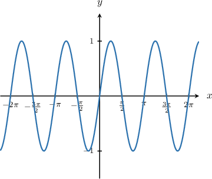
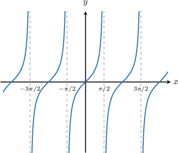
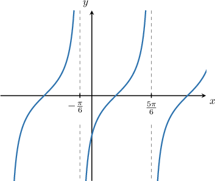

# Limits of Trigonometric Functions

Source: https://www.mathacademy.com/topics/1719?courseId=111
Topic ID: 1719

## Prerequisites

- [The Power and Root Rules for Limits](./37-the-power-and-root-rules-for-limits.md)
- [Combining Graph Transformations of Sine and Cosine](./275-combining-graph-transformations-of-sine-and-cosine.md)
- [Graph Transformations of Tangent and Cotangent](./654-graph-transformations-of-tangent-and-cotangent.md)
- [Infinite Limits from Graphs](./1814-infinite-limits-from-graphs.md)
- [Limits at Infinity from Graphs](./1873-limits-at-infinity-from-graphs.md)

## Lesson

### Introduction

Below are the graphs of the two most important trigonometric functions, $\sin(x)$ and $\cos(x).$

For any *finite* real number $a$ we have

$$

\lim\limits_{x\to a}\sin x=\sin (a) \qquad\text{and}\qquad\lim\limits_{x\to a}\cos x=\cos (a).

$$

For example,

$$

\begin{aligned}\underset{𝑥→𝜋/2}{lim}sin⁡𝑥 & =sin⁡(\frac{𝜋}{2})=1 \\ \underset{𝑥→2𝜋/3}{lim}cos⁡𝑥 & =cos⁡(\frac{2𝜋}{3})=−0.5.\end{aligned}

$$

However, the limits at infinity do not exist. As $x$ approaches $\infty$ or $-\infty$, the values of $\sin(x)$ and $\cos(x)$ oscillate between $1$ and $−1$ forever. So, we have

$$

\lim\limits_{x\to \pm \infty} \sin x=\text{DNE}\qquad\text{and}\qquad \lim\limits_{x\to \pm \infty} \cos x=\text{DNE}.

$$

### Example: Computing the Limit of Sine or Cosine

#### Question

Calculate $\lim\limits_{x\to \pi/8} \left(1 + 2\sin \left(2x\right) \right)^2.$

#### Explanation

Substituting $x=\dfrac{\pi}{8}$ directly into the limit, we have

$$

\begin{aligned}\underset{𝑥→𝜋/8}{lim}(1+2sin⁡(2𝑥))^{2} & =(1+2sin⁡(2⋅\frac{𝜋}{8}))^{2} \\ & =(1+2sin⁡(\frac{𝜋}{4}))^{2} \\ & =(1+2⋅\frac{\sqrt{2}}{2})^{2} \\ & =(1+\sqrt{2})^{2} \\ & =1^{2}+2⋅1⋅\sqrt{2}+(\sqrt{2})^{2} \\ & =1+2\sqrt{2}+2 \\ & =3+2\sqrt{2}.\end{aligned}

$$

### Example: Computing the Limit at Infinity of a Sine or Cosine Function

#### Question

Calculate $\lim\limits_{x \rightarrow \infty} \sin\left(2x\right).$

#### Explanation

Let's sketch the graph of $y = \sin\left(2x\right).$

As $x$ increases, the graph oscillates between the values $y=-1$ and $y=1$ indefinitely. Therefore,

$$

\lim_{x\to \infty} \sin\left(2x\right)= \mathrm{DNE.}

$$

### Limits of Tangent

Below is the graph of the tangent function $y=\tan(x).$

Note that $\tan x$ is not defined at the vertical asymptotes $x= \dfrac{\pi}{2} + n\pi$ where $n$ is an integer. However, everywhere else, the limit of the tangent function is the value of the tangent function:

$$

\lim\limits_{x \to a} \tan (x)=\tan\left(a\right),\qquad a\neq \dfrac{\pi}{2} + n\pi,

$$

For example,

$$

\begin{aligned}\underset{𝑥→𝜋/6}{lim}tan⁡(𝑥)=tan⁡(\frac{𝜋}{6})=\frac{\sqrt{3}}{3}.\end{aligned}

$$

However, the limits at infinity do not exist. As $x$ approaches $\infty$ or $-\infty,$ the values of $\tan(x)$ keep oscillating, and we have

$$

\lim\limits_{x\to \pm \infty} \tan x=\text{DNE} .

$$

### Example: Computing the Limit of Tangent

#### Question

Find $\lim\limits_{x \to \sqrt{\pi}/2}\tan\left(2x^2-\dfrac{\pi}{4}\right).$

#### Explanation

Substituting $x=\dfrac{\sqrt \pi}{2}$ directly into the limit, we have

$$

\begin{aligned}\underset{𝑥→\sqrt{𝜋}/2}{lim}tan⁡(2𝑥^{2}−\frac{𝜋}{4}) & =tan⁡(2(\frac{\sqrt{𝜋}}{2})^{2}−\frac{𝜋}{4}) \\ & =tan⁡(2(\frac{𝜋}{4})−\frac{𝜋}{4}) \\ & =tan⁡(\frac{𝜋}{2}−\frac{𝜋}{4}) \\ & =tan⁡(\frac{𝜋}{4}) \\ & =1.\end{aligned}

$$

### Limits at the Vertical Asymptotes of Tangent

Let's take another look at the graph of the tangent function $y=\tan(x).$

As we can see from the graph, $x = \pm \dfrac{\pi}{2}, \pm \dfrac{3\pi}{2}, \ldots$ are the points where $y=\tan (x)$ has vertical asymptotes. Both the left and right-sided limits at those points are infinite. In particular,

$$

\lim\limits_{x\to \pi/2^{-}}\tan(x)=\infty,\qquad \lim\limits_{x\to \pi/2^{+}}\tan(x)=-\infty.

$$

Since the left and right-sided limits are not equal, we have

$$

\lim\limits_{x\to \pi/2}\tan(x)=\text{DNE}.

$$

In general, at any vertical asymptote $x= \dfrac{\pi}{2} + n\pi$ where $n$ is an integer, the limit is undefined:

$$

\lim\limits_{x\to \pi/2+n\pi}\tan(x)=\text{DNE}.

$$

### Example: Computing a Limit at a Vertical Asymptote of Tangent

#### Question

Evaluate $\lim\limits_{x \to (-\pi/6)^{-}} \tan\left(x-\dfrac\pi 3 \right).$

#### Explanation

First, let's try direct substitution:

$$

\begin{aligned}\underset{𝑥→(−𝜋/6)^{−}}{lim}tan⁡(𝑥−\frac{𝜋}{3}) & =\underset{𝑥→(−𝜋/6)^{−}}{lim}\frac{sin⁡(𝑥−\frac{𝜋}{3})}{3} \\ & =\frac{sin⁡(−\frac{𝜋}{6}−\frac{𝜋}{3})}{6} \\ & =\frac{sin⁡(−\frac{𝜋}{2})}{2} \\ & =\frac{−1}{0},\end{aligned}

$$

which is not defined.

Therefore, to find the limit, let's sketch the graph of $y = \tan\left(x-\dfrac\pi 3 \right).$

We see that as $x$ approaches $-\dfrac\pi 6$ from the left, the values of $y=\tan\left(x-\dfrac\pi 3 \right)$ are positive and increase without bound. Therefore, we conclude that

$$

\lim\limits_{x \to (-\pi/6)^{-}} \tan\left(x-\dfrac\pi 3 \right)= \infty.

$$
