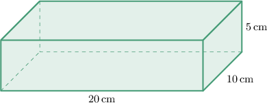
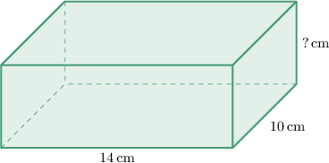
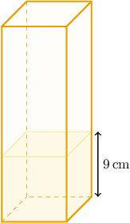

# Volumes of Rectangular Solids

Source: https://www.mathacademy.com/topics/1753?courseId=111
Topic ID: 1753

## Prerequisites

- [Solving One-Step Multiplication and Division Equations](../../../middle-school/lessons/grade-7/40-solving-one-step-multiplication-and-division-equations.md)
- [Volumes of Cubes](./1467-volumes-of-cubes.md)
- [The Product Rule for Radicals](../../../middle-school/lessons/grade-8/1927-the-product-rule-for-radicals.md)

## Lesson

### Introduction

Let's consider the rectangular prism below. How can we calculate its volume?

In general, we can find the volume $V$ of a rectangular prism using the formula

$$

V = lwh,

$$

where $l$ is the length, $w$ is the width, and $h$ is the height of the solid.

Substituting

$$

l = 20\,\textrm{cm}, \qquad w=10\,\textrm{cm}, \qquad h=5\,\textrm{cm}

$$

into the formula, we obtain

$$

\begin{aligned}𝑉 & =20⋅10⋅5=1\,000\,cm^{3}.\end{aligned}

$$

### Example: Calculating the Volume of a Rectangular Solid Given Its Dimensions

#### Question

What is the volume of a rectangular solid that has length, width, and height of $5 \: \textrm{m},$ $\sqrt3 \: \textrm{m},$ and $\sqrt6 \: \textrm{m},$ respectively?

#### Explanation

We can find the volume $V$ of the rectangular prism using the formula

$$

V = lwh,

$$

where $l$ is the length, $w$ is the width, and $h$ is the height of the solid.

Substituting

$$

l=5 \, \textrm{m}, \qquad w=\sqrt3 \, \textrm{m}, \qquad h=\sqrt6 \, \textrm{m}

$$

into the formula, we obtain

$$

V = 5 \cdot \sqrt3 \cdot \sqrt6 = 5\sqrt{18} = 15\sqrt2 \: \textrm{m}^3.

$$

### Example: Finding a Dimension of a Rectangular Solid Given Its Volume and Some Other Dimensions

#### Question

Determine the height of the rectangular solid below given that its volume is $700\:\textrm{cm}^3.$

#### Explanation

We can find the volume $V$ of the rectangular prism using the formula

$$

V = lwh,

$$

where $l$ is the length, $w$ is the width, and $h$ is the height of the solid.

Substituting

$$

V = 700, \qquad l=14, \qquad w=10

$$

into the formula, we obtain the following:

$$

\begin{aligned}700 & =14⋅10⋅ℎ \\ 700 & =140ℎ \\ ℎ & =5\end{aligned}

$$

Therefore, the height is $5\:\textrm{cm}.$

### Example: Finding the Volume of a Rectangular Solid: Word Problems

#### Question

The diagram below shows a carton of orange juice. One-third of the carton is filled with juice, forming a cube. Find the volume of the empty space in the carton.

#### Explanation

The orange juice in the carton creates a cube. Since the height of the juice is $9\,\textrm{cm},$ the side length of the cube is also $9\,\textrm{cm}.$

The height of $9 \: \textrm{cm}$ shown in the diagram represents a third of the carton's height. Therefore, the height of the carton is

$$

3 \cdot 9 = 27 \: \textrm{cm}.

$$

The empty space in the carton is a rectangular prism that is $9\:\textrm{cm}$ long, $9\:\textrm{cm}$ wide, and $27 - 9 = 18\:\textrm{cm}$ high.

We can find the volume $V$ of the rectangular prism using the formula

$$

V = lwh,

$$

where $l$ is the length, $w$ is the width, and $h$ is the height of the solid.

Substituting

$$

l=9\,\textrm{cm}, \qquad w=9\,\textrm{cm}, \qquad h=18\,\textrm{cm}

$$

into the formula, we obtain

$$

V = 9 \cdot 9 \cdot 18 = 1\,458\:\textrm{cm}^3.

$$

Therefore, we conclude that there is $1\,458 \: \textrm{cm}^3$ of empty space in the carton.
