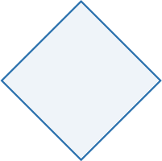
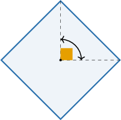
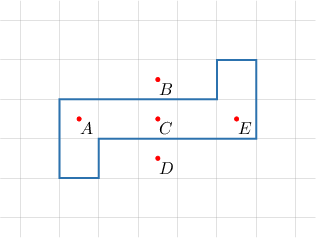
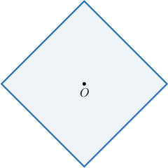
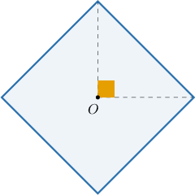
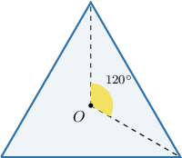
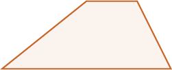
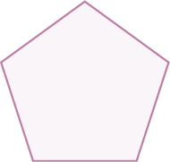
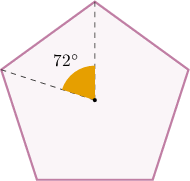

# Rotational Symmetry

Source: https://www.mathacademy.com/topics/2227?courseId=111
Topic ID: 2227

## Prerequisites

- [Regular Polygons](../../../middle-school/lessons/grade-8/1322-regular-polygons.md)
- [Rotations of Geometric Figures](./1517-rotations-of-geometric-figures.md)
- [Rectangles, Rhombuses, and Squares](../../../elementary-school/lessons/grade-5/3751-rectangles-rhombuses-and-squares.md)

## Lesson

### Introduction

A geometric figure has **rotational symmetry** if it can be rotated about a point, called the **center of rotation**, by an angle $\alpha,$ where $0^\circ < \alpha < 360^\circ,$ so that the resulting figure lies perfectly on top of the original figure.

For example, let's consider the square below.

This square has rotational symmetry because it appears unchanged after a rotation of $90^\circ$ (counterclockwise or clockwise) about its center.

### Example: Identifying the Center of Rotation of a Polygon

#### Question

The polygon below has rotational symmetry. Which of the marked points is the center of rotation?

#### Explanation

Notice that by rotating the given polygon $180^\circ$ counterclockwise (or clockwise) about the point $C,$ we map the polygon onto itself.

Therefore, point $C$ is the center of rotation.

### Example: Identifying Angles that Map a Polygon Onto Itself

#### Question

The square shown above is rotated about its center $O.$ Which of the following angles of rotation would carry the rotated square onto itself?

1. $180^\circ$

2. $160^\circ$

3. $270^\circ$

#### Explanation

If we rotate a square about its center by multiples of

$$

\dfrac{360^\circ}{4} = 90^\circ,

$$

we get the same square.

Among the given options, the multiples of $90^\circ$ are

- $2 \cdot 90^\circ = 180^\circ,$ and

- $3 \cdot 90^\circ = 270^\circ.$

Therefore, a rotation by an angle of $180^\circ$ or $270^\circ$ will carry the rotated square onto itself.

So, the correct answer is "I and III only."

### Order of Rotational Symmetry

The **order** of rotational symmetry of a figure is the number of times the figure lies perfectly on top of itself as we rotate it through an angle of $360^\circ.$

To demonstrate, let's consider an equilateral triangle. What is its order of rotational symmetry?

An equilateral triangle is a regular polygon with ${\color{blue}3}$ sides.

To compute the smallest angle that we can rotate the figure so that it appears unchanged, we divide $360^\circ$ by ${\color{blue}{3}},$ as follows:

$$

\dfrac{360^\circ}{\color{blue}3} = 120^\circ

$$

So, we can rotate the triangle about its center by $120^\circ$ a total of $\color{blue}3$ times before the triangle's vertices return to their original position.

Therefore, the order of rotational symmetry of an equilateral triangle is ${\color{blue}{3}}.$

In general, the order of rotational symmetry of a *regular* $n$-gon is $n.$

### Figures With Rotational Symmetry of Order 1

Most figures do not have any rotational symmetry.

For example, consider the following trapezoid.

No matter what point we choose as a center of rotation, the only angles that will map the figure onto itself are the multiples of $360^\circ\mathbin{:}$

$$

0^\circ, \quad 360^\circ, \quad 720^\circ, \quad \ldots

$$

We say that the order of rotational symmetry for such figures is equal to $1.$

### Example: Determining the Order of Rotational Symmetry for a Polygon

#### Question

What is the order of rotational symmetry of the regular pentagon below?

#### Explanation

If we rotate the shape about its center by multiples of

$$

\dfrac{360^\circ}{\color{blue}5} = 72^\circ,

$$

we get the same shape. And $72^\circ$ is the smallest such angle.

Therefore, the order of rotational symmetry for the given shape is ${\color{blue}5}.$
