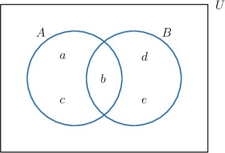
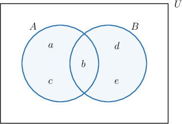
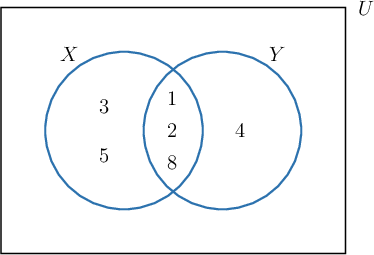
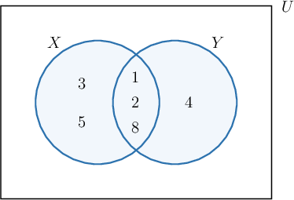

# The Union of Sets

Source: https://www.mathacademy.com/topics/2826?courseId=111
Topic ID: 2826

## Prerequisites

- [Sets](./45-sets.md)

## Lesson

### Introduction

The **union** of two sets and denoted is the set of all elements belonging to either or or both.

For example, consider the sets and We can represent these sets using a Venn diagram, as follows:

The union consists of all the elements that are in or or both. To represent we will shade in all the area that is contained within either or or both.

The elements are in either or or both. Therefore, the union of and is

Notice that belongs to both and but we list it only once in In a set, each distinct element is written only once.

### Example: Finding a Union of Sets Using a Venn Diagram

#### Question

The sets $X = \{1, 2, 3, 5, 8 \}$ and $Y = \{1, 2, 4, 8 \}$ are shown in the Venn diagram above. Find $X\cup Y.$

#### Explanation

The union $X \cup Y$ consists of all the elements that are in $X$ or $Y,$ or both. To represent $X \cup Y,$ we will shade in all the area that is contained within either $X$ or $Y,$ or both.

The elements $1,2,3,4,5,8$ are in either $X$ or $Y,$ or both. Therefore, the union of $X$ and $Y$ is

$$

X \cup Y = \{ 1,2,3,4,5,8 \}.

$$

### Unions Without Venn Diagrams

Although Venn diagrams can be useful to visualize unions, we do not have to draw a Venn diagram every time we wish to compute a union.

For example, let's again consider the sets $A = \{a,b,c \}$ and $B = \{b, d, e \}.$ This time, we will compute the union $A \cup B$ without using a Venn diagram. We just need to find all the elements that are in either $A$ or $B,$ or both.

So, we will start with the elements of $A,$ and then go through the elements of $B$ to look for any elements that we do not already have. Remember that we are looking for elements that we do *not* already have in $A.$

- For the element $b \in B,$ we have $b \in A. \quad \color{red}\times$

- For the element $d \in B,$ we have $d \not \in A. \quad \color{green}\checkmark$

- For the element $e \in B,$ we have $e \not \in A. \quad \color{green}\checkmark$

So, to get the union, we need to take the elements of $A$ and also include $d$ and $e.$

Therefore, the union of $A$ and $B$ is

$$

A \cup B = \{ a,b,c,d,e \}.

$$

### Example: Finding a Union of Sets Without a Venn Diagram

#### Question

Given the sets $X = \{2, 5, 7, 8\},$ $Y = \{1, 3, 5\},$ and $Z = \{2, 4, 6, 8\},$ find $X \cup Y,$ $Y \cup Z,$ and $Z \cup X.$

#### Explanation

The union $X \cup Y$ is the set of all elements belonging to either $X$ or $Y,$ or both. So, we have

$$

\begin{aligned}𝑋∪𝑌 & ={2,5,7,8}∪{1,3,5} \\ & ={1,2,3,5,7,8}.\end{aligned}

$$

The union $Y \cup Z$ is the set of all elements belonging to either $Y$ or $Z,$ or both. So, we have

$$

\begin{aligned}𝑌∪𝑍 & ={1,3,5}∪{2,4,6,8} \\ & ={1,2,3,4,5,6,8}.\end{aligned}

$$

The union $Z \cup X$ is the set of all elements belonging to either $Z$ or $X,$ or both. So, we have

$$

\begin{aligned}𝑍∪𝑋 & ={2,4,6,8}∪{2,5,7,8} \\ & ={2,4,5,6,7,8}.\end{aligned}

$$

### Example: Finding Unions of Sets Given Verbally

#### Question

Let $A$ and $B$ be the set of all multiples of $4$ that are greater than $0$ and the set of all multiples of $6$ that are greater than $0,$ respectively. What is $A \cup B?$

#### Explanation

The multiples of $4$ that are greater than $0$ are

$$

A = \{ 4,8,12,16,20,24,28,32, 36 \ldots \}.

$$

Likewise, multiples of $6$ that are greater than $0$ are

$$

B = \{ 6,12,18,24,30,36,\ldots \}.

$$

Now, $A \cup B$ is the ** of $A$ and $B,$ which means that we want to find the elements that are in either $A$ or $B,$ or both.

Therefore, we have

$$

\begin{aligned}𝐴∪𝐵 & ={4,8,12,16,20,24,28,32,36,…}∪{6,12,18,24,30,36,…} \\ & ={4,6,8,12,16,18,20,24,28,30,32,36,…}.\end{aligned}

$$
