# Combining Reflections With Other Graph Transformations

Source: https://www.mathacademy.com/topics/2841?courseId=111
Topic ID: 2841

## Prerequisites

- [Combining Graph Transformations: Three or More Operations](./634-combining-graph-transformations-three-or-more-operations.md)
- [Vertical Reflections of Functions](./1150-vertical-reflections-of-functions.md)
- [Horizontal Reflections of Functions](./1585-horizontal-reflections-of-functions.md)

## Lesson

### Introduction

Given the graph of a curve $y= f(x),$ there are two types of reflections we can apply to it:

1. Reflection across the $y$-axis. This is a transformation of the form

2. Reflection across the $x$-axis. This is a transformation of the form

For example, let's consider the function $y=f(x)$ below.

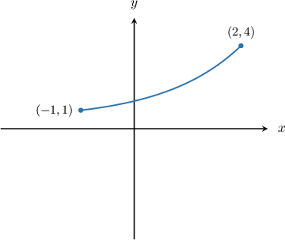

The graph of $y=f(-x)$ is a reflection of $y=f(x)$ in the $y$-axis, and it looks as follows:

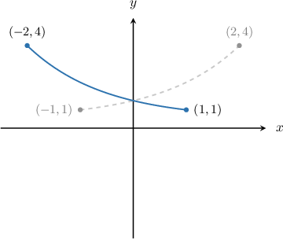

The graph of $y=-f(x)$ is a reflection of $y=f(x)$ in the $x$-axis, and it looks as follows:

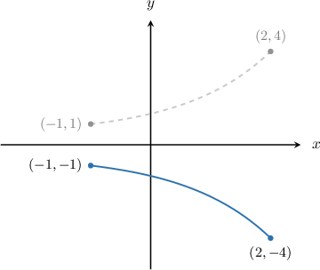

We can also combine reflections with other graph transformations. Let's see how.

### Example: Determining the Correct Order of Transformations Given a Transformed Function Expression

#### Question

The graph of $y=-f(x-2)+3,$ can be obtained from the graph of $y=f(x)$ by applying **** of the following transformations:

- $(\text{T}1)$ - Translation by $3$ units up

- $(\text{T}2)$ - Reflection across the $x$-axis

- $(\text{T}3)$ - Translation by $2$ units to the right

- $(\text{T}4)$ - Translation by $2$ units to the left

What could be a possible ordering of the appropriate transformations?

#### Explanation

To perform transformations of functions with multiple operations, we must remember the following rule:

1. First, we perform the transformations ** the argument of $f.$ We first carry out horizontal stretches and reflections, followed by horizontal translations.

2. Then, we perform the transformations ** the argument of $f.$ We first carry out vertical stretches and reflections, followed by vertical translations.

To get $y=-f(x-2)+3,$ we could apply the following steps:

- Take the curve $y=f(x).$

- Apply transformation $(\text{T}3)\mathbin{:}$ Translate $y=f(x)$ by $2$ units to the right to get the graph of

- Apply transformation $(\text{T}2)\mathbin{:}$ Reflect $y=f(x-2)$ across the $x$-axis to get the graph of

- Apply transformation $(\text{T}1)\mathbin{:}$ Translate $y=-f(x-2)$ by $3$ units up to get the graph of

Therefore, a possible order of transformations is

$\qquad$ $(\text{T}3) \to (\text{T}2) \to (\text{T}1).$

### Example: Identifying Graph Transformations Resulting From Reflections With Shifting

#### Question

The diagram below shows the function $y=f(x).$ Find the graph of $y=-f(x+3).$

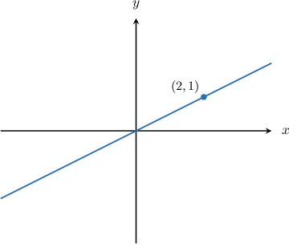

#### Explanation

To perform transformations of functions with multiple operations, we must remember the following rule:

1. First, we perform the transformations ** the argument of $f.$ We first carry out horizontal stretches and reflections, followed by horizontal translations.

2. Then, we perform the transformations ** the argument of $f.$ We first carry out vertical stretches and reflections, followed by vertical translations.

To plot $y=-f(x+3),$ we apply the following steps:

- Take the curve $y=f(x).$

- Translate it to the left by $3$ units $y=f(x+3).$

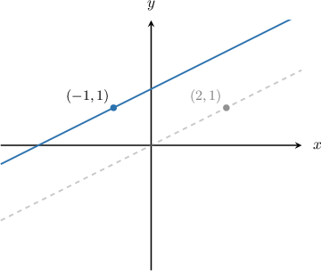

- Then, reflect the result across the $x$- axis to get the graph of $y=-f(x+3).$

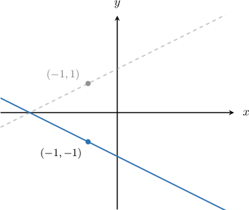

### Example: Identifying Graph Transformations Resulting From Reflections With Scaling

#### Question

The diagram below shows the function $y=f(x).$ Find the graph of $y=f\left(-3x\right).$

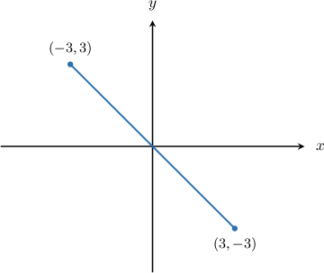

#### Explanation

To perform transformations of functions with multiple operations, we must remember the following rule:

1. First, we perform the transformations ** the argument of $f.$ We first carry out horizontal stretches and reflections, followed by horizontal translations.

2. Then, we perform the transformations ** the argument of $f.$ We first carry out vertical stretches and reflections, followed by vertical translations.

First, let's factor out the minus sign next to the $x$ inside the function:

$$

y=f\left(-\left(3x\right)\right)

$$

To plot $y=f\left(-\left(3x\right)\right),$ we apply the following steps:

- Take the curve $y=f(x).$

- Stretch it by a scale factor of $\dfrac{1}{3}$ parallel to the $x$-axis to get the graph of $y=f\left(3x\right).$

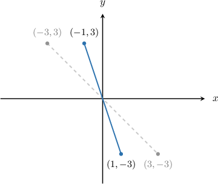

- Then, reflect it across the $y$-axis to get the graph of $y=f\left(-\left(3x\right)\right).$

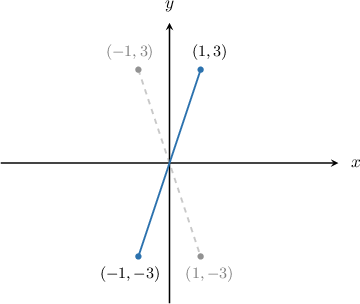

### Example: Identifying Graph Transformations Resulting From Reflections With Other Transformations

#### Question

The diagram below shows the function $y=f(x).$ Find the graph of $y=3f\left(-x+1\right)?$

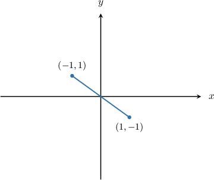

#### Explanation

To perform transformations of functions with multiple operations, we must remember the following rule:

1. First, we perform the transformations ** the argument of $f.$ We first carry out horizontal stretches and reflections, followed by horizontal translations.

2. Then, we perform the transformations ** the argument of $f.$ We first carry out vertical stretches and reflections, followed by vertical translations.

First, let's factor out the negative sign next to the $x$ inside the function:

$$

y=3f\left(-(x-1)\right)

$$

To plot $y=3f\left(-(x-1)\right),$ we apply the following steps:

- Take the curve $y=f(x).$

- Reflect it across the $y$-axis to get the graph of $y=f\left(-x\right)$ (remember that multiplication comes ** subtraction in the order of operations).

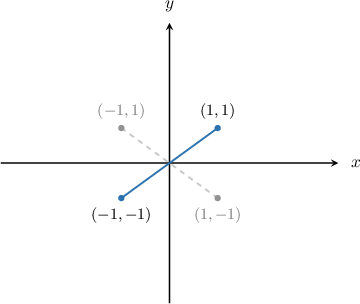

- Then, translate the result by $1$ unit to the right to get the graph of $y=f\left(-(x-1)\right).$

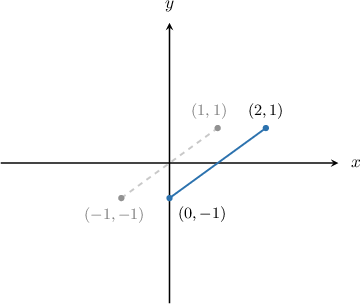

- Finally, stretch the result by a scale factor of $3$ parallel to the $y$-axis to get the graph of $y=3f\left(-(x-1)\right).$

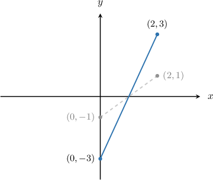
