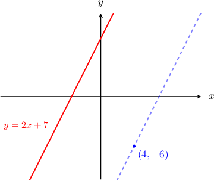

# Finding Equations of Parallel Lines

Source: https://www.mathacademy.com/topics/3556?courseId=111
Topic ID: 3556

## Prerequisites

- [Parallel Lines in the Coordinate Plane](../../../high-school/traditional/lessons/algebra-i/837-parallel-lines-in-the-coordinate-plane.md)

## Lesson

### Introduction

The graph of ${y=2x+7}$ is shown in the picture below. Let's find the equation of the line that passes through $(4,-6)$ and is parallel to $y=2x+7.$

Since parallel lines have equal slopes, the slope of the new line should be equal to the slope of $y=2x+7,$ which is $2.$

Therefore, we wish to find a line that has a slope of $2$ and passes through the point $(4,-6).$ To find the equation of this line, we use the point-slope form:

$$

\begin{aligned}𝑦−𝑦_{1} & =𝑚(𝑥−𝑥_{1}) \\ 𝑦−(−6) & =2(𝑥−4) \\ 𝑦+6 & =2𝑥−8 \\ 𝑦 & =2𝑥−14\end{aligned}

$$

### Example: Finding the Equation of a Line Passing Through a Point

#### Question

Find the equation of the line that passes through the point $(0,1)$ and is parallel to the line $y=\dfrac{2}{3}x + 5.$

#### Explanation

Since parallel lines have equal slopes, the slope of the new line should be equal to the slope of the line $y=\dfrac{2}{3}x + 5.$ The slope of the line $y=\dfrac{2}{3}x + 5$ is $\dfrac{2}{3}.$

So, we want a line with the slope $\dfrac{2}{3}$ that passes through the point $(0,1).$ Using point-slope form and simplifying, we obtain the equation of the line:

$$

\begin{aligned}𝑦−𝑦_{1} & =𝑚(𝑥−𝑥_{1}) \\ 𝑦−1 & =\frac{2}{3}(𝑥−0) \\ 𝑦−1 & =\frac{2}{3}𝑥 \\ 𝑦 & =\frac{2}{3}𝑥+1\end{aligned}

$$

### Example: Finding the Equation of a Line Passing Through Two Points

#### Question

Find the equation of the line that passes through the point $(1,-1)$ and is parallel to the line passing through the points $(3,1)$ and $(6,2).$

#### Explanation

Since parallel lines have equal slopes, both lines should have the same slope.

First, let's find the slope of the line passing through the points $(3,1)$ and $(6,2) \mathbin{:}$

$$

\begin{aligned}𝑚 & =\frac{𝑦_{2}−𝑦_{1}}{𝑥_{2}−𝑥_{1}} \\ & =\frac{2−1}{6−3} \\ & =\frac{1}{3}\end{aligned}

$$

Therefore, we wish to find a line that has a slope of $\dfrac{1}{3}$ and passes through the point $(1,-1).$ To find the equation of this line, we use the point-slope form:

$$

\begin{aligned}𝑦−𝑦_{1} & =𝑚(𝑥−𝑥_{1}) \\ 𝑦−(−1) & =\frac{1}{3}(𝑥−1) \\ 𝑦+1 & =\frac{1}{3}𝑥−\frac{1}{3} \\ 𝑦 & =\frac{1}{3}𝑥−\frac{4}{3}\end{aligned}

$$

### Example: Working With Lines in Standard Form

#### Question

Find the equation of the line that passes through the point $(1,-1)$ and is parallel to the line passing through the points $(2,1)$ and $(6,4).$ Write your answer in ****.

#### Explanation

Since parallel lines have equal slopes, both lines should have the same slope.

First, let's find the slope of the line passing through the points $(2,1)$ and $(6,4)\mathbin{:}$

$$

\begin{aligned}𝑚 & =\frac{𝑦_{2}−𝑦_{1}}{𝑥_{2}−𝑥_{1}} \\ & =\frac{4−1}{6−2} \\ & =\frac{3}{4}\end{aligned}

$$

Therefore, we wish to find a line that has a slope of $\dfrac{3}{4}$ and passes through the point $(1,-1).$ To find the equation of this line, we use point-slope form:

$$

\begin{aligned}𝑦−𝑦_{1} & =𝑚(𝑥−𝑥_{1}) \\ 𝑦−(−1) & =\frac{3}{4}(𝑥−1) \\ 𝑦+1 & =\frac{3}{4}𝑥−\frac{3}{4} \\ 𝑦 & =\frac{3}{4}𝑥−\frac{7}{4}\end{aligned}

$$

Finally, we write this equation in standard form.

$$

\begin{aligned}𝑦 & =\frac{3}{4}𝑥−\frac{7}{4} \\ 4𝑦 & =3𝑥−7 \\ −3𝑥+4𝑦 & =−7 \\ 3𝑥−4𝑦 & =7\end{aligned}

$$
