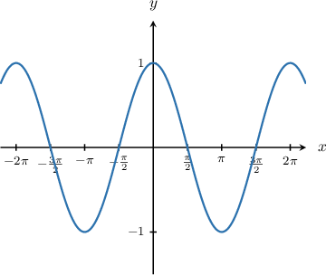
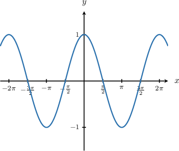
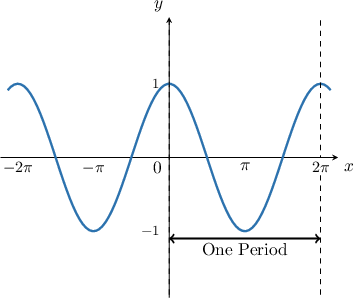
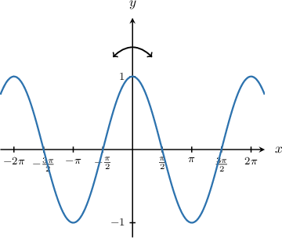
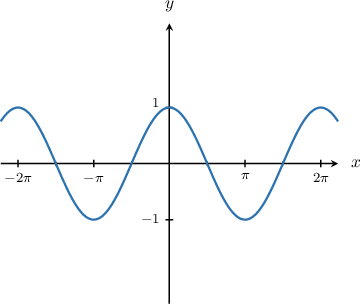

# Describing Properties of the Cosine Function

Source: https://www.mathacademy.com/topics/3557?courseId=111
Topic ID: 3557

## Prerequisites

- [Even and Odd Functions](./725-even-and-odd-functions.md)
- [Graphing Sine and Cosine](./1491-graphing-sine-and-cosine.md)
- [Local Extrema of Functions](./2707-local-extrema-of-functions.md)

## Lesson

### Introduction

Let's look again at the graph of the function $y=\cos x.$

The cosine function has infinitely many zeros and an infinite number of points where the function reaches its maximum and minimum value. Let's write general expressions for these properties, assuming $n$ is an integer.

**The Zeros of the Function**

From the graph, we see that the zeros of the function are $x=\pm\dfrac{\pi}{2}, \pm \dfrac{3\pi}{2}\dots$

A general expression for the zeros is

$$

x = \dfrac{\pi}{2} + n\pi.

$$

**The Maxima of the Function**

The function has a maximum when $x=0$ and is periodic with period $2\pi.$ Therefore, a general expression for the values of $x$ that maximize cosine is

$$

x = 2n\pi.

$$

**The Minima of the Function**

The function has a minimum when $x=\pi$ and is periodic with period $2\pi.$ Therefore, a general expression for the values of $x$ that minimize cosine is

$$

x = \pi + 2n\pi.

$$

### Example: Describing Properties of the Cosine Function

#### Question

Which of the following statements are true regarding the function $y=\cos x?$ Assume that $n$ is an integer.

1. The range of the function is $[-1,1].$

2. The function has minimum values at $x =n\pi.$

3. The function intersects the $x$-axis at $x=\dfrac{\pi}{2} +\pi n.$

#### Explanation

First, let's plot the graph of $y=\cos{x}.$

Now, let's go through each statement.

- Statement I is true. The minimum value is $-1,$ and the maximum value is $1.$ Therefore, the range is $[-1,1].$

- Statement II is false. The function has a minimum at $x=\pi$ and the period is $2\pi.$ Therefore, the minimum values occur at $\pi+2n\pi.$

- Statement III is true. These are the zeros of the cosine curve. The cosine curve has zeros at $x=\dfrac{\pi}{2} + n\pi.$

In conclusion, only statements I and III are true.

### The Periodicity Property of the Cosine Function

Let's look at the graph of the cosine function again.

The periodicity of the function is another characteristic of its graph. The period of the cosine function is $2\pi,$ shown below:

This means that $\cos\left(x+2n\pi\right) = \cos \left(x\right)$ for any number $x$ and any integer $n.$

### Example: Utilizing the Periodicity Property of the Cosine Function

#### Question

If $\cos x =- \dfrac {1}{3},$ find the value of $2\cos(x + 4\pi)+3.$

#### Explanation

The period of $y = \cos x$ is $2\pi.$ Therefore, for any integer $n$ we have

$$

\cos{x} = \cos{(x+2n\pi)} .

$$

Substituting $n=2$ into the right-hand-side of the above gives

$$

\begin{aligned}cos⁡𝑥 & =cos⁡(𝑥+2⋅2⋅𝜋) \\ & =cos⁡(𝑥+4𝜋).\end{aligned}

$$

Therefore, if $\cos{x} =- \dfrac {1}{3},$ then $\cos{(x+4\pi)} = - \dfrac {1}{3}.$

Finally, then

$$

\begin{aligned}2cos⁡(𝑥+4𝜋)+3 & =2(−\frac{1}{3})+3 \\ & =−\frac{2}{3}+3 \\ & =\frac{7}{3}.\end{aligned}

$$

### The Evenness Property of the Cosine Function

Recall that a function $f(x)$ is *even* if it satisfies the property

$$

f(-x) = f(x).

$$

As it turns out, cosine is an even function! So, for any value of $x,$ we have

$$

\cos(-x) = \cos(x).

$$

Even functions are always symmetric about the $y$-axis. This is indeed true of the cosine function, as we can see from the diagram below.

We can use the evenness property of cosine in conjunction with its periodicity property to simplify trigonometric expressions. Let's see an example.

### Example: Utilizing the Evenness Property of the Cosine Function

#### Question

If $\cos x = \dfrac{\sqrt 3}{4},$ then find the value of $\cos (-x-6\pi).$

#### Explanation

First, let's recall the graph of $y=\cos{x}.$

From the graph, we note the following:

- The period of $\cos{x}$ is $2\pi.$

- Our graph is symmetric about the $y$-axis. This means that $\cos{x}$ is an ** function, and we have

Let's now evaluate our expression:

- Firstly, using the periodicity of $\cos{x},$ we have

- Secondly, using the evenness of $\cos{x},$ we have

Therefore, $\cos (-x-6\pi)= \dfrac{\sqrt 3}{4}.$
