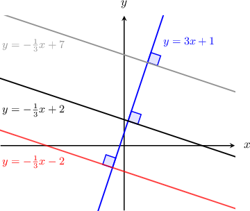

# Finding Equations of Perpendicular Lines

Source: https://www.mathacademy.com/topics/3562?courseId=111
Topic ID: 3562

## Prerequisites

- [Perpendicular Lines in the Coordinate Plane](./1427-perpendicular-lines-in-the-coordinate-plane.md)

## Lesson

### Introduction

To find the slope of a line that is perpendicular to a given line $y=mx+b,$ we can just take the **negative reciprocal** of the given slope $m.$ So, the slope of the perpendicular line would be $-\dfrac{1}{m}.$

For example, consider the line $y = 3x + 1,$ which has a slope of $m=3.$ The negative reciprocal of $3$ is $-\dfrac{1}{3}.$ So, any line with a slope of $-\dfrac{1}{3}$ will be perpendicular to the given line, because

$$

3 \cdot \left( -\dfrac{1}{3} \right) = -1.

$$

To illustrate, some lines with a slope of $-\dfrac{1}{3}$ are plotted below. We can see that they are all perpendicular to the given line $y=3x+1.$

### Example: Finding the Equation of a Perpendicular Line

#### Question

Find the equation of the line that is perpendicular to $y = 4x - 1$ and passes through the point $(-8,7).$

#### Explanation

Let $l_1$ denote the line $y = 4x - 1,$ and let $l_2$ denote the line we want to find.

Since perpendicular lines have slopes that are negative reciprocals of each other, the slope of $l_2$ is the negative reciprocal of the slope of $l_1.$ Since $l_1$ has a slope of $4,$ the line $l_2$ must have a slope of $-\dfrac{1}{4}.$

Our perpendicular line must have the slope $m=-\dfrac{1}{4}$ and pass through the point $(x_1,y_1)=(-8,7).$ Using point-slope form and simplifying, we obtain the equation of the line:

$$

\begin{aligned} y - y_1 &= m(x-x_1) \\[5pt] y - 7 &= -\dfrac{1}{4}(x-(-8)) \\[5pt] y - 7 &= -\dfrac{1}{4}(x+8)\\[5pt] y - 7 &= -\dfrac{1}{4}x - 2 \\[5pt] y &= -\dfrac{1}{4}x + 5 \end{aligned}

$$

### Example: Finding the Equation of a Line Perpendicular to a Line Through Two Points

#### Question

Find the equation of the line that passes through the point $(3,4)$ and is perpendicular to the line passing through the points $(0,1)$ and $(-2,4).$

#### Explanation

Perpendicular lines have slopes which are negative reciprocals of each other.

First, let's find the slope $m_1$ of the line passing through the points $(0,1)$ and $(-2,4)\mathbin{:}$

$$

\begin{aligned}𝑚_{1} & =\frac{𝑦_{2}−𝑦_{1}}{𝑥_{2}−𝑥_{1}} \\ & =\frac{4−1}{−2−0} \\ & =\frac{3}{−2} \\ & =−\frac{3}{2}\end{aligned}

$$

Since we want a perpendicular line, the slope $m$ of the line we're trying to find must satisfy

$$

m \cdot \left(-\dfrac{3}{2}\right) = -1 \quad \Rightarrow \quad m = \dfrac{2}{3}.

$$

We know that the line passes through the point $(3,4).$ Using point-slope form and simplifying, we obtain the equation of the line:

$$

\begin{aligned}𝑦−𝑦_{1} & =𝑚(𝑥−𝑥_{1}) \\ 𝑦−4 & =\frac{2}{3}(𝑥−3) \\ 𝑦−4 & =\frac{2}{3}𝑥−2 \\ 𝑦 & =\frac{2}{3}𝑥+2\end{aligned}

$$

### Example: Finding the Equation of a Line Perpendicular to a Line in Standard Form

#### Question

What is the equation of the line that passes through the point $(6,2)$ and is perpendicular to $3x-2y=1?$

#### Explanation

First, we write the equation $3x-2y=1$ in its slope-intercept form as follows:

$$

\begin{aligned}3𝑥−2𝑦 & =1 \\ −2𝑦 & =−3𝑥+1 \\ 𝑦 & =\frac{3}{2}𝑥−\frac{1}{2}\end{aligned}

$$

Since perpendicular lines have slopes that are negative reciprocals of each other, the slope of the new line should be the negative reciprocal of the slope of the given line $y=\dfrac{3}{2}x - \dfrac{1}{2}.$ The given line has a slope of $\dfrac{3}{2},$ so our perpendicular line must have a slope of $-\dfrac{2}{3}.$

Our perpendicular line must have the slope $m=-\dfrac{2}{3}$ and pass through the point $(x_1,y_1) = (6,2).$ Using point-slope form and simplifying, we obtain the equation of the line in slope-intercept form:

$$

\begin{aligned}𝑦−𝑦_{1} & =𝑚(𝑥−𝑥_{1}) \\ 𝑦−2 & =−\frac{2}{3}(𝑥−6) \\ 𝑦−2 & =−\frac{2}{3}𝑥+4 \\ 𝑦 & =−\frac{2}{3}𝑥+6\end{aligned}

$$
