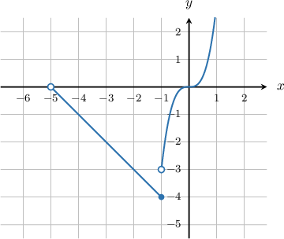
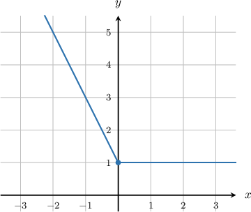
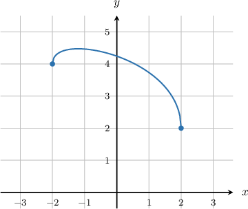
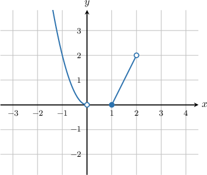

# The Left and Right-Sided Limits of a Function

Source: https://www.mathacademy.com/topics/472?courseId=111
Topic ID: 472

## Prerequisites

- [The Finite Limit of a Function](./461-the-finite-limit-of-a-function.md)

## Lesson

### Introduction

We already know that $\lim\limits_{x \to \, a} f(x)$ represents the limit of $f(x)$ as $x$ approaches $a.$ However, there are really two ways that $x$ can approach $a$ -- from the left side or from the right side -- and sometimes, it matters which direction we choose.

For example, consider the function below.

- As $x \to -1$ from the left, we have $f(x) \to -4,$ but

- as $x \to -1$ from the right, we have $f(x) \to -3.$

To be more precise about the direction in which $x$ approaches $a$, we use superscripts. The minus sign $(-)$ means "from the left" and the plus sign $(+)$ means "from the right."

- **Left-sided limit:** $\lim\limits_{x \to \, a^-} f(x)$ represents the limit of $f(x)$ as $x$ approaches $a$ *from the left.*

- **Right-sided limit:** $\lim\limits_{x \to \, a^+} f(x)$ represents the limit of $f(x)$ as $x$ approaches $a$ *from the right.*

For the function graphed above, the left-sided limit is

$$

\lim\limits_{x\rightarrow \,-1^{-}}f(x)=-4

$$

and the right-sided limit is

$$

\lim\limits_{x\rightarrow \,-1^{+}}f(x)=-3 \,.

$$

At the same time, if we consider the point $x=-5,$ we note that the left-sided limit at this point does not exist because the function to the left of $x=-5$ is not defined. If the limit **does not exist**, we usually denote it using the abbreviation $\text{DNE}{:}$

$$

\lim\limits_{x\rightarrow \,-5^{-}}f(x)=\text{DNE}

$$

**Note:** The "minus" superscript $(-)$ indicates "left" because the left direction is the negative direction on the number line, and the "plus" superscript $(+)$ indicates "right" because the right direction is the positive direction on the number line.

### Example: Evaluating Left and Right Limits at an Interior Point

#### Question

Find $\displaystyle\lim_{x\rightarrow 0^-} f(x)$ and $\displaystyle\lim_{x\rightarrow 0^+} f(x)$ for the function given below.

#### Explanation

As $x$ approaches $0$ from the **, the function $f(x)$ approaches $1.$ Therefore,

$$

\lim\limits_{x\rightarrow \,0^{-}}f(x) = 1 \, .

$$

Likewise, as $x$ approaches $0$ from the **, the function $f(x)$ approaches $1.$ Therefore,

$$

\lim\limits_{x\rightarrow \,0^{+}}f(x) = 1 \, .

$$

In conclusion, we have

$$

\lim\limits_{x\rightarrow \,0^{-}}f(x)=\lim\limits_{x\rightarrow \,0^{+}}f(x)=1 \,.

$$

### Example: Evaluating Left and Right Limits at Endpoints

#### Question

The function $y=f(x)$ (shown below) is defined on $x\in [-2,2]$. Find the left-sided and right-sided limits for the function at $x=-2$ and $x=2$.

#### Explanation

We see from the graph that, approaching $x=-2$ from the right, the function approaches the value $y=4$. However, we cannot approach $x=-2$ from the left, because the function is not defined left of $x=-2.$ Consequently,

$$

\lim\limits_{x\rightarrow \,-2^{-}}f(x)=\text{DNE}\,,\quad\lim\limits_{x\rightarrow \,-2^{+}}f(x)=4 \,.

$$

On the other hand, approaching $x=2$ from the left, the function approaches the value $y=2$. However, we cannot approach $x=2$ from the right, because the function is not defined right of $x=2.$ So we have

$$

\lim\limits_{x\rightarrow 2^{-}}f(x)=2\,,\quad\lim\limits_{x\rightarrow \,2^{+}}f(x)=\text{DNE} \,.

$$

**** Here, $\text{DNE}$ is simply short for "does not exist".

### Comparing Limits that Do Not Exist

If two limits *do not exist*, then we *cannot* say that they are equal because we can't compare the undefined values.

So, if

$$

\lim\limits_{x \to a} f(x) = \text{DNE}, \qquad \lim\limits_{x \to b} g(x) = \text{DNE},

$$

then

$$

\lim\limits_{x \to a} f(x) \neq \lim\limits_{x \to b} g(x) \, .

$$

### Example: Identifying True Equalities Involving Limits

#### Question

Which of the following statements are true concerning the function $y=f(x)$ whose graph is shown below?

1. $\lim\limits_{x\rightarrow \,0^-}f(x)=\lim\limits_{x\rightarrow \,1^+}f(x)$

2. $\lim\limits_{x\rightarrow \,0^+}f(x)=\lim\limits_{x\rightarrow \,1^+}f(x)$

3. $\lim\limits_{x\rightarrow \,0^+}f(x)=\lim\limits_{x\rightarrow \,1^-}f(x)$

#### Explanation

First, let's compute the limits in question.

Looking at the graph, as $x$ approaches $0$ from the left, the function value $f(x)$ approaches $0.$ However, as $x$ approaches $0$ from the right, the function value $f(x)$ is undefined. So we have

$$

\lim\limits_{x\rightarrow \,0^-}f(x)=0, \qquad \lim\limits_{x\rightarrow \,0^+}f(x)=\text{DNE} \, .

$$

On the other hand, as $x$ approaches $1$ from the left, the function value $f(x)$ is undefined, and as $x$ approaches $1$ from the right, the function value $f(x)$ approaches $0.$ So we have

$$

\lim\limits_{x\rightarrow \,1^-}f(x)=\text{DNE}, \qquad \lim\limits_{x\rightarrow \,1^+}f(x)=0 \, .

$$

Now, let's look at each statement in turn.

I. $\lim\limits_{x\rightarrow \,0^-}f(x)=\lim\limits_{x\rightarrow \,1^+}f(x)$ becomes $0=0,$ which is true.

II. $\lim\limits_{x\rightarrow \,0^+}f(x)=\lim\limits_{x\rightarrow \,1^+}f(x)$ becomes $\text{DNE}=0,$ which is false.

III. $\lim\limits_{x\rightarrow \,0^+}f(x)=\lim\limits_{x\rightarrow \,1^-}f(x)$ becomes $\text{DNE}=\text{DNE},$ which is false because we can't compare the undefined values.

Therefore, only statement I is true.
