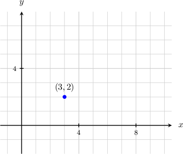
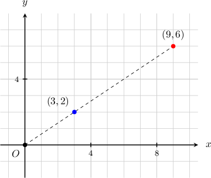
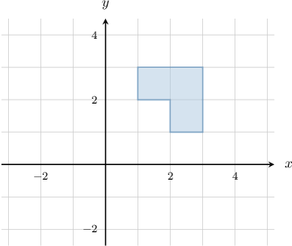
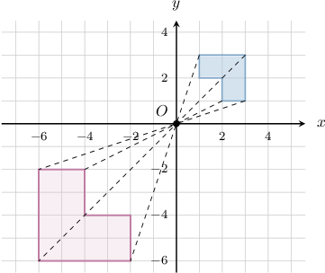
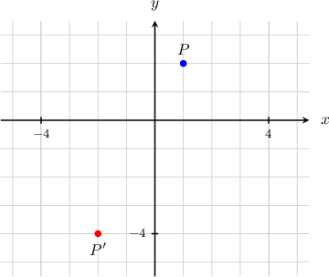
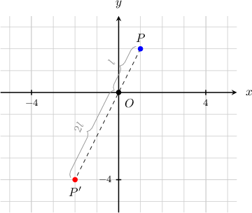
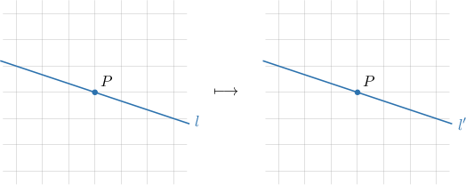
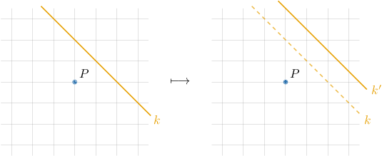
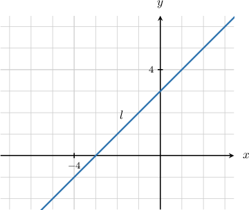
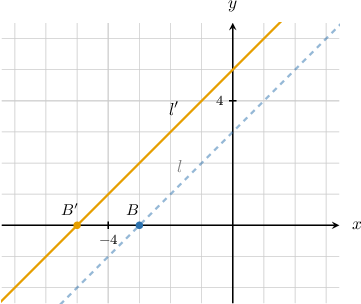

# Dilations of Figures in the Coordinate Plane

Source: https://www.mathacademy.com/topics/577?courseId=111
Topic ID: 577

## Prerequisites

- [Solving One-Step Multiplication and Division Equations](../../../middle-school/lessons/grade-7/40-solving-one-step-multiplication-and-division-equations.md)
- [Dilations of Geometric Figures](./2216-dilations-of-geometric-figures.md)

## Lesson

### Introduction

In the coordinate plane, dilations are typically centered at the origin. When a dilation is centered at the origin, it can be represented by a function

$$

(x,y) \mapsto (kx, ky)

$$

where $k$ is the scale factor of the dilation.

For example, let's compute the image of the point $(3,2)$ (shown below) under the action of a dilation with center $O$ and scale factor $3.$

A dilation with center at the origin and a scale factor of $3$ can be represented by the function

$$

(x,y) \mapsto \left(3x,3y\right).

$$

Applying this function to the point $(3,2),$ we have

$$

(3,2) \mapsto \left(3\cdot 3, \:3 \cdot 2 \right) = (9,6).

$$

Therefore, the resulting point is $(9,6).$

### Example: Dilating Points in the Coordinate Plane

#### Question

Find the image of the point $(-5,2)$ under the action of a dilation with center $O$ and scale factor $-3?$

#### Explanation

A dilation with center at the origin and a scale factor of $-3$ can be represented by the function

$$

(x,y) \mapsto (-3x,-3y).

$$

Applying this function to the point $(-5,2),$ we have

$$

(-5,2) \mapsto \big((-3) \cdot (-5), \: (-3) \cdot 2 \big) = (15,-6).

$$

Therefore, the resulting point is $(15,-6).$

### Example: Dilating Figures in the Coordinate Plane

#### Question

What is the image of the polygon shown above under a dilation that is centered at the origin and has a scale factor of $-2?$

#### Explanation

The dilation with center at the origin and a scale factor of $-2$ can be represented by the function

$$

(x,y) \mapsto \left(-2x,-2y\right).

$$

Applying this function to the vertices $(2,1),$ $(3,1),$ $(3,3),$ $(1,3),$ $(1,2),$ and $(2,2),$ we have the following:

$$

\begin{aligned}(2,1) & ↦(−2⋅2,\,−2⋅1)=(−4,−2) \\ (3,1) & ↦(−2⋅3,\,−2⋅1)=(−6,−2) \\ (3,3) & ↦(−2⋅3,\,−2⋅3)=(−6,−6) \\ (1,3) & ↦(−2⋅1,\,−2⋅3)=(−2,−6) \\ (1,2) & ↦(−2⋅1,\,−2⋅2)=(−2,−4) \\ (2,2) & ↦(−2⋅2,\,−2⋅2)=(−4,−4)\end{aligned}

$$

Therefore, we get the following polygon.

### Finding a Center of Dilation

Let's discuss how to find a center of a dilation

The center of a dilation lies on any line that passes through corresponding points on a figure and its image. Therefore, we can find a center of dilation as the intersection of any two of these lines.

Let's look at some examples:

- Consider the rectangle $ABCD$ and its image $A'B'C'D'$ under the action of a dilation, shown below. We can find the center of dilation $O$ by connecting two corresponding points with a straight line and finding their intersection. For example, if we draw the lines $\overset{\longleftrightarrow}{AA'}$ and $\overset{\longleftrightarrow}{BB'}$ and find their intersection, we get the center of dilation $O$ shown below.

- Sometimes, a figure and its image lie on opposite sides of the center of dilation. For example, consider the rectangle $ABCD$ and its image $A'B'C'D'$ shown below. If we draw the lines $\overset{\longleftrightarrow}{AA'}$ and $\overset{\longleftrightarrow}{BB'},$ we find that the center of dilation $O$ lies between the two shapes.

### Example: Finding the Scale Factor of a Dilation in the Coordinate Plane

#### Question

The point $P'(-2,-4)$ is the image of the point $P(1,2)$ under a dilation with the center at the origin, as shown above. What is the scale factor of the transformation?

#### Explanation

A dilation with center at the origin and a factor of $k$ can be represented by the function

$$

(x,y) \mapsto (kx,ky)\,.

$$

Applying this function to the point $P$ and equating the result to $P',$ we get

$$

\begin{aligned}(𝑘⋅1,𝑘⋅2)=(−2,−4)\,⟹\,\begin{matrix}𝑘=−2 \\ 2𝑘=−4.\end{matrix}\end{aligned}

$$

Therefore, $k=\dfrac{(-4)}{2}=-2.$

### The Image of a Line Under a Dilation

If $l$ is a line passing through the center of dilation, then the image $l'$ under the dilation is the same as the original line.

However, if $k$ is a line that does not pass through the center of dilation, then the image $k'$ is parallel to the original line.

### Example: The Image of a Line Under a Dilation

#### Question

A dilation with center $O$ is defined by the function $(x,y) \mapsto \left(\dfrac53x, \dfrac53y\right).$ What is the image of the line shown above under the action of this transformation?

#### Explanation

A dilation maps a line $l$ not passing through the center of the dilation onto a parallel line $l'.$

To find the image of the line, we proceed as follows:

- Take a point $B \in l.$

- Find the image $B'$ of $B$ under the dilation.

- Find $l'$ as the line that passes through $B'$ and is parallel to $l.$

Notice that $B(-3,0)$ lies on $l,$ as shown below. The image of this point under the dilation is

$$

\begin{aligned}(\frac{5}{3}⋅(−3),\frac{5}{3}⋅0) & =(−5,0).\end{aligned}

$$

Therefore, we have the following image of $l\mathbin{:}$

