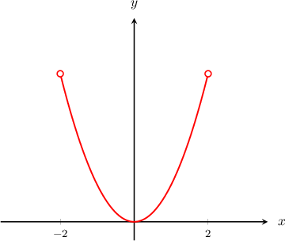
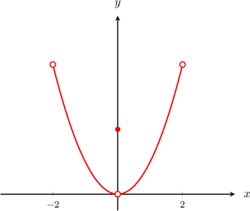
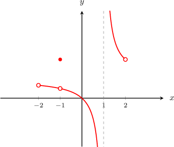
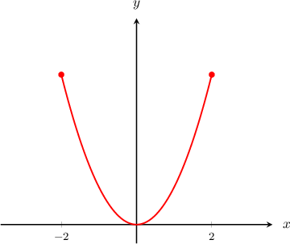
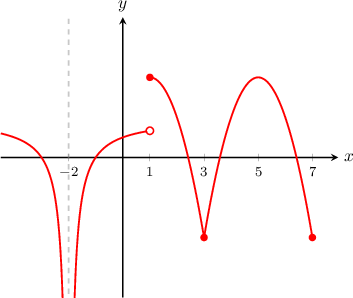
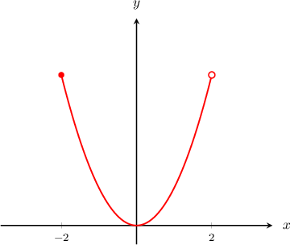
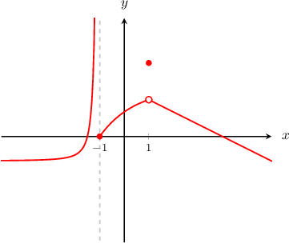
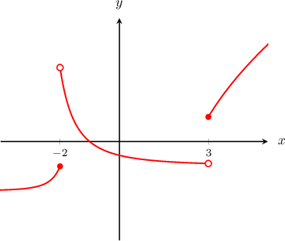

# Continuity Over an Interval

Source: https://www.mathacademy.com/topics/612?courseId=111
Topic ID: 612

## Prerequisites

- [Left and Right Continuity](./474-left-and-right-continuity.md)

## Lesson

### Introduction

Let's consider the function $y=f(x)$ defined on the open interval $x\in(-2,2),$ as shown below.

The function is continuous at every point in its domain. So, we say that the function is **continuous on the (open) interval** $(-2,2).$

In addition, the function is continuous on any open subinterval of $(-2,2).$ For example, the open intervals

$$

(-2,-1),\quad (0,1),\quad (0,2),

$$

etc, are all **intervals of continuity** of $y=f(x).$

Let's compare this to the very similar function $y=g(x)$ given below.

The function $y=g(x)$ is also defined on the entire open interval $(-2,2),$ but there is a point of discontinuity at $x=0.$ The function is continuous everywhere else.

For this reason, we say that the function $g(x)$ is continuous on the intervals $(-2,0)$ and $(0,2).$

### Example: Determining Open Intervals of Continuity

#### Question

On which intervals is the function $y= f(x)$ below continuous?

#### Explanation

To determine the intervals of continuity of a function, we take the domain of the function and exclude any points of discontinuity.

The function is defined on the intervals $(-2,1)$ and $(1,2).$ There is a discontinuity at $x=1,$ but this is already excluded.

There is also a discontinuity at $x=-1,$ so we need to exclude that.

Therefore, the function is continuous in the intervals $(-2,-1),$ $(-1,1),$ and $(1,2).$ It is also continuous on any subinterval of these intervals.

### Continuity on a Closed Interval

Let's now take a look at the function $y=f(x)$ defined on the closed interval $[-2,2],$ shown below.

Notice that the function $f(x)$ is

- continuous on the open interval $(-2,2)$,

- right-continuous at the endpoint $x=-2$, and

- left-continuous at the other endpoint $x=2.$

For the above reasons, we say that the function $f(x)$ is **continuous over the (closed) interval** $[-2,2].$ It is also continuous on any (open or closed) subinterval of this interval.

In general, a function $f(x)$ is said to be continuous over the interval $[a,b]$ if it is

- continuous on the open interval $(a,b),$

- right-continuous at $x=a,$ and

- left-continuous at $x=b.$

### Example: Determining Closed Intervals of Continuity

#### Question

On which intervals is the function $y= f(x)$ below continuous? You may assume that all points of discontinuity of $f(x)$ are shown in the diagram.

#### Explanation

The function is continuous on the open intervals $(-\infty, -2),$ $(-2,1),$ and $(1,7).$

Additionally, the function is right-continuous at $x=1$ and left-continuous at $x=7.$ Hence, it is continuous on the closed interval $[1,7].$

Therefore, we can say that the function is continuous on the intervals $(-\infty,-2),$ $(-2,1),$ and $[1,7].$ It is also continuous on any subinterval of these intervals.

### Continuity Over Semi-Open Intervals

Let's take a look at the function $y=f(x)$ below.

We say that $y=f(x)$ is **continuous over the interval** $(-2,2]$ because it is

- continuous over the interval $(-2,2),$ and

- left-continuous at $x=2.$

Similarly, let's consider the graph of $y=g(x)$ below.

We say that $y=g(x)$ is **continuous over the interval** $[-2,2)$ because it is

- continuous over the interval $(-2,2),$ and

- right-continuous at $x=-2.$

### Example: Identifying Semi-Open Intervals of Continuity

#### Question

Determine the intervals in which the function $y= f(x)$ below is continuous. You may assume that all points of discontinuity of $f(x)$ are shown in the diagram.

#### Explanation

The function is continuous on the open intervals $(-\infty,-1),$ $(-1,1)$ and $(1,\infty).$

Additionally, the function is right-continuous at $x=-1.$ Hence, it is continuous on the interval $[-1,1).$

Therefore, we can say that the function is continuous on the intervals $(-\infty,-1),$ $[-1,1)$ and $(1,\infty).$ It is also continuous on any subinterval of these intervals.

### Example: Identifying the Intervals of Continuity of a Function

#### Question

Consider the function $y=f(x)$ above. On which of the following intervals is the function continuous?

1. $x\in (-\infty, -3)$

2. $x\in (-2,3)$

3. $x\in [3,\infty)$

You may assume that all points of discontinuity of $f(x)$ are shown in the diagram.

#### Explanation

Let's examine each statement.

- The function is continuous on $(-\infty,-3).$ It is continuous on $(-\infty, -2]$ and this contains the interval $(-\infty,-3).$

- The function is continuous on the open interval $(-2,3).$

- The function is continuous on $[3, \infty).$ It is continuous on $(3,\infty)$ and also right continuous at $x=3.$

Therefore, the correct answer is "I, II, and III."
